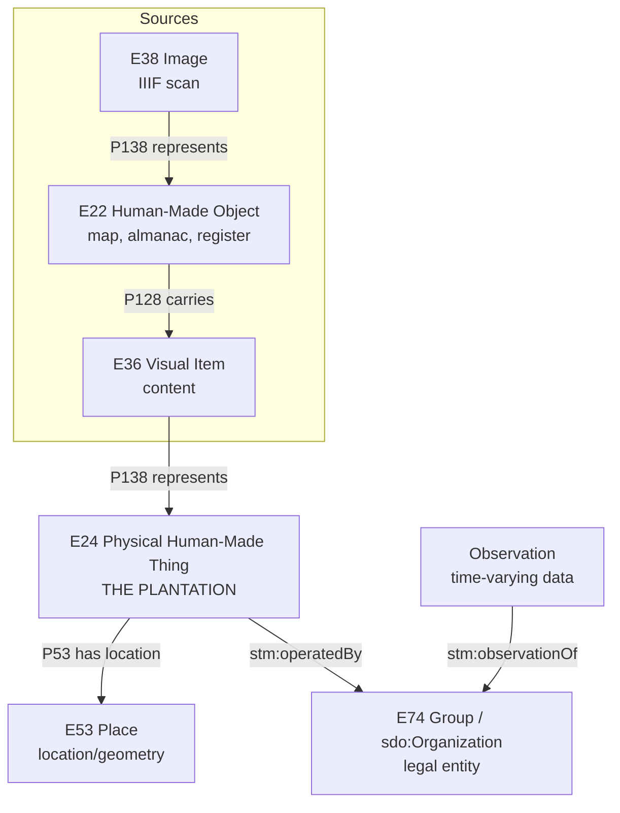
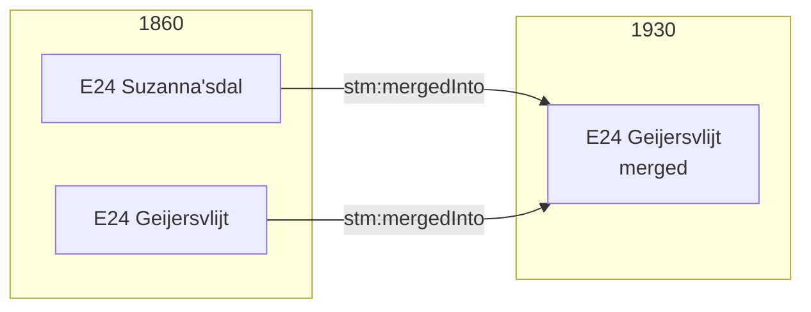
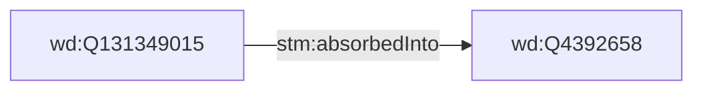

# Data Model Skill

Quick reference for Suriname Time Machine data modeling. For rationale, see [ARCHIVE-conceptual-thinking.md](ARCHIVE-conceptual-thinking.md). For validation, see [CHECKLIST.md](CHECKLIST.md).

## Core Model: E24 Plantation as Central Entity

The **plantation** (E24 Physical Human-Made Thing) is the main entity. Everything connects to/from it:



| Entity       | Class                         | Role                                       |
| ------------ | ----------------------------- | ------------------------------------------ |
| Plantation   | E24 Physical Human-Made Thing | Main entity - the physical plantation      |
| Location     | E53 Place                     | Where the plantation is (geometry)         |
| Organization | E74 Group / sdo:Organization  | Who operates it                            |
| Source       | E22 Human-Made Object         | Map, book, ledger depicting the plantation |
| Observation  | stm:OrganizationObservation   | Annual snapshot from Almanakken            |

## Universal Source Pattern

All sources follow this chain:

```
E22 Human-Made Object → P128 carries → E36 Visual Item → P138 represents → E24 Plantation
        ↑                                                                        ↓
E38 Image (scan)                                                          P53 has location
        ↓                                                                        ↓
   P138 represents → E22                                                   E53 Place
```

Key insight: **Maps depict plantations (E24); plantations have locations (E53)**. The map does NOT depict the location directly.

## URI Patterns

```
Plantation:     stm:plantation/{name-slug}
Location:       stm:place/{year}/fid-{fid}     (from QGIS polygon)
Organization:   wd:{Q-ID}                       (Wikidata URI)
Source:         stm:source/{type}-{id}
Observation:    stm:obs/{recordid}              (from Almanakken)
```

## Entity Properties

### Plantation (E24 Physical Human-Made Thing)

```
skos:prefLabel       - canonical name (@nl)
skos:altLabel        - spelling variants
crm:P2_has_type      - PlantationStatus (Built/Planned/Abandoned/Unknown)
crm:P53_has_location - E53 Place (the geometry)
stm:operatedBy       - Organization (Q-ID)
prov:wasDerivedFrom  - source that depicts this
```

### Location (E53 Place)

```
stm:fid              - QGIS feature ID
stm:mapYear          - year of source map
stm:observedLabel    - label from map (if any)
geo:hasGeometry      - polygon (geo:asWKT)
```

### Organization (E74 / sdo:Organization)

```
skos:prefLabel       - canonical name (@nl)
sdo:additionalType   - wd:Q188913 (plantation type)
stm:absorbedInto     - if absorbed by another org
```

### Observation (from Almanakken)

```
stm:observationOf      - Organization (Q-ID)
stm:observationYear    - year
stm:observedName       - name as recorded
stm:hasOwner           - eigenaren
stm:hasAdministrator   - administrateurs
stm:hasDirector        - directeuren
stm:enslavedCount      - slaven
stm:hasProduct         - product_std
prov:hadPrimarySource  - almanac source
```

## Data Source Mapping

### QGIS CSV → Plantation + Location

| CSV Column | Entity           | Property                      |
| ---------- | ---------------- | ----------------------------- |
| fid        | Location (E53)   | stm:fid                       |
| coords     | Location (E53)   | geo:hasGeometry               |
| label_1930 | Plantation (E24) | skos:prefLabel                |
| qid        | Plantation (E24) | stm:operatedBy (links to org) |

### Almanakken CSV → Observation

| CSV Column     | Property                 |
| -------------- | ------------------------ |
| recordid       | URI                      |
| year           | stm:observationYear      |
| plantation_id  | stm:observationOf (Q-ID) |
| plantation_org | stm:observedName         |
| eigenaren      | stm:hasOwner             |
| slaven         | stm:enslavedCount        |

## Linking Plantations to Organizations

The Q-ID connects everything:

```
QGIS CSV (qid) ──────────────────────┐
                                     ▼
                            Organization (wd:Q-ID)
                                     ▲
Almanakken CSV (plantation_id) ──────┘
```

For uncertain links, use qualified link entity:

```
stm:link/{plantation}_{Q-ID}
    stm:plantation      - E24
    stm:organization    - wd:Q-ID
    stm:linkCertainty   - Certain / Probable / Uncertain
    stm:linkEvidence    - explanation
```

## Type Vocabularies (E55)

### Plantation Status

- `stm:PlantationStatus_Built` - physically constructed
- `stm:PlantationStatus_Planned` - plan only, never built
- `stm:PlantationStatus_Abandoned` - ceased operations
- `stm:PlantationStatus_Unknown` - can't determine

### Link Certainty

- `stm:Certainty_Certain` - confirmed match
- `stm:Certainty_Probable` - likely match
- `stm:Certainty_Uncertain` - tentative

## Temporal Changes

### Plantation Mergers

When plantations merge, the E24 entities merge (not just locations):



### Organization Absorption



## Key Decisions

1. **E24 is the main plantation entity** - physical thing depicted by sources
2. E53 Place = location property of E24 (not separate "land plot" entity)
3. E22 Human-Made Object for sources - maps are physical artifacts
4. E36 Visual Item carries what source depicts
5. P138 represents connects content to E24 (not to E53 directly)
6. P53 has location connects E24 to E53
7. sdo:Organization for PICO compatibility
8. Q-ID as linking key between QGIS and Almanakken
9. OrganizationObservation for time-varying attributes
10. Qualified links with certainty for uncertain matches
11. E55 Type for status vocabularies
12. GeoSPARQL for geometry on E53
13. SKOS for naming (prefLabel/altLabel)
14. No emojis in any files
15. erDiagram doesn't support %% comments

## Formatting Rules

- No emojis anywhere
- Mermaid erDiagram: use YAML frontmatter, NOT %% comments
- Mermaid flowchart: %% comments OK
- See diagram files in docs/models/
