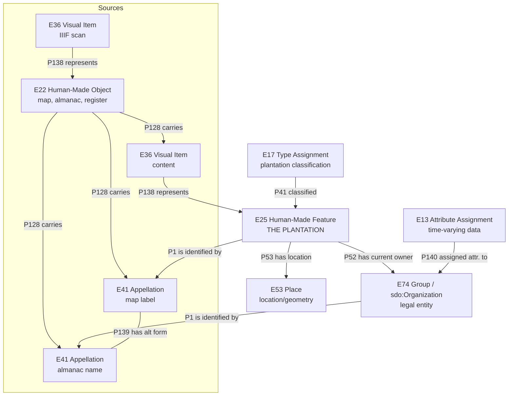
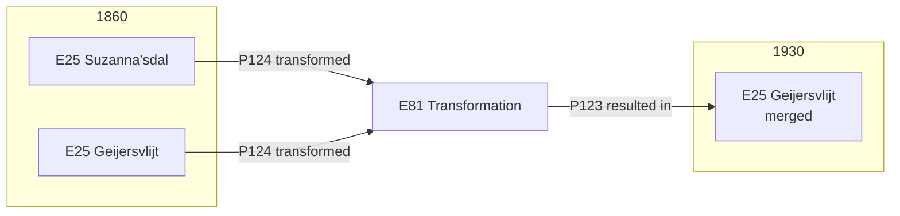
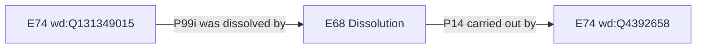

# Data Model Skill

Quick reference for Suriname Time Machine data modeling. For rationale, see [ARCHIVE-conceptual-thinking.md](ARCHIVE-conceptual-thinking.md). For validation, see [CHECKLIST.md](CHECKLIST.md).

## Keeping Sources of Truth in Sync

The data model is defined in **three places** that must stay consistent. When changing any entity, property, or relation, update all three:

| Source                                 | What to update                                                                                                      |
| -------------------------------------- | ------------------------------------------------------------------------------------------------------------------- |
| `.github/skills/data-model/SKILL.md`   | Canonical reference: entity tables, property lists, mermaid diagrams, CSV mappings                                  |
| `app/app/model/page.tsx`               | `ENTITIES` array (properties, descriptions), `RELATIONS` array, documentation sections                              |
| `app/components/` + `app/lib/types.ts` | `PlantationPanel.tsx` CrmField labels/badges, `EntityGraph.tsx` nodes/links, `types.ts` interfaces and CRM comments |

## Core Model: E25 Plantation as Central Entity

The **plantation** (E25 Human-Made Feature) is the main entity. E25 and E74 are **separate entities** linked via `P52 has current owner`. Names are modeled as **E41 Appellation** entities carried by sources (E22).



| Entity         | Class                        | Role                                               |
| -------------- | ---------------------------- | -------------------------------------------------- |
| Plantation     | E25 Human-Made Feature       | Main entity - the physical plantation              |
| Location       | E53 Place                    | Where the plantation is (geometry)                 |
| Organization   | E74 Group / sdo:Organization | Who owns/operates it (separate entity)             |
| Appellation    | E41 Appellation              | Name of plantation/organization                    |
| Source         | E22 Human-Made Object        | Map, book, ledger depicting the plantation         |
| Observation    | E13 Attribute Assignment     | Annual snapshot from Almanakken                    |
| Classification | E17 Type Assignment          | Classifies E25 plantation status (subclass of E13) |

## E25 and E74: Separate Entities

The physical plantation (E25) is NOT the same thing as the legal organization (E74). They are linked:

```
E25 Plantation ──P52 has current owner──> E74 Organization (wd:Q-ID)
E25 Plantation ──P51 has former or current owner──> E74 Organization (wd:Q-ID)
```

- `P52 has current owner` (E18 Physical Thing -> E39 Actor): legal owner at time of record
- `P51 has former or current owner` (E18 Physical Thing -> E39 Actor): ownership at any time

The postgres schema junction table `e25_e74_ownership` carries `relationship_type` (owner | operator | administrator) and `certainty` for nuance that RDF handles via PICO roles.

## E41 Appellation: Names as First-Class Entities

Names are modeled as **E41 Appellation** (subclass of E90 Symbolic Object), connected via:

- `P1 is identified by` (E1 CRM Entity -> E41 Appellation): names any entity
- `P128 carries` (E18 Physical Thing -> E90 Symbolic Object): source carries the name
- `P139 has alternative form` (E41 -> E41): links variant spellings
- `P190 has symbolic content` (E90 -> string): the actual text of the name

Each source creates its own E41 instance that identifies the entity type it refers to. A map label (printed cartography) identifies the physical plantation (E25). An almanac entry (handwritten table) identifies the organization (E74). These are **distinct E41 instances**, linked to each other by P139 has alternative form.

Name provenance flows through the source chain:

```
E22 Map 1930 ──P128 carries──> E41a "Geijersvlijt" ──P1i identifies──> E25 Plantation
E22 Almanac 1818 ──P128 carries──> E41b "Geyers-Vlijt" ──P1i identifies──> E74 Organization

E41a ──P139 has alternative form──> E41b
E25 ──P52 has current owner──> E74 (linked via Q-ID)
```

The P139 link between E41a and E41b makes the name equivalence explicit without conflating the physical thing with the legal entity. Temporal scope of a name is inferred from the E12 Production event of the E22 source that carries it. No separate E15 Identifier Assignment needed.

`rdfs:label` is kept as a convenience display label alongside the formal E41 chain.

## Universal Source Pattern

All sources follow this chain (including appellations):

```
E22 Map ──P128 carries──> E36 Visual Item ──P138 represents──> E25 Plantation
        ──P128 carries──> E41a (map label) ──P1i identifies──> E25

E22 Almanac ──P128 carries──> E41b (almanac name) ──P1i identifies──> E74 Organization

E41a ──P139 has alternative form──> E41b

E36 Visual Item (scan) ──P138 represents──> E22
E25 ──P53 has location──> E53 Place
E25 ──P52 has current owner──> E74
```

Key insight: **Maps depict plantations (E25); plantations have locations (E53)**. The map does NOT depict the location directly. Each source type carries names (E41) that identify its own entity type: map labels identify E25, almanac names identify E74.

## Entity Properties

### Plantation (E25 Human-Made Feature)

```
crm:P1_is_identified_by  - E41 Appellation (formal name)
rdfs:label                - canonical display label (@nl)
crm:P2_has_type           - PlantationStatus (Built/Planned/Abandoned/Unknown)
crm:P53_has_location      - E53 Place (the geometry)
crm:P52_has_current_owner - E74 Organization (via Q-ID)
crm:P51_has_former_or_current_owner - for historical ownership
prov:wasDerivedFrom       - source that depicts this
```

### Location (E53 Place)

```
crm:P48_has_preferred_identifier - E42 Identifier (QGIS feature ID)
crm:P1_is_identified_by          - E41 Appellation (label from map)
geo:hasGeometry                  - polygon (geo:asWKT)
geo:hasCentroid                  - centroid point (WGS84)
dcterms:conformsTo               - source CRS (EPSG:31170)
```

### Organization (E74 Group / sdo:Organization)

```
crm:P1_is_identified_by          - E41 Appellation (formal name)
crm:P48_has_preferred_identifier - E42 Identifier (Wikidata Q-ID)
crm:P1_is_identified_by          - E42 Identifier (PSUR register ID)
rdfs:label                       - canonical display label (@nl)
sdo:additionalType               - wd:Q188913 (plantation type)
crm:P99i_was_dissolved_by        - E68 Dissolution (-> successor E74)
```

### Appellation (E41 Appellation)

```
crm:P190_has_symbolic_content - the actual name string
crm:P139_has_alternative_form - variant spelling (another E41)
crm:P128i_is_carried_by       - E22 source that records this name
crm:P72_has_language           - E56 Language (e.g. nl, sr)
```

### Observation (E13 Attribute Assignment, from Almanakken)

The Almanakken (Surinaamse Almanakken) is modeled as a **single E22 Human-Made Object** -- one bound book/series, not one E22 per edition year. Each CSV row in the almanac dataset is a separate **E13 Attribute Assignment** that records one year of observation about one organization. The E22 is the source; the E13 is the observation.

```
E22 Almanakken (single source)
    |
    +-- E13 row 1 (year 1750, org Q...)  --prov:hadPrimarySource--> E22
    +-- E13 row 2 (year 1751, org Q...)  --prov:hadPrimarySource--> E22
    +-- ...
```

E13 properties:

```
crm:P140_assigned_attribute_to - E74 Organization (Q-ID)
crm:P4_has_time-span           - E52 Time-Span (year)
crm:P141_assigned              - E41 Appellation (observed name)
crm:P14_carried_out_by         - E39 Actor (eigenaar, P14.1 role)
crm:P14_carried_out_by         - E39 Actor (administrateur, P14.1 role)
crm:P14_carried_out_by         - E39 Actor (directeur, P14.1 role)
crm:P141_assigned              - E55 Type (product)
crm:P43_has_dimension           - E54 Dimension (size in akkers)
crm:P7_took_place_at           - E53 Place (location text)
crm:P3_has_note                - page reference (provenance)
prov:hadPrimarySource           - E22 Source (almanac)
```

> **Deferred -- person-related data**: Enslaved counts (`slaven` column) and free resident counts (`vrije_bewoners`) are NOT modeled as E54 Dimension values on E13. These require proper person-level modeling via PICO (PersonObservation / PersonReconstruction) before implementation. See `docs/concepts/pico-model.md`.

### Classification (E17 Type Assignment)

When an almanac row marks a plantation as "verlaten" (deserted), this is modeled as an **E17 Type Assignment** -- a CIDOC-CRM subclass of E13 specifically for classifying entities. E17 targets the **E25 Plantation** (the physical thing), not the E74 Organization.

```
E17 Type Assignment
    crm:P41_classified             - E25 Plantation (the physical thing)
    crm:P42_assigned               - E55 Type (type/plantation-status/abandoned)
    crm:P4_has_time-span           - E52 Time-Span (year from almanac)
    prov:hadPrimarySource           - E22 Source (almanac)
```

E17 inherits P4 (time-span) and prov:hadPrimarySource from E13. The target type `type/plantation-status/abandoned` is defined in the Type Vocabularies section below.

## Data Source Mapping

### QGIS CSV -> Plantation + Location + Appellation

| CSV Column       | Entity             | Property                                      |
| ---------------- | ------------------ | --------------------------------------------- |
| fid              | Location (E53)     | P48 has preferred identifier -> E42 (QGIS ID) |
| coords           | Location (E53)     | geo:hasGeometry                               |
| label_1930       | Appellation (E41)  | P190 (creates E41, P1 on E25)                 |
| label_1860-79    | Appellation (E41)  | P190 (alt E41, P139 variant)                  |
| plantation_label | Plantation (E25)   | rdfs:label (display)                          |
| qid              | Plantation (E25)   | P52 has current owner -> wd:Q-ID              |
| qid_alt          | Organization (E74) | P51 former owner, P99i dissolved by E68       |
| psur_id          | Organization (E74) | P1 is identified by -> E42 Identifier (PSUR)  |
| psur_id2         | Organization (E74) | P1 is identified by -> E42 (2nd, from merger) |
| psur_id3         | Organization (E74) | P1 is identified by -> E42 (3rd, from merger) |

### Almanakken CSV -> Observation + Appellation

| CSV Column        | Property                                                    | Priority |
| ----------------- | ----------------------------------------------------------- | -------- |
| recordid          | URI                                                         | core     |
| year              | P4 has time-span -> E52 (year)                              | core     |
| plantation_id     | P140 assigned attribute to (Q-ID)                           | core     |
| plantation_org    | E41 Appellation (P190, P1 on E74)                           | core     |
| plantation_std    | E41 Appellation (standardized)                              | core     |
| eigenaren         | P14 carried out by (picot:owner)                            | core     |
| administrateurs   | P14 carried out by (picot:admin)                            | core     |
| directeuren       | P14 carried out by (picot:director)                         | core     |
| slaven            | _(deferred -- requires PICO integration)_                   | deferred |
| psur_id           | P1 -> E42 Identifier (PSUR)                                 | linking  |
| product_std       | P141 assigned -> E55 Type                                   | primary  |
| deserted          | E17: P41 classified -> E25, P42 assigned -> E55 (abandoned) | primary  |
| loc_std           | P7 took place at -> E53 (text)                              | primary  |
| size_std          | P43 has dimension -> E54 (akkers)                           | primary  |
| page              | P3 has note (page reference)                                | useful   |
| split1_id..5_id   | P99i -> E68 Dissolution (merger)                            | linking  |
| split1_lab..5_lab | labels for merged plantations                               | linking  |
| partof_lab        | P107i label                                                 | linking  |
| part_of_id        | P107i is member of (Q-ID)                                   | linking  |
| reference_std_id  | P67 refers to (Q-ID)                                        | linking  |
| reference_std_lab | label for reference plantation                              | linking  |
| vrije_bewoners    | _(deferred -- requires PICO integration)_                   | deferred |
| function          | P2 has type (free text)                                     | deferred |
| additional_info   | P3 has note (free text)                                     | deferred |

## Linking Plantations to Organizations

The Q-ID connects everything:

```
QGIS CSV (qid) ──> E25 ──P52 has current owner──> E74 (wd:Q-ID)
                                                       ^
Almanakken CSV (plantation_id) ──> Observation ──> E74 (wd:Q-ID)
```

Each source creates distinct E41 instances identifying different entity types:

```
E22 Map 1930 ──P128 carries──> E41a "Geijersvlijt" ──P1i identifies──> E25 (plantation/geijersvlijt)
E22 Almanac  ──P128 carries──> E41b "Geyers-Vlijt" ──P1i identifies──> E74 (wd:Q4392658)
E41a ──P139 has alternative form──> E41b
```

For uncertain links, use qualified link entity:

```
{base}link/{plantation}_{Q-ID}
    crm:P140_assigned_attribute_to  - E25
    crm:P141_assigned               - wd:Q-ID
    crm:P2_has_type                 - Certain / Probable / Uncertain
    crm:P3_has_note                 - explanation
```

## Type Vocabularies (E55)

### Plantation Status

- `type/plantation-status/built` - physically constructed
- `type/plantation-status/planned` - plan only, never built
- `type/plantation-status/abandoned` - ceased operations
- `type/plantation-status/unknown` - can't determine

### Link Certainty

- `type/certainty/certain` - confirmed match
- `type/certainty/probable` - likely match
- `type/certainty/uncertain` - tentative

## External Vocabularies

All non-CRM vocabularies used in this model are published standards. Links provided for transparency.

| Prefix             | Full Name                  | Status                                                | Specification                                                     | Properties Used                                                        |
| ------------------ | -------------------------- | ----------------------------------------------------- | ----------------------------------------------------------------- | ---------------------------------------------------------------------- |
| `prov:`            | W3C PROV Ontology          | W3C Recommendation (2013)                             | https://www.w3.org/TR/prov-o/                                     | `wasDerivedFrom`, `hadPrimarySource` -- source provenance              |
| `dcterms:`         | Dublin Core Metadata Terms | DCMI Recommendation / ISO 15836-2:2019                | https://www.dublincore.org/specifications/dublin-core/dcmi-terms/ | `conformsTo` (CRS), `identifier`                                       |
| `sdo:`             | Schema.org                 | Community standard (Google, Microsoft, Yahoo, Yandex) | https://schema.org/                                               | `contentUrl` (IIIF), `sameAs` (Wikidata), `additionalType`             |
| `geo:`             | OGC GeoSPARQL              | OGC Standard                                          | https://www.ogc.org/standard/geosparql/                           | `hasGeometry`, `asWKT`, `hasCentroid`                                  |
| `rdfs:`            | RDF Schema                 | W3C Recommendation                                    | https://www.w3.org/TR/rdf-schema/                                 | `label` (display names)                                                |
| `pico:` / `picot:` | PICO Model (HDSC)          | Academic research model (not a W3C/ISO standard)      | Historical Data Science Center publication                        | `picot:owner`, `picot:administrator`, `picot:director` -- person roles |

## Temporal Changes

### Plantation Mergers

When plantations merge, E81 Transformation simultaneously ends old E25 entities and produces the merged E25:



### Organization Absorption

When one organization absorbs another, the old organization is dissolved. The absorbing organization acts as agent of the dissolution:



## People Connection (PICO-compatible)

Almanac columns map to PICO PersonObservation roles:

| Almanac Column  | PICO Role           | Connection to E74    |
| --------------- | ------------------- | -------------------- |
| eigenaren       | picot:owner         | P52i person owns E25 |
| administrateurs | picot:administrator | P107 member of E74   |
| directeuren     | picot:director      | P107 member of E74   |

Each almanac row creates PersonObservations:

```
Observation (1818, Q4392658)
    --observes--> E74 Geyersvlijt (wd:Q4392658)
    --has PersonObservation--> "J.C. Geyer" (pico:hasRole picot:owner)
    --has PersonObservation--> "J. Petsch" (pico:hasRole picot:director)
```

PersonObservations can be linked to PersonReconstructions (derived identities).

## Key Decisions

1. **E25 is the main plantation entity** - physical thing depicted by sources
2. **E25 and E74 are separate entities** - linked via P52/P51 (not dual-typed)
3. **E41 Appellation for names** - first-class entities, not just SKOS labels
4. **Each source creates distinct E41** - map labels identify E25, almanac names identify E74, linked by P139
5. **P52 has current owner** connects E25 to E74 (standard CIDOC-CRM, not custom operatedBy)
6. **Name provenance via source chain** - E22 P128 carries E41 (name came from this source)
7. **skos:prefLabel kept as display convenience** alongside formal E41 chain
8. E53 Place = location property of E25 (not separate "land plot" entity)
9. E22 Human-Made Object for sources - maps are physical artifacts
10. E36 Visual Item carries what source depicts
11. P138 represents connects content to E25 (not to E53 directly)
12. P53 has location connects E25 to E53
13. sdo:Organization for PICO compatibility
14. Q-ID as linking key between QGIS and Almanakken
15. E13 Attribute Assignment for time-varying observations (not custom OrganizationObservation)
16. Qualified links with certainty for uncertain matches
17. E55 Type for status vocabularies
18. GeoSPARQL for geometry on E53
19. No emojis in any files
20. erDiagram doesn't support %% comments
21. P131 is deprecated in CIDOC-CRM v7.3.1 - use P1 only

## Formatting Rules

- No emojis anywhere
- Mermaid erDiagram: use YAML frontmatter, NOT %% comments
- Mermaid flowchart: %% comments OK
- See diagram files in docs/models/
