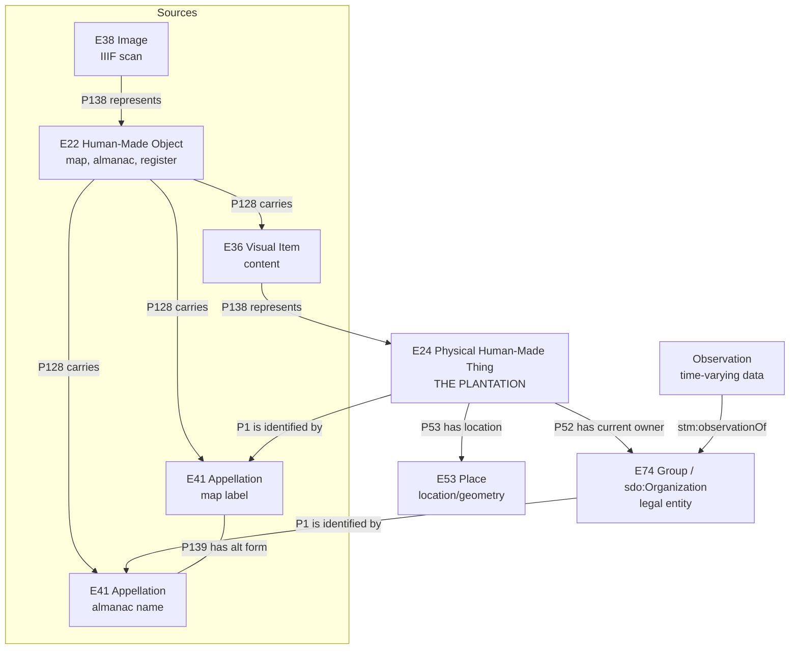
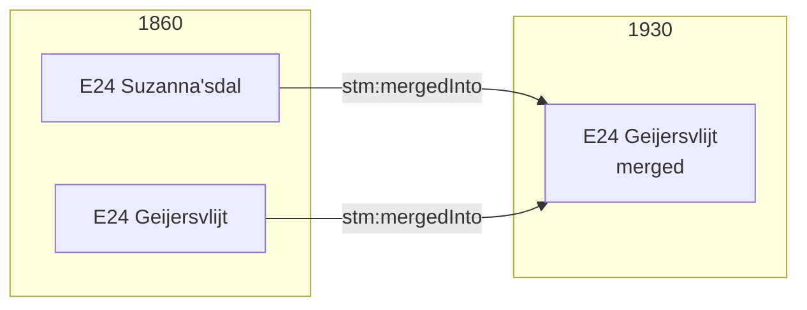
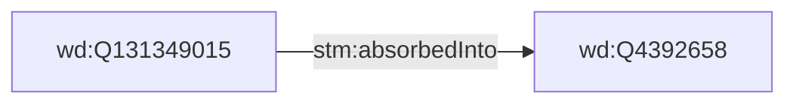

# Data Model Skill

Quick reference for Suriname Time Machine data modeling. For rationale, see [ARCHIVE-conceptual-thinking.md](ARCHIVE-conceptual-thinking.md). For validation, see [CHECKLIST.md](CHECKLIST.md).

## Core Model: E24 Plantation as Central Entity

The **plantation** (E24 Physical Human-Made Thing) is the main entity. E24 and E74 are **separate entities** linked via `P52 has current owner`. Names are modeled as **E41 Appellation** entities carried by sources (E22).



| Entity       | Class                         | Role                                       |
| ------------ | ----------------------------- | ------------------------------------------ |
| Plantation   | E24 Physical Human-Made Thing | Main entity - the physical plantation      |
| Location     | E53 Place                     | Where the plantation is (geometry)         |
| Organization | E74 Group / sdo:Organization  | Who owns/operates it (separate entity)     |
| Appellation  | E41 Appellation               | Name of plantation/organization            |
| Source       | E22 Human-Made Object         | Map, book, ledger depicting the plantation |
| Observation  | stm:OrganizationObservation   | Annual snapshot from Almanakken            |

## E24 and E74: Separate Entities

The physical plantation (E24) is NOT the same thing as the legal organization (E74). They are linked:

```
E24 Plantation ──P52 has current owner──> E74 Organization (wd:Q-ID)
E24 Plantation ──P51 has former or current owner──> E74 Organization (wd:Q-ID)
```

- `P52 has current owner` (E18 Physical Thing -> E39 Actor): legal owner at time of record
- `P51 has former or current owner` (E18 Physical Thing -> E39 Actor): ownership at any time

The postgres schema junction table `e24_e74_ownership` carries `relationship_type` (owner | operator | administrator) and `certainty` for nuance that RDF handles via PICO roles.

## E41 Appellation: Names as First-Class Entities

Names are modeled as **E41 Appellation** (subclass of E90 Symbolic Object), connected via:

- `P1 is identified by` (E1 CRM Entity -> E41 Appellation): names any entity
- `P128 carries` (E18 Physical Thing -> E90 Symbolic Object): source carries the name
- `P139 has alternative form` (E41 -> E41): links variant spellings
- `P190 has symbolic content` (E90 -> string): the actual text of the name

Each source creates its own E41 instance that identifies the entity type it refers to. A map label (printed cartography) identifies the physical plantation (E24). An almanac entry (handwritten table) identifies the organization (E74). These are **distinct E41 instances**, linked to each other by P139 has alternative form.

Name provenance flows through the source chain:

```
E22 Map 1930 ──P128 carries──> E41a "Geijersvlijt" ──P1i identifies──> E24 Plantation
E22 Almanac 1818 ──P128 carries──> E41b "Geyers-Vlijt" ──P1i identifies──> E74 Organization

E41a ──P139 has alternative form──> E41b
E24 ──P52 has current owner──> E74 (linked via Q-ID)
```

The P139 link between E41a and E41b makes the name equivalence explicit without conflating the physical thing with the legal entity. Temporal scope of a name is inferred from the E12 Production event of the E22 source that carries it. No separate E15 Identifier Assignment needed.

`skos:prefLabel` is kept as a convenience display label alongside the formal E41 chain.

## Universal Source Pattern

All sources follow this chain (including appellations):

```
E22 Map ──P128 carries──> E36 Visual Item ──P138 represents──> E24 Plantation
        ──P128 carries──> E41a (map label) ──P1i identifies──> E24

E22 Almanac ──P128 carries──> E41b (almanac name) ──P1i identifies──> E74 Organization

E41a ──P139 has alternative form──> E41b

E38 Image (scan) ──P138 represents──> E22
E24 ──P53 has location──> E53 Place
E24 ──P52 has current owner──> E74
```

Key insight: **Maps depict plantations (E24); plantations have locations (E53)**. The map does NOT depict the location directly. Each source type carries names (E41) that identify its own entity type: map labels identify E24, almanac names identify E74.

## URI Patterns

```
Plantation:     stm:plantation/{name-slug}
Location:       stm:place/{year}/fid-{fid}     (from QGIS polygon)
Organization:   wd:{Q-ID}                       (Wikidata URI)
Appellation:    stm:appellation/{slug}          (name entity)
Source:         stm:source/{type}-{id}
Observation:    stm:obs/{recordid}              (from Almanakken)
```

## Entity Properties

### Plantation (E24 Physical Human-Made Thing)

```
crm:P1_is_identified_by  - E41 Appellation (formal name)
skos:prefLabel            - canonical display label (@nl)
crm:P2_has_type           - PlantationStatus (Built/Planned/Abandoned/Unknown)
crm:P53_has_location      - E53 Place (the geometry)
crm:P52_has_current_owner - E74 Organization (via Q-ID)
crm:P51_has_former_or_current_owner - for historical ownership
prov:wasDerivedFrom       - source that depicts this
```

### Location (E53 Place)

```
stm:fid              - QGIS feature ID
stm:mapYear          - year of source map
stm:observedLabel    - label from map (if any)
geo:hasGeometry      - polygon (geo:asWKT)
```

### Organization (E74 Group / sdo:Organization)

```
crm:P1_is_identified_by - E41 Appellation (formal name)
skos:prefLabel           - canonical display label (@nl)
sdo:additionalType       - wd:Q188913 (plantation type)
stm:absorbedInto         - if absorbed by another org
```

### Appellation (E41 Appellation)

```
crm:P190_has_symbolic_content - the actual name string
crm:P139_has_alternative_form - variant spelling (another E41)
crm:P128i_is_carried_by       - E22 source that records this name
crm:P72_has_language           - E56 Language (e.g. nl, sr)
```

### Observation (from Almanakken)

```
stm:observationOf      - Organization (Q-ID)
stm:observationYear    - year
stm:observedName       - name as recorded (also an E41)
stm:hasOwner           - eigenaren (-> PersonObservation)
stm:hasAdministrator   - administrateurs (-> PersonObservation)
stm:hasDirector        - directeuren (-> PersonObservation)
stm:enslavedCount      - slaven
stm:hasProduct         - product_std
prov:hadPrimarySource  - almanac source
```

## Data Source Mapping

### QGIS CSV -> Plantation + Location + Appellation

| CSV Column       | Entity             | Property                                     |
| ---------------- | ------------------ | -------------------------------------------- |
| fid              | Location (E53)     | stm:fid                                      |
| coords           | Location (E53)     | geo:hasGeometry                              |
| label_1930       | Appellation (E41)  | P190 (creates E41, P1 on E24)                |
| label_1860-79    | Appellation (E41)  | P190 (alt E41, P139 variant)                 |
| plantation_label | Plantation (E24)   | skos:prefLabel (display)                     |
| qid              | Plantation (E24)   | P52 has current owner -> wd:Q-ID             |
| qid_alt          | Organization (E74) | P51 former owner, stm:absorbedInto qid       |
| psur_id          | Organization (E74) | skos:closeMatch psur:{ID} (flawed, see note) |
| psur_id2         | Organization (E74) | skos:closeMatch (2nd, from merger)           |
| psur_id3         | Organization (E74) | skos:closeMatch (3rd, from merger)           |

### Almanakken CSV -> Observation + Appellation

| CSV Column        | Property                            | Priority |
| ----------------- | ----------------------------------- | -------- |
| recordid          | URI                                 | core     |
| year              | stm:observationYear                 | core     |
| plantation_id     | stm:observationOf (Q-ID)            | core     |
| plantation_org    | E41 Appellation (P190, P1 on E74)   | core     |
| plantation_std    | E41 Appellation (standardized)      | core     |
| eigenaren         | stm:hasOwner (-> PersonObs)         | core     |
| administrateurs   | stm:hasAdministrator (-> PersonObs) | core     |
| directeuren       | stm:hasDirector (-> PersonObs)      | core     |
| slaven            | stm:enslavedCount                   | core     |
| psur_id           | skos:closeMatch psur:{ID} (flawed)  | linking  |
| product_std       | stm:hasProduct                      | primary  |
| deserted          | stm:isDeserted (boolean)            | primary  |
| loc_std           | stm:locationStd (string for now)    | primary  |
| size_std          | stm:sizeAkkers                      | primary  |
| page              | stm:pageReference (provenance)      | useful   |
| split1_id..5_id   | stm:absorbedInto (merger network)   | linking  |
| split1_lab..5_lab | labels for merged plantations       | linking  |
| partof_lab        | stm:partOf label                    | linking  |
| part_of_id        | stm:partOf (Q-ID)                   | linking  |
| reference_std_id  | stm:referencedBy (Q-ID)             | linking  |
| reference_std_lab | label for reference plantation      | linking  |
| function          | stm:function (free text)            | deferred |
| additional_info   | stm:additionalInfo (free text)      | deferred |

## Linking Plantations to Organizations

The Q-ID connects everything:

```
QGIS CSV (qid) ──> E24 ──P52 has current owner──> E74 (wd:Q-ID)
                                                       ^
Almanakken CSV (plantation_id) ──> Observation ──> E74 (wd:Q-ID)
```

Each source creates distinct E41 instances identifying different entity types:

```
E22 Map 1930 ──P128 carries──> E41a "Geijersvlijt" ──P1i identifies──> E24 (stm:plantation/geijersvlijt)
E22 Almanac  ──P128 carries──> E41b "Geyers-Vlijt" ──P1i identifies──> E74 (wd:Q4392658)
E41a ──P139 has alternative form──> E41b
```

For uncertain links, use qualified link entity:

```
stm:link/{plantation}_{Q-ID}
    stm:plantation      - E24
    stm:organization    - wd:Q-ID
    stm:linkCertainty   - Certain / Probable / Uncertain
    stm:linkEvidence    - explanation
```

## Type Vocabularies (E55)

### Plantation Status

- `stm:PlantationStatus_Built` - physically constructed
- `stm:PlantationStatus_Planned` - plan only, never built
- `stm:PlantationStatus_Abandoned` - ceased operations
- `stm:PlantationStatus_Unknown` - can't determine

### Link Certainty

- `stm:Certainty_Certain` - confirmed match
- `stm:Certainty_Probable` - likely match
- `stm:Certainty_Uncertain` - tentative

## Temporal Changes

### Plantation Mergers

When plantations merge, the E24 entities merge (not just locations):



### Organization Absorption



## People Connection (PICO-compatible)

Almanac columns map to PICO PersonObservation roles:

| Almanac Column  | PICO Role           | Connection to E74    |
| --------------- | ------------------- | -------------------- |
| eigenaren       | picot:owner         | P52i person owns E24 |
| administrateurs | picot:administrator | P107 member of E74   |
| directeuren     | picot:director      | P107 member of E74   |

Each almanac row creates PersonObservations:

```
Observation (1818, Q4392658)
    --observes--> E74 Geyersvlijt (wd:Q4392658)
    --has PersonObservation--> "J.C. Geyer" (pico:hasRole picot:owner)
    --has PersonObservation--> "J. Petsch" (pico:hasRole picot:director)
```

PersonObservations can be linked to PersonReconstructions (derived identities).

## Key Decisions

1. **E24 is the main plantation entity** - physical thing depicted by sources
2. **E24 and E74 are separate entities** - linked via P52/P51 (not dual-typed)
3. **E41 Appellation for names** - first-class entities, not just SKOS labels
4. **Each source creates distinct E41** - map labels identify E24, almanac names identify E74, linked by P139
5. **P52 has current owner** connects E24 to E74 (standard CIDOC-CRM, not custom stm:operatedBy)
6. **Name provenance via source chain** - E22 P128 carries E41 (name came from this source)
7. **skos:prefLabel kept as display convenience** alongside formal E41 chain
8. E53 Place = location property of E24 (not separate "land plot" entity)
9. E22 Human-Made Object for sources - maps are physical artifacts
10. E36 Visual Item carries what source depicts
11. P138 represents connects content to E24 (not to E53 directly)
12. P53 has location connects E24 to E53
13. sdo:Organization for PICO compatibility
14. Q-ID as linking key between QGIS and Almanakken
15. OrganizationObservation for time-varying attributes
16. Qualified links with certainty for uncertain matches
17. E55 Type for status vocabularies
18. GeoSPARQL for geometry on E53
19. No emojis in any files
20. erDiagram doesn't support %% comments
21. P131 is deprecated in CIDOC-CRM v7.3.1 - use P1 only

## Formatting Rules

- No emojis anywhere
- Mermaid erDiagram: use YAML frontmatter, NOT %% comments
- Mermaid flowchart: %% comments OK
- See diagram files in docs/models/
