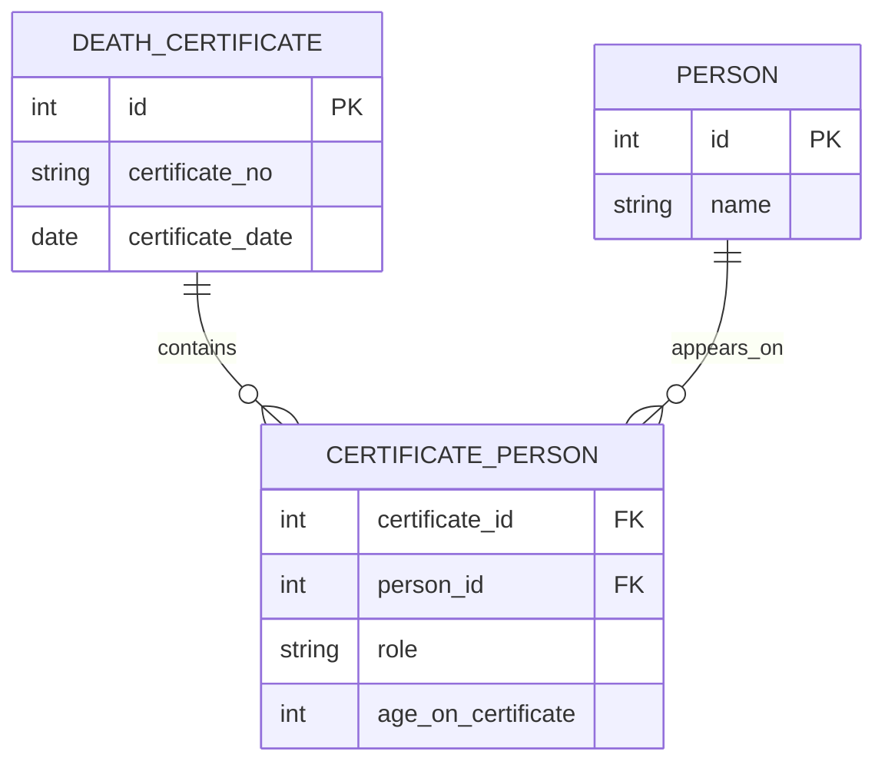
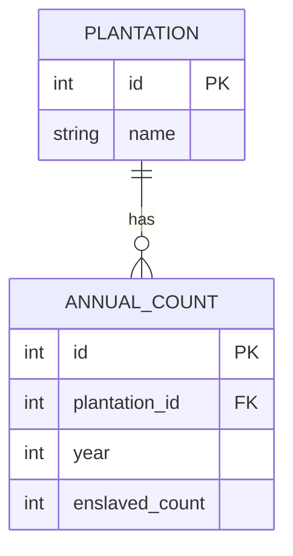

# Source to Model: Tracing Transformations

> How data moves from original sources to our database, what changes, what gets lost. Trying to keep track so I can reverse my decisions if needed.

---

## Why This Document Exists

Every time I normalise data, I make choices. "These two things are the same entity." "This column should be extracted into a separate table." "This implicit information should be made explicit."

Each choice loses something and gains something. I want to document the choices so that:

1. I can see where data came from (provenance)
2. I can reconstruct the original if I change my mind (reversibility)
3. I can explain decisions to others (transparency)
4. I can spot when I've introduced errors (debugging)

This is also part of the ethical framework. If I'm going to interpret colonial records, I should be explicit about what interpretation I'm adding.

---

## The Fundamental Tension

**Original records are messy.** Names are spelled inconsistently. Dates are incomplete. Relationships are implied, not stated. One document might contradict another.

**Databases want structure.** Primary keys. Foreign keys. Controlled vocabularies. One row per entity.

The transformation from messy source to clean database involves dozens of small decisions. Most of them are probably fine. Some of them might be wrong. Without documentation, I can't tell which is which.

---

## Pattern: Flat to Relational

This is the most common transformation I do.

### Example: Death Certificates

The source CSV has columns like:

```
certificate_no, deceased_name, deceased_age, spouse_1_name, spouse_1_age, spouse_2_name, spouse_2_age, ...
```

Up to four spouses, each with their own set of columns.

Problems with this structure:

- If someone has no spouse, there are empty columns
- If someone has five spouses (unlikely but possible), there's no column
- Querying "find all appearances of Maria" requires checking multiple columns

The relational solution:



**What I gain:** Flexibility, queryability.

**What I lose:** The structure of the original document. The source said "spouse_1" and "spouse_2," which implies an ordering. My junction table doesn't preserve that ordering unless I add a column for it.

**Do I care?** Maybe. The "spouse_1" slot might have meant something (first marriage? most recent? primary?). I don't know. By flattening to "role = spouse," I lose the distinction.

**Current decision:** Add an `order_in_source` column to preserve the original slot position. I can ignore it in queries but it's there if I need it.

---

## Pattern: Implicit to Explicit

Sometimes the source encodes meaning in structure rather than data.

### Example: Almanakken (Yearly Data)

The source has plantation counts by year as columns:

```
| plantation | 1801 | 1802 | 1803 | ... |
| De Hoop    | 150  | 148  | 152  | ... |
```

The year is the column header, not a data value.

Transformation:



**What I gain:** Can query by year. Can add new years without schema changes. Standard SQL works.

**What I lose:** Nothing really? This one feels like pure improvement.

**But wait:** The source might have footnotes or special markings on individual cells. Those would be lost in the transformation. Need to check the actual source format.

---

## Pattern: Names

This one I keep revisiting.

### The Problem

A slave register has a column "name." It contains "Jan."

Questions:

- Is "Jan" the name this person called themselves?
- Is it a name given by an enslaver?
- Is it a baptismal name?
- Is there another name we don't know?

The source doesn't tell us. It just says "Jan."

### My Current Approach

```sql
CREATE TABLE person_name (
    id SERIAL PRIMARY KEY,
    person_id INTEGER REFERENCES person(id),
    name_value TEXT NOT NULL,
    name_type TEXT,  -- 'enslaver_given', 'self_identified', 'unknown', etc.
    source_id INTEGER REFERENCES source_document(id),
    is_primary BOOLEAN DEFAULT FALSE
);
```

When I import from a slave register, I set `name_type = 'unknown'`. I don't assume it was enslaver-given (though it probably was). I don't assume it wasn't self-identified (though it probably wasn't).

If later research reveals more about the name's origin, I can update `name_type`.

**Open question:** Should `name_type` be a controlled vocabulary? A lookup table? Or just a text field with conventions?

Currently using text. Easier to start, but risks inconsistency. Will probably add constraints later.

---

## Pattern: Certainty

How do I record that I'm not sure about something?

### Approach 1: At the Field Level

Add a `*_certainty` column for each uncertain field.

```sql
birth_year INTEGER,
birth_year_certainty TEXT  -- 'definite', 'probable', 'possible', 'uncertain'
```

**Problem:** Table gets wide. Every field potentially needs its twin.

### Approach 2: At the Record Level

One certainty field per record.

```sql
CREATE TABLE person (
    ...
    overall_certainty TEXT
);
```

**Problem:** Different aspects might have different certainty. I might be sure about the name but uncertain about the birth year.

### Approach 3: Interpretation Table

```sql
CREATE TABLE interpretation (
    id SERIAL PRIMARY KEY,
    entity_type TEXT,
    entity_id INTEGER,
    field_name TEXT,
    field_value TEXT,
    certainty TEXT,
    evidence TEXT,
    interpreter TEXT,
    interpreted_at TIMESTAMP
);
```

Every claim is an interpretation. The `person` table becomes just identifiers; all the actual data lives in `interpretation`.

**Problem:** Queries become complex. "Find everyone born before 1800" requires joining to interpretation and filtering by field_name.

**Current approach:** Mix of 1 and 3. Core fields have inline certainty. Complex or contested claims go in an interpretation table.

This is messy. I'm not happy with it. But I haven't found a cleaner solution.

---

## Specific Source Transformations

### Death Certificates

| Source Field       | Target Table       | Target Field       | Notes                |
| ------------------ | ------------------ | ------------------ | -------------------- |
| CERTIFICATE_NUMBER | death_certificate  | certificate_no     | Direct copy          |
| DECEASED_NAME      | person             | (via person_name)  | Create/match person  |
| DECEASED_AGE       | certificate_person | age_on_certificate | Might be estimated   |
| DECEASED_SEX       | person             | sex                | Standardise to M/F/U |
| SPOUSE_1_NAME      | person             | (via person_name)  | Create/match person  |
| ...                | ...                | ...                | ...                  |

**Matching:** When I see a name, do I create a new person or match to an existing one? This is the hardest part. Currently using conservative matching: only match if there's strong evidence it's the same person. Better to have duplicates than wrong merges.

### Slave Registers

| Source Field | Target Table | Target Field                  | Notes                      |
| ------------ | ------------ | ----------------------------- | -------------------------- |
| REG_NUMBER   | person       | external_id                   | Per-source identifier      |
| NAME         | person_name  | name_value                    | Always enslaver-context    |
| PLANTATION   | organisation | (via organisation_membership) | Match to plantation lookup |
| ...          | ...          | ...                           | ...                        |

**Plantation matching:** The register has free text like "De Hoop" or "D'Hoop" or "de hoop" or "Plantage de Hoop". These all need to match to the same organisation. I'm building a lookup table of variants.

### QGIS Maps

This is different because the source isn't tabular. It's spatial features with attributes.

| Source           | Target Table             | Notes                        |
| ---------------- | ------------------------ | ---------------------------- |
| Polygon geometry | map_feature.geometry     | Direct copy                  |
| Feature label    | map_feature.label_text   | OCR/HTR text                 |
| Layer            | map_feature.feature_type | Encodes what kind of feature |
| (interpretation) | place                    | Link from feature to place   |

The key insight: the map feature and the place are different things. The feature is what's on the map. The place is what we think it represents. They shouldn't be the same record.

---

## What I'm Still Working Out

### Versioning

When I update a transformation (realise I was parsing a field wrong), what happens to data already imported?

Options:

- Re-import everything (clean but slow)
- Mark old imports and add new ones (messy but traceable)
- Update in place and log the change (efficient but loses history)

Haven't decided.

### Batch vs. Incremental

Should I process all sources at once, or one at a time?

One at a time is easier to debug. All at once might catch cross-source issues (same person appearing in multiple sources).

Currently doing one at a time, then a separate reconciliation pass.

### Reversibility

I keep saying transformations should be reversible. But I'm not actually testing this. Maybe I should write scripts that go from database back to source format, and verify they match.

**To do:** Pick one source and implement round-trip transformation. See where it breaks.

---

## References

**Muller, Samuel, et al.** _Manual for the Arrangement and Description of Archives_. 1898.
The classic. About physical archives, but the principles of provenance and original order apply to digital transformation.

**Renear, Allen H., and Carole L. Palmer.** "Strategic Reading, Ontologies, and the Future of Scientific Publishing." _Science_ 325 (2009).
On the tension between document structure and data structure.

---

7 January 2026
