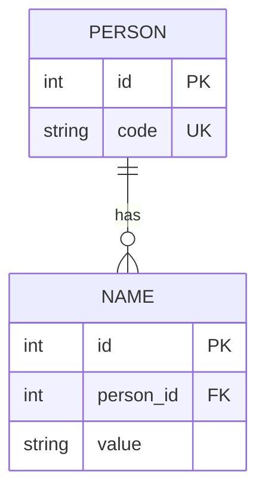
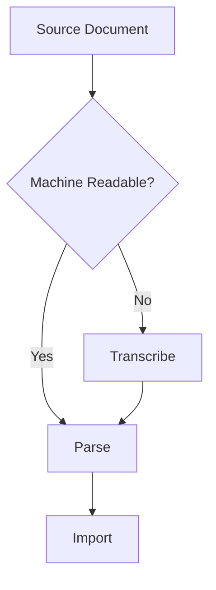
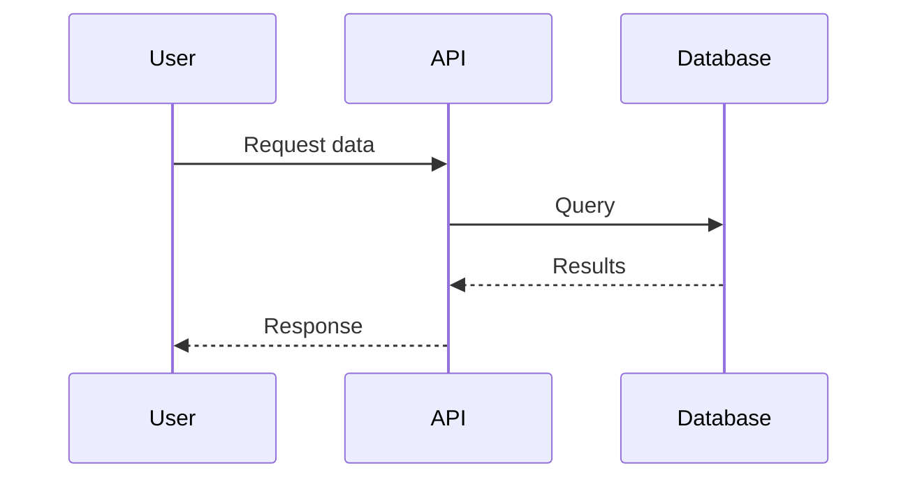
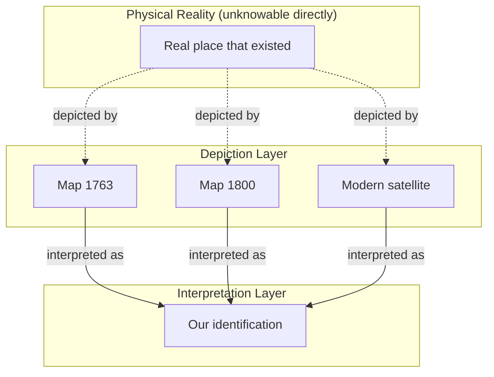
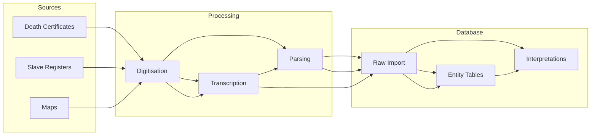
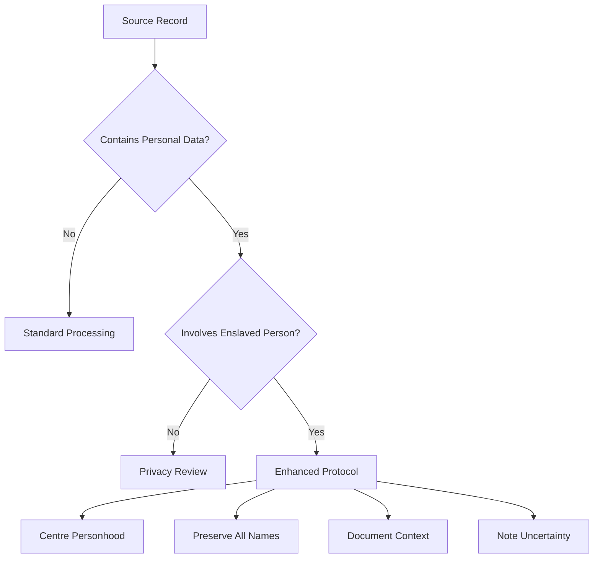

# Visualisation: Notes on Diagrams

> How to draw things, what the diagrams mean, which tools I'm using.

---

## Why Diagrams

I think in pictures more than in text. When I'm trying to understand a data model, I need to draw it. A page of table definitions doesn't stick in my head the way a diagram does.

Also: the act of drawing forces precision. If I can't draw the relationship between two entities, I probably don't understand it well enough.

---

## Mermaid

I'm using Mermaid for diagrams embedded in Markdown. The syntax is readable, it renders in GitHub, and I don't need a separate tool.

### Entity-Relationship Diagrams

This is what I use most. Shows tables and how they connect.



The notation:

- `||` means exactly one
- `o|` means zero or one
- `|{` means one or more
- `o{` means zero or more

So `PERSON ||--o{ NAME` means: one person can have zero or more names; each name belongs to exactly one person.

I always have to look up the symbols. They're not intuitive to me.

### Flowcharts

For processes and decisions.



TD is top-down. LR is left-right.

### Sequence Diagrams

For showing interactions between systems.



Solid arrows are calls, dashed arrows are returns.

---

## Viewing in VS Code

I installed **Markdown Preview Mermaid Support** (extension ID: `bierner.markdown-mermaid`). Now when I preview a Markdown file, the diagrams render.

**Gotcha:** The preview doesn't always update when I change the Mermaid code. Sometimes I have to close and reopen the preview.

**Alternative:** There's **Markdown Preview Enhanced** which has more features but feels heavier. I'm sticking with the simpler one for now.

---

## Mermaid Live Editor

For drafting diagrams, I use https://mermaid.live/

Benefits:

- Real-time preview
- Shows errors with line numbers
- Can export to PNG/SVG
- Can share via URL

I draft there, then paste into the Markdown file.

---

## Diagrams I Keep Coming Back To

### The Three-Layer Model

This is from the [location model](../models/location-model.md). I've drawn versions of this probably ten times.



The dotted lines are "we assume this" (the real place caused the depiction, but we can't prove it). The solid lines are "we assert this" (we've decided these depictions show the same place).

### Source to Database Flow

How data moves from original sources to our system.



This is oversimplified. The real flow has branches, loops, error handling. But it captures the basic shape.

### Ethical Decision Tree

From the [ethical framework](./ethical-framework.md). Not sure if this is actually useful or just me thinking out loud.



---

## Things I Haven't Figured Out

### Class diagrams for conceptual models

Mermaid has class diagrams, but they feel like UML for code, not for concepts. I want to show "Person is an Entity" without implying implementation inheritance.

I've tried using them but the results look wrong.

### Temporal visualisation

How do I show something changing over time in a static diagram? A place that moves, a person with different names at different periods.

I've seen timeline diagrams but Mermaid doesn't support them natively. There are extensions but I haven't tried them.

### Uncertainty in diagrams

When I draw a relationship, it looks definite. How do I show "maybe this, or maybe that"? Dashed lines sometimes, but that's ad hoc.

---

## Export for Publications

If I ever need these diagrams outside of Markdown (papers, presentations), I can:

1. Screenshot from the preview (quick and dirty)
2. Use Mermaid CLI to export PNG/SVG:
   ```bash
   npm install -g @mermaid-js/mermaid-cli
   mmdc -i diagram.mmd -o diagram.png
   ```
3. Use the Live Editor export feature

For publication quality, probably option 2 or 3. For internal docs, screenshots are fine.

---

## A Note on Aesthetics

Mermaid diagrams are not beautiful. They're functional. The auto-layout sometimes does weird things (nodes in the wrong order, edges crossing unnecessarily).

I've accepted that I can't control layout precisely. If I need a beautiful diagram, I'll use something else (Figma, draw.io). For working notes, Mermaid is good enough.

---

_Last edited: 2025-01-06_
