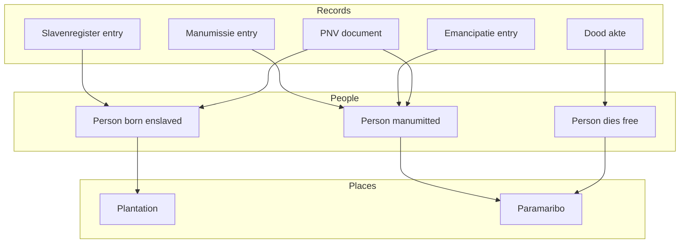

# Data sources overview

All datasets we are integrating and where they come from.

---

## The datasets

| #   | name                   | records  | period      | what                   |
| --- | ---------------------- | -------- | ----------- | ---------------------- |
| 01  | Plantagen 1900         | ~40      | 1900        | plantation survey      |
| 02  | Slavenregisters        | ~82,000  | 1830-1863   | slave registers        |
| 03  | Emancipatieregisters   | ~34,000  | 1863        | emancipation records   |
| 04  | Surinaamse manumissies | ~9,000   | 1832-1863   | manumissions           |
| 05  | PNV 18e-19e            | ~280,000 | 1700-1838   | vrijbrieven, contracts |
| 06  | Doodakten Suriname     | ~30,000  | 1828-1935   | death certificates     |
| 07  | QGIS Maps              | varies   | 18th-19th c | georeferenced maps     |
| 08  | HDSC Transcriptions    | large    | various     | transcription files    |
| 09  | Heritage Guide 3D      | ~66      | various     | monuments              |

Some overlap. Manumissions appear in multiple places. Same persons appear across datasets at different life stages.

---

## Temporal coverage

```
Dataset          1700    1750    1800    1850    1900    1950
                 |       |       |       |       |       |
PNV 18e-19e     [===============================]
Slavenregisters                         [=======]
Manumissies                             [=======]
Emancipatie                                   [=]
Doodakten                               [================]
Plantagen 1900                                  [=]
Heritage 3D     [==================================]
QGIS Maps       [==================================]
```

PNV is the spine. Most records, longest timespan. But least structured (document images). Slavenregisters most structured. Death certificates bridge into 20th century.

---

## How they connect



One person, multiple records across life. Key challenge is linking them.

---

## Key identifiers

Each dataset has its own ID scheme as it seems:

| dataset         | id field        | example    |
| --------------- | --------------- | ---------- |
| Slavenregisters | PSUR_ID         | PSUR_12345 |
| Manumissies     | Id_person       | 5678       |
| Doodakten       | original_scanid | scan_001   |
| QGIS maps       | (none)          | -          |
| Heritage 3D     | Wikidata Q-ID   | Q12345678  |

---

## Reading order

Suggest going through docs in order:

1. this overview
2. each numbered source doc (01 through 09)
3. HDSC questions for outstanding issues

Each doc has same structure: what it is, what fields, how it connects, problems, todo.

---

7 January 2026
