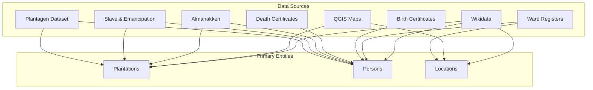

# Data Sources Overview

> Inventory of all datasets for the Suriname Time Machine database project.

## Dataset Summary

| #   | Dataset                                                    | Time Period | Rows    | Columns | Primary Entity      | Source                                  |
| --- | ---------------------------------------------------------- | ----------- | ------- | ------- | ------------------- | --------------------------------------- |
| 1   | [Suriname Plantagen Dataset](01-plantagen-dataset.md)      | 1700–1863   | 375     | 15      | Plantations         | [@RosenbaumFeldbrugge2024-plantagen]    |
| 2   | [Death Certificates](02-death-certificates.md)             | 1845–1915   | 192,335 | 38      | Death records       | [@vanOort2023-deathcert]                |
| 3   | [Birth Certificates](03-birth-certificates.md)             | 1828–1921   | 63,200  | 32      | Birth records       | [@Collection2024-birthcert]             |
| 4   | [Ward Registers](04-ward-registers.md)                     | 1828–1847   | 102,260 | 40      | Persons (census)    | [@KasteleijnvanOort2024-ward]           |
| 5   | [Slave & Emancipation Registers](05-slave-emancipation.md) | 1830–1863   | 95,388  | 38      | Enslaved persons    | [@RosenbaumFeldbrugge2023-emancipation] |
| 6   | [Surinaamse Almanakken](06-almanakken.md)                  | 1819–1935   | 22,000  | 60      | Plantation records  | [@vanOort2023-almanakken]               |
| 7   | [QGIS Maps](07-qgis-maps.md)                               | 1763–1861   | ~300    | varies  | Geographic features | Own digitization                        |
| 8   | [Wikidata](08-wikidata.md)                                 | —           | —       | —       | External references | [@Wikidata2024]                         |
| 9   | [Heritage Guide / 3D Models](09-heritage-guide-3d.md)      | —           | TBD     | TBD     | Historic buildings  | Suriname Heritage Guide                 |

---

## Map Temporal Coverage Visualization

```
Year:    1700  1750  1800  1850  1900  1950
         |     |     |     |     |     |
Plantagen ████████████████████░░░░░░░░░░░░  (1700-1863)
Slave/Em  ░░░░░░░░░░░░████████░░░░░░░░░░░░  (1830-1863)
Ward Reg  ░░░░░░░░░░░░░████░░░░░░░░░░░░░░░  (1828-1847)
Birth     ░░░░░░░░░░░░░███████████████░░░░  (1828-1921)
Death     ░░░░░░░░░░░░░░░███████████░░░░░░  (1845-1915)
Almanak   ░░░░░░░░░░░░████████████████████  (1819-1935)
QGIS Maps ░░░░░████░░░░░████░░░░░░░░░░░░░░  (1763, 1817, 1840, 1861)
```

---

## Entity Connections Across Datasets



---

## Data Source Categories

### 1. **Plantation-centric datasets**

Sources where plantations are the primary entity:

- Plantagen Dataset (plantation-level aggregates)
- Almanakken (plantation management records)
- QGIS Maps (plantation geographic locations)

### 2. **Person-centric datasets**

Sources where individuals are the primary entity:

- Death Certificates (deceased persons + witnesses)
- Birth Certificates (children + parents + witnesses)
- Ward Registers (household census records)
- Slave & Emancipation Registers (enslaved individuals)

### 3. **Geographic datasets**

Sources with spatial information:

- QGIS Maps (georeferenced historic maps)
- Ward Registers (street addresses in Paramaribo)

### 4. **External reference sources**

Sources for linking and enrichment:

- Wikidata (persistent identifiers, biographical data)

---

## Key Identifiers Across Datasets

| Identifier        | Format     | Found In              | Description                      |
| ----------------- | ---------- | --------------------- | -------------------------------- |
| `PSUR_ID`         | `PSUR0001` | Plantagen, Almanakken | Plantation unique identifier     |
| `Id_person`       | integer    | Slave/Emancipation    | Person identifier within dataset |
| `original_scanid` | integer    | Death/Birth Certs     | Link to scanned document         |
| `Wikidata Q-ID`   | `Q123456`  | External              | Wikidata entity identifier       |

---

## Reading Order

For understanding the data landscape, we recommend reading the dataset documentation in this order:

1. **[Plantagen Dataset](01-plantagen-dataset.md)** — Start here: defines the plantation universe
2. **[Slave & Emancipation](05-slave-emancipation.md)** — Individual enslaved persons linked to plantations
3. **[Almanakken](06-almanakken.md)** — Detailed annual plantation records
4. **[QGIS Maps](07-qgis-maps.md)** — Geographic context for plantations
5. **[Ward Registers](04-ward-registers.md)** — Urban population of Paramaribo
6. **[Birth Certificates](03-birth-certificates.md)** — Vital records (births)
7. **[Death Certificates](02-death-certificates.md)** — Vital records (deaths)
8. **[Wikidata](08-wikidata.md)** — External linking strategy

---

_Last updated: 2026-01-06_
