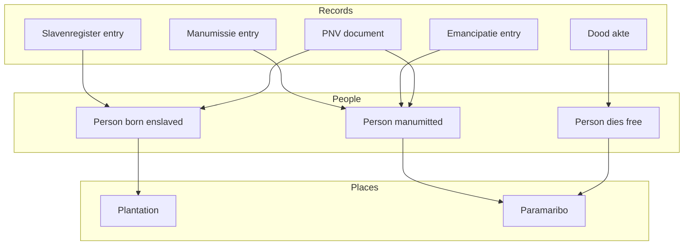

# Data sources overview

All datasets we are integrating and where they come from.

---

## The datasets

| #   | name                                   | records | period      | what                             |
| --- | -------------------------------------- | ------- | ----------- | -------------------------------- |
| 01  | Plantagen dataset (v1.0)               | ~40     | 1900        | plantation survey                |
| 02  | Doodakten Suriname                     | ~30,000 | 1845-1915   | death certificates               |
| 03  | Geboorteakten Paramaribo               | TBD     | 1828-1921   | birth certificates               |
| 04  | Wijkregisters Paramaribo               | TBD     | 1828-1847   | ward registers                   |
| 05  | Slaven- en Emancipatieregisters (v1.1) | TBD     | 1830-1863   | slavery & emancipation registers |
| 06  | Surinaamse Almanakken (Plantages)      | TBD     | 18th-19th c | plantation listings              |
| 07  | QGIS Maps                              | varies  | 18th-20th c | georeferenced maps               |
| 08  | Wikidata                               | varies  | various     | linked open data                 |
| 09  | Heritage Guide 3D                      | ~66     | various     | monuments                        |
| 10  | Historic Map Annotations               | TBD     | 17th-19th c | HTR place names from maps        |

Some overlap. Manumissions appear in multiple places. Same persons appear across datasets at different life stages.

We intentionally keep parallel records (duplicate or near-duplicate entries across sources) to preserve provenance, allow traceable comparisons, and support scientific review of changes and linkages over time.

---

## Temporal coverage

```
Dataset               1700    1750    1800    1850    1900    1950
                      |       |       |       |       |       |
Almanakken           [==========================]
Slaven/Emancipatie                     [=======]
Wijkregisters                         [==]
Geboorteakten                        [===============]
Doodakten                                [===========]
Plantagen 1900                                  [=]
QGIS Maps       [====================================]
Historic Maps   [==================================]
```

Registers provide the most structured person-level data. The plantation dataset and almanakken give place-level snapshots. Historic maps and QGIS layers add spatial context.

---

## How they connect



One person, multiple records across life. Key challenge is linking them.

---

## Key identifiers

Each dataset has its own ID scheme as it seems:

| dataset            | id field      | example                   |
| ------------------ | ------------- | ------------------------- |
| Plantagen dataset  | ID_plantation | PSUR0001                  |
| Doodakten          | id            | SR-NA_2.10.61_1000_0001-r |
| Geboorteakten      | id            | SR-NA_2.10.61_1_0008-r    |
| Wijkregisters      | Id            | 15601                     |
| Slaven/Emancipatie | Id_person     | 12345                     |
| Almanakken         | recordid      | 1818-28-1                 |
| QGIS maps          | (none)        | -                         |
| Heritage 3D        | Wikidata Q-ID | Q12345678                 |

---

## Reading order

Suggest going through docs in order:

1. this overview
2. each numbered source doc (01 through 10)
3. HDSC questions for outstanding issues

Each doc has same structure: what it is, what fields, how it connects, problems, todo.

---

7 January 2026
