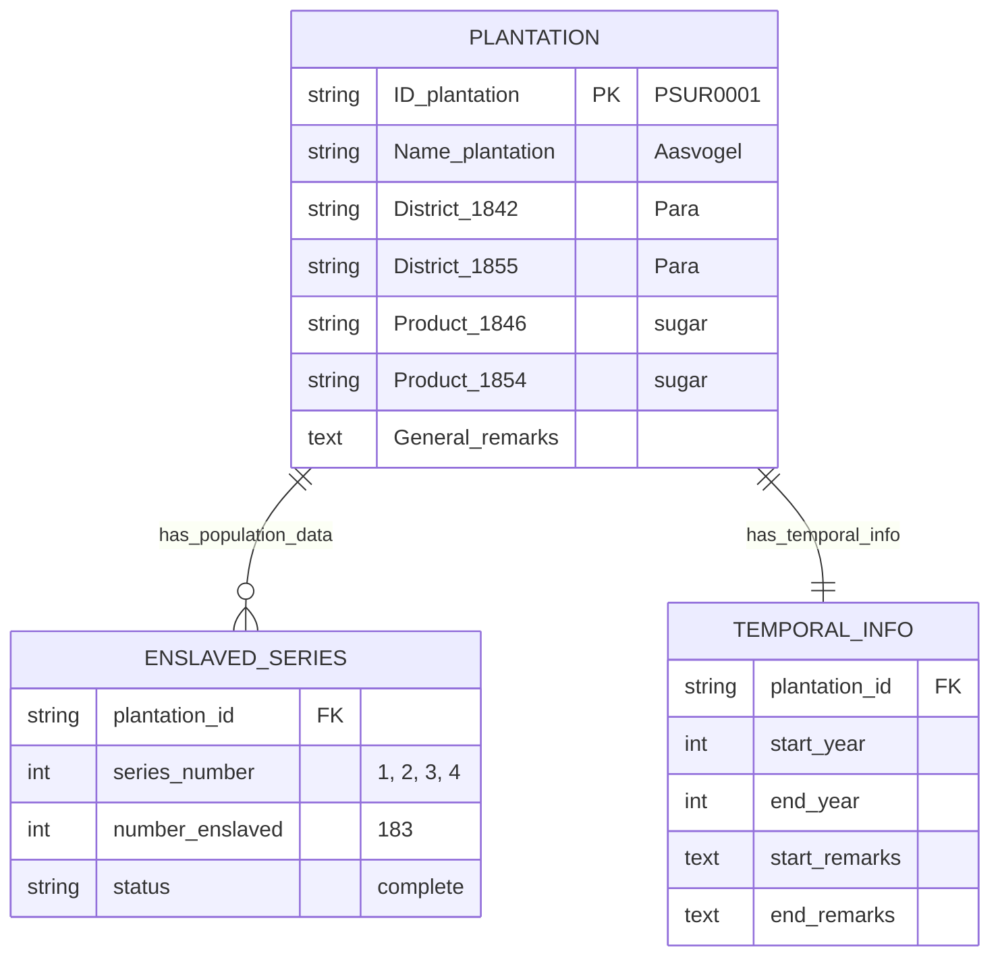
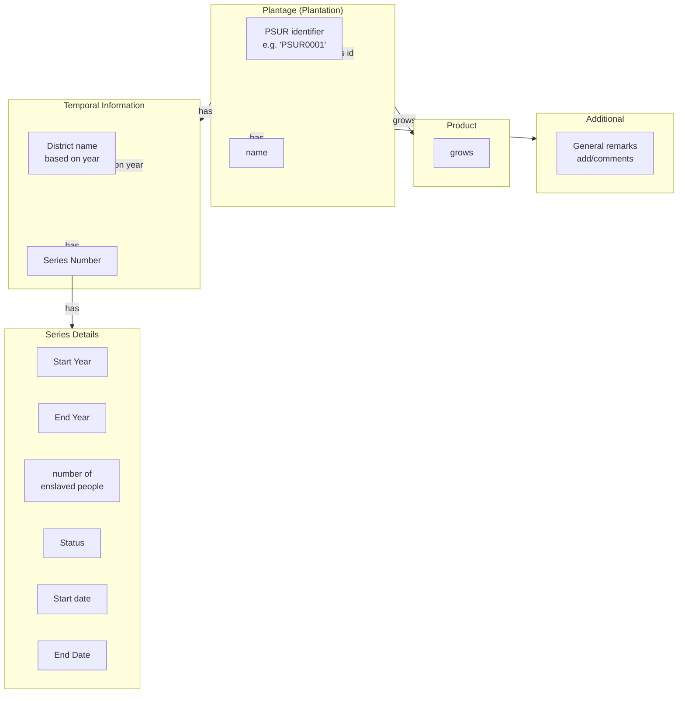

# Suriname Plantagen Dataset (Slave Registers)

> **Version:** 1.1  
> **Citation:** [@RosenbaumFeldbrugge2024-plantagen]  
> **License:** CC BY-SA 4.0  
> **DOI:** [10.17026/SS/YOFINK](https://hdl.handle.net/10622/YOFINK)

---

## Dataset Overview

| Property                | Value                               |
| ----------------------- | ----------------------------------- |
| **Primary Entity**      | Plantations (organizations)         |
| **Time Coverage**       | 1700–1863 (slavery period)          |
| **Data Rows**           | 375                                 |
| **Data Columns**        | 15                                  |
| **File Format**         | CSV                                 |
| **Geographic Coverage** | Suriname (all plantation districts) |

### Purpose

This dataset provides a **master list of Suriname plantations** with:

- Unique identifiers (PSUR IDs)
- plantages are not seen as locations but as organisations
- Enslaved population counts across 4 time series
- Product information at different years
- District classification at different years
- General remarks and historical notes

---

## Field Definitions

Based on the source documentation, the dataset contains these columns:

### Identification

| Field             | Type        | Description                          | Example    | Crucial for Linking | Primary Information |
| ----------------- | ----------- | ------------------------------------ | ---------- | ------------------- | ------------------- |
| `ID_plantation`   | text/string | PSUR identifier (unique key)         | `PSUR0001` |                     |                     |
| `Name_plantation` | text/string | Primary/standardized plantation name | `Aasvogel` |                     |                     |

### Enslaved Population Series

The dataset tracks enslaved population across **4 temporal series**:

| Field                    | Type    | Description                           | Notes      | Crucial for Linking | Primary Information |
| ------------------------ | ------- | ------------------------------------- | ---------- | ------------------- | ------------------- |
| `Serie1_number_enslaved` | integer | Number of enslaved people in Series 1 | ~1830–1840 |                     |                     |
| `Serie2_number_enslaved` | integer | Number of enslaved people in Series 2 | ~1841–1850 |                     |                     |
| `Serie3_number_enslaved` | integer | Number of enslaved people in Series 3 | ~1851–1860 |                     |                     |
| `Serie4_number_enslaved` | integer | Number of enslaved people in Series 4 | ~1861–1863 |                     |                     |

### Series Status

Each series has a status indicating data completeness:

| Field           | Type        | Description              | Values                                | Crucial for Linking | Primary Information |
| --------------- | ----------- | ------------------------ | ------------------------------------- | ------------------- | ------------------- |
| `Serie1_Status` | text/string | Completeness of Series 1 | `complete`, `missing`, `non existent` |                     |                     |
| `Serie2_Status` | text/string | Completeness of Series 2 | `complete`, `missing`, `non existent` |                     |                     |
| `Serie3_Status` | text/string | Completeness of Series 3 | `complete`, `missing`, `non existent` |                     |                     |
| `Serie4_Status` | text/string | Completeness of Series 4 | `complete`, `missing`, `non existent` |                     |                     |

### Temporal Information

| Field           | Type        | Description                      | Notes | Crucial for Linking | Primary Information |
| --------------- | ----------- | -------------------------------- | ----- | ------------------- | ------------------- |
| `StartYear`     | integer     | Start year of plantation records |       |                     |                     |
| `EndYear`       | integer     | End year of plantation records   |       |                     |                     |
| `Start_remarks` | text/string | Notes about start/transfer       |       |                     |                     |
| `Start_date`    | text/string | Specific start date if known     |       |                     |                     |
| `End_remarks`   | text/string | Notes about end/closure          |       |                     |                     |
| `End_date`      | text/string | Specific end date if known       |       |                     |                     |

### Geographic Information

| Field           | Type        | Description      | Notes                              | Crucial for Linking | Primary Information |
| --------------- | ----------- | ---------------- | ---------------------------------- | ------------------- | ------------------- |
| `District_1842` | text/string | District in 1842 | Historical administrative division |                     |                     |
| `District_1855` | text/string | District in 1855 | May differ from 1842               |                     |                     |

### Production Information

| Field          | Type        | Description           | Values                                       | Crucial for Linking | Primary Information |
| -------------- | ----------- | --------------------- | -------------------------------------------- | ------------------- | ------------------- |
| `Product_1846` | text/string | Product grown in 1846 | `sugar`, `coffee`, `cotton`, `cacao`, `food` |                     |                     |
| `Product_1854` | text/string | Product grown in 1854 | Same as above                                |                     |                     |
| `Product_1859` | text/string | Product grown in 1859 | Same as above                                |                     |                     |

### Additional Information

| Field             | Type        | Description                                 | Crucial for Linking | Primary Information |
| ----------------- | ----------- | ------------------------------------------- | ------------------- | ------------------- |
| `General_remarks` | text/string | Additional notes and historical information |                     |                     |

---

## Entity-Relationship Diagram

---

## Data Interpretation Diagram

Based on the conceptual diagram from the source:

---

## Observations & Notes

### Key Design Decisions in Source Data

1. **Denormalized temporal data**: Products and districts at specific years are stored as separate columns (`Product_1846`, `Product_1854`) rather than in a normalized time-series table.

2. **Series-based population tracking**: Enslaved population is organized into 4 temporal series rather than year-by-year counts.

3. **Status tracking**: Each series has a status field to indicate data quality/availability.

### Implications for Database Design

1. **Normalization opportunity**: Convert `Product_YEAR` and `District_YEAR` columns into proper temporal tables for better querying.

2. **Series interpretation needed**: The exact year ranges for Series 1-4 need to be documented (approximately 1830-1840, 1841-1850, 1851-1860, 1861-1863).

3. **PSUR_ID as linking key**: The `ID_plantation` (PSUR ID) serves as the master key for connecting plantation data across datasets (Almanakken, Slave Registers, etc.).

### Questions to Investigate

- [ ] What are the exact date ranges for each series?
- [ ] How do districts map between 1842 and 1855 classifications?
- [ ] Are there plantations that changed products over time?
- [ ] How does this dataset relate to the Slave & Emancipation Registers?

---

## Related Datasets

| Dataset                                          | Relationship                               | Linking Field               |
| ------------------------------------------------ | ------------------------------------------ | --------------------------- |
| [Slave & Emancipation](05-slave-emancipation.md) | Individual enslaved persons on plantations | `Plantation`                |
| [Almanakken](06-almanakken.md)                   | Detailed annual plantation management      | `plantation_id` → `PSUR_ID` |
| [QGIS Maps](07-qgis-maps.md)                     | Geographic plantation locations            | Map features → plantation   |
| [Wikidata](08-wikidata.md)                       | External identifiers                       | `Wikidata_id` if available  |

---

7 January 2026
