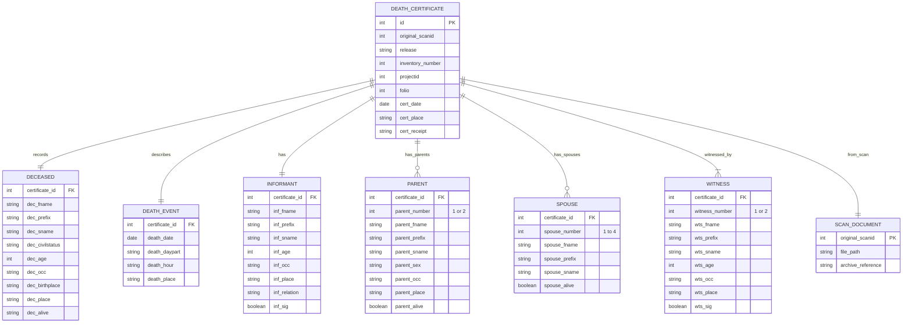
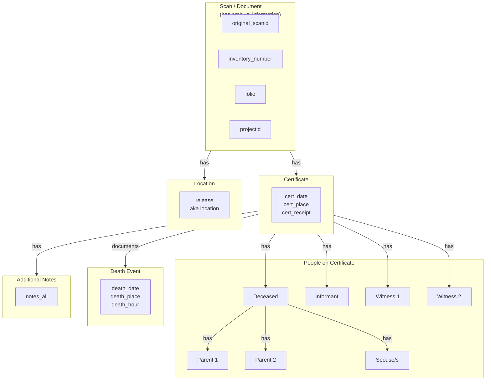

# Suriname Death Certificates 1845-1915

> **Version:** 1.0  
> **Citation:** [@vanOort2023-deathcert]  
> **License:** CC BY-SA 4.0

---

## Dataset Overview

| Property                | Value                              |
| ----------------------- | ---------------------------------- |
| **Primary Entity**      | Death certificates (vital records) |
| **Time Coverage**       | 1845–1915                          |
| **Data Rows**           | 192,335                            |
| **Data Columns**        | 38                                 |
| **File Format**         | CSV                                |
| **Geographic Coverage** | Suriname (Districts + Paramaribo)  |

### Purpose

This dataset contains transcribed **death certificates** from Suriname, including:

- Deceased person information (name, age, occupation, address)
- Death details (date, time, place)
- Certification metadata (certificate date, place, receipt type)
- Informant information (who reported the death)
- Parent information (for the deceased)
- Spouse information (multiple spouses possible)
- Witness information (typically 2 witnesses)
- Archival references (scan ID, inventory number, folio)

---

## Field Definitions

Based on the source documentation screenshot:

### Document Identification

| Field              | Type        | Description                                      | Example      |
| ------------------ | ----------- | ------------------------------------------------ | ------------ |
| `id`               | integer     | Record identifier                                | `1`          |
| `original_scanid`  | integer     | Original scan identifier                         | `12345`      |
| `release`          | text/string | Place name (like Paramaribo)                     | `Paramaribo` |
| `inventory_number` | integer     | Inventory number from National Archives Suriname |              |
| `projectid`        | integer     | Project entry identifier                         |              |
| `folio`            | integer     | Folio number of the birth certificate            |              |

### Certification Metadata

| Field          | Type        | Description                                        | Format/Values                                          |
| -------------- | ----------- | -------------------------------------------------- | ------------------------------------------------------ |
| `cert_date`    | date        | Date the certificate was issued                    | `dd-mm-yyyy`                                           |
| `cert_place`   | text/string | Place the certificate was issued (like Paramaribo) |                                                        |
| `cert_receipt` | text/string | Whether the death was declared in person           | `declared in person` or `declared in a written letter` |

### Informant Identification

The informant is the person who reported the death:

| Field           | Type        | Description                                                     |
| --------------- | ----------- | --------------------------------------------------------------- |
| `inf_fname`     | text/string | First name of the informant                                     |
| `inf_prefix`    | text/string | Prefix (like 'van')                                             |
| `inf_sname`     | text/string | Last name of the informant                                      |
| `inf_age`       | integer     | Age of the informant (format: yy)                               |
| `inf_occ`       | text/string | Occupation of the informant                                     |
| `inf_place`     | text/string | Address of the informant (in form of street name, river, place) |
| `inf_relation`  | text/string | The informant's relation with the deceased (like behende, oom)  |
| `inf_otherinfo` | text/extra  | Other information concerning the informant                      |
| `inf_sig`       | text/string | Whether informant was able to sign the certificate              |
| `inf_sig_other` | text/string | Other information about the informant's signature               |

### Death Information

| Field             | Type        | Description                       | Format       |
| ----------------- | ----------- | --------------------------------- | ------------ |
| `death_date`      | date        | Date of death                     | `dd-mm-yyyy` |
| `death_daypart`   | text/string | Part of the day the deceased died |              |
| `death_hour`      | text/string | Hour of the day the deceased died |              |
| `death_place`     | text/string | Place where the deceased died     |              |
| `death_otherinfo` | text/string | Other information about the death |              |

### Deceased Information

| Field                | Type        | Description                                 |
| -------------------- | ----------- | ------------------------------------------- |
| `dec_fname`          | text/string | First name of the deceased person           |
| `dec_prefix`         | text/string | Surname prefix of the deceased person       |
| `dec_sname`          | text/string | Last name of the deceased person            |
| `dec_civilstatus`    | text/string | Civil status of the deceased person         |
| `dec_age`            | integer     | Age of the deceased person (format: yy)     |
| `dec_occ`            | text/string | Occupation of the deceased person           |
| `dec_birthplace`     | text/string | Place where the deceased person was born    |
| `dec_place`          | text/string | Address of the deceased                     |
| `dec_alive`          | text/string | Sex of the deceased person                  |
| `dec_otherinfo`      | text/string | Other information about the deceased person |
| `dec_prev_residence` | text/string | Previous residence of the deceased person   |

### Parent 1 (of the deceased)

| Field                | Type        | Description                                            |
| -------------------- | ----------- | ------------------------------------------------------ |
| `parent_fname_1`     | text/string | The first name of the first parent of the deceased     |
| `parent_prefix_1`    | text/string | The surname prefix of the first parent of the deceased |
| `parent_sname_1`     | text/string | The last name of the first parent of the deceased      |
| `parent_sex_1`       | text/string | The sex of the first parent of the deceased            |
| `parent_occ_1`       | text/string | The occupation of the first parent of the deceased     |
| `parent_place_1`     | text/string | The address of the first parent of the deceased        |
| `parent_alive_1`     | text/string | Whether the first parent was alive at moment of death  |
| `parent_otherinfo_1` | text/string | Other information about the first parent               |

### Parent 2 (of the deceased)

| Field                | Type        | Description                                             |
| -------------------- | ----------- | ------------------------------------------------------- |
| `parent_fname_2`     | text/string | The first name of the second parent of the deceased     |
| `parent_prefix_2`    | text/string | The surname prefix of the second parent of the deceased |
| `parent_sname_2`     | text/string | The last name of the second parent of the deceased      |
| `parent_sex_2`       | text/string | The sex of the second parent of the deceased            |
| `parent_occ_2`       | text/string | The occupation of the second parent of the deceased     |
| `parent_place_2`     | text/string | The address of the second parent of the deceased        |
| `parent_alive_2`     | text/string | Whether the second parent was alive at moment of death  |
| `parent_otherinfo_2` | text/string | Other information about the second parent               |

### Spouse(s)

The dataset allows for **up to 4 spouses** (historical records may mention multiple marriages):

| Field                | Type        | Description                                        |
| -------------------- | ----------- | -------------------------------------------------- |
| `spouse_fname_1`     | text/string | First name of first spouse (if applicable)         |
| `spouse_prefix_1`    | text/string | Surname prefix of first spouse                     |
| `spouse_sname_1`     | text/string | Last name of first spouse (if applicable)          |
| `spouse_alive_1`     | text/string | Whether first spouse was alive at moment of death  |
| `spouse_otherinfo_1` | text/string | Other information about the first spouse           |
| `spouse_fname_2`     | text/string | First name of second spouse                        |
| `spouse_prefix_2`    | text/string | Surname prefix of second spouse                    |
| `spouse_sname_2`     | text/string | Last name of second spouse                         |
| `spouse_alive_2`     | text/string | Whether second spouse was alive at moment of death |
| `spouse_otherinfo_2` | text/string | Other information about the second spouse          |
| `spouse_fname_3`     | text/string | First name of third spouse                         |
| `spouse_prefix_3`    | text/string | Surname prefix of third spouse                     |
| `spouse_sname_3`     | text/string | Last name of third spouse                          |
| `spouse_alive_3`     | text/string | Whether third spouse was alive at moment of death  |
| `spouse_otherinfo_3` | text/string | Other information about the third spouse           |
| `spouse_fname_4`     | text/string | First name of fourth spouse                        |
| `spouse_prefix_4`    | text/string | Surname prefix of fourth spouse                    |
| `spouse_sname_4`     | text/string | Last name of fourth spouse                         |
| `spouse_alive_4`     | text/string | Whether fourth spouse was alive at moment of death |
| `spouse_otherinfo_4` | text/string | Other information about the fourth spouse          |

### Witness 1

| Field             | Type        | Description                                            |
| ----------------- | ----------- | ------------------------------------------------------ |
| `wts_fname_1`     | text/string | The first name of the first witness                    |
| `wts_prefix_1`    | text/string | The surname prefix of the first witness                |
| `wts_sname_1`     | text/string | The last name of the first witness                     |
| `wts_age_1`       | integer     | Age of the first witness (format: yy)                  |
| `wts_occ_1`       | text/string | Occupation of the first witness                        |
| `wts_place_1`     | text/string | Address of the first witness                           |
| `wts_sig_1`       | text/string | Whether first witness was able to sign the certificate |
| `wts_sig_other_1` | text/string | Other information about the first witness signature    |

### Witness 2

| Field             | Type        | Description                                             |
| ----------------- | ----------- | ------------------------------------------------------- |
| `wts_fname_2`     | text/string | The first name of the second witness                    |
| `wts_prefix_2`    | text/string | The surname prefix of the second witness                |
| `wts_sname_2`     | text/string | The last name of the second witness                     |
| `wts_age_2`       | integer     | Age of the second witness (format: yy)                  |
| `wts_occ_2`       | text/string | Occupation of the second witness                        |
| `wts_place_2`     | text/string | Address of the second witness                           |
| `wts_sig_2`       | text/string | Whether second witness was able to sign the certificate |
| `wts_sig_other_2` | text/string | Other information about the second witness signature    |

### Additional Notes

| Field       | Type        | Description                                                     |
| ----------- | ----------- | --------------------------------------------------------------- |
| `notes_all` | text/string | All notations added by the clerk on the side of the certificate |

---

## Entity-Relationship Diagram



---

## Data Interpretation Diagram

Based on the conceptual diagram from the source:



---

## Data Distribution

From the histogram in the source documentation:

```
Number of Death Certificates per Year, 1845-1915
━━━━━━━━━━━━━━━━━━━━━━━━━━━━━━━━━━━━━━━━━━━━━━━━━━━━━━
Districts: ▬▬▬▬  Paramaribo: ━━━━

Observations:
- Peak around 1865-1875 (post-emancipation period)
- Separate tracking for Districts vs Paramaribo
- Total: 192,335 records over 70 years (~2,747 average per year)
```

---

## Observations & Notes

### Key Design Decisions in Source Data

1. **Flat denormalized structure**: All 38 columns in a single table/row, repeating patterns for Parent 1/2, Spouse 1-4, Witness 1/2.

2. **Multiple spouses**: Up to 4 spouses allowed, reflecting historical marital patterns.

3. **Archival linking**: `original_scanid`, `inventory_number`, `folio` enable linking back to physical documents.

4. **Name structure**: Dutch naming convention with prefix (tussenvoegsel) separated (e.g., `van`, `de`).

### Implications for Database Design

1. **Normalization opportunity**: Create separate `PERSONS` and `VITAL_RECORD_PERSONS` junction tables instead of flat spouse/parent/witness columns.

2. **Role-based person relationships**: Design allows tracking same person as witness on multiple certificates.

3. **Provenance tracking**: The `source_columns` concept becomes important here — a person's name comes from multiple columns (`dec_fname`, `dec_prefix`, `dec_sname`).

### Questions to Investigate

- [ ] How do we identify the same person across multiple certificates?
- [ ] Are there recurring witnesses (professional witnesses)?
- [ ] How to handle missing/unknown parent information?
- [ ] What is the overlap with Birth Certificates (same person appearing)?

---

## Related Datasets

| Dataset                                          | Relationship              | Potential Linking      |
| ------------------------------------------------ | ------------------------- | ---------------------- |
| [Birth Certificates](03-birth-certificates.md)   | Same person born/died     | Name matching, dates   |
| [Ward Registers](04-ward-registers.md)           | Address/location matching | `dec_place`, `release` |
| [Slave & Emancipation](05-slave-emancipation.md) | Pre-1863 deaths           | Person matching        |

---

7 January 2026
