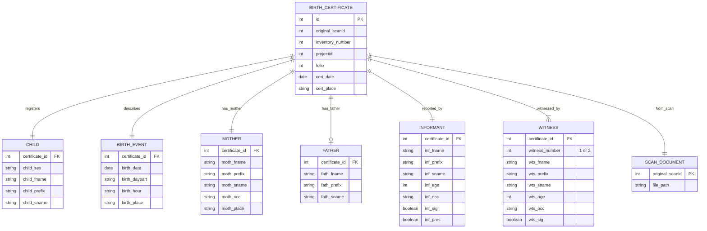
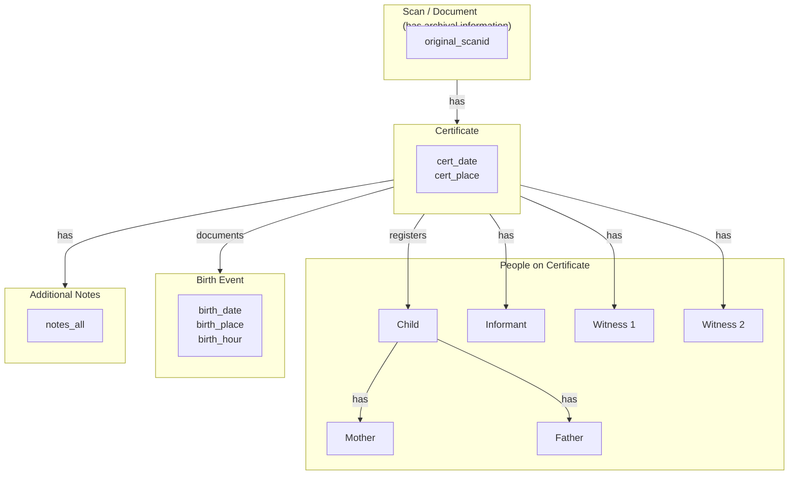

# Paramaribo Birth Certificates 1828-1921

> **Version:** 1.0  
> **Citation:** [@Collection2024-birthcert]  
> **License:** CC BY-SA 4.0  
> **DOI:** [10.17026/FUBB05](https://hdl.handle.net/10622/FUBB05)

---

## Dataset Overview

| Property                | Value                              |
| ----------------------- | ---------------------------------- |
| **Primary Entity**      | Birth certificates (vital records) |
| **Time Coverage**       | 1828–1921                          |
| **Data Rows**           | 63,200                             |
| **Data Columns**        | 32                                 |
| **File Format**         | CSV                                |
| **Geographic Coverage** | Paramaribo (city only)             |

### Purpose

This dataset contains transcribed **birth certificates** from Paramaribo, including:

- Child information (sex, name)
- Birth details (date, time, place)
- Mother information (name, occupation, address)
- Father information (name, occupation)
- Certification metadata (certificate date, place)
- Informant information
- Witness information (typically 2 witnesses)
- Archival references (scan ID, inventory number, folio)

---

## Field Definitions

Based on the source documentation screenshot:

### Document Identification (Certificate)

| Field              | Type    | Description                                      |
| ------------------ | ------- | ------------------------------------------------ |
| `id`               | integer | Unique certificate identifier                    |
| `original_scanid`  | integer | Scan identifier                                  |
| `inventory_number` | integer | Inventory number from National Archives Suriname |
| `projectid`        | integer | Project entry identifier                         |
| `folio`            | integer | Folio number of the birth certificate            |

### Certification Metadata

| Field        | Type        | Description                                        | Format       |
| ------------ | ----------- | -------------------------------------------------- | ------------ |
| `cert_date`  | date        | Date the certificate was issued                    | `dd-mm-yyyy` |
| `cert_place` | text/string | Place the certificate was issued (like Paramaribo) |              |

### Informant Identification

| Field            | Type        | Description                                        |
| ---------------- | ----------- | -------------------------------------------------- |
| `inf_fname`      | text/string | The first name of the informant                    |
| `inf_prefix`     | text/string | The surname prefix of the informant                |
| `inf_sname`      | text/string | The last name of the informant                     |
| `inf_age`        | integer     | Age of the informant (format: yy)                  |
| `inf_occ`        | text/string | Occupation of the informant                        |
| `inf_place`      | text/string | Address of the informant                           |
| `inf_otherinfo`  | text/string | Other information concerning the informant         |
| `inf_sig`        | text/string | Whether informant was able to sign the certificate |
| `inf_sig_other`  | text/string | Other information about the informant's signature  |
| `inf_pres`       | text/string | Whether informant was present at birth             |
| `inf_pres_other` | text/string | Other information about the informant's presence   |

### Birth Information

| Field           | Type        | Description                        | Format       |
| --------------- | ----------- | ---------------------------------- | ------------ |
| `birth_date`    | date        | Date of birth                      | `dd-mm-yyyy` |
| `birth_daypart` | text/string | Part of the day the child was born |              |
| `birth_hour`    | text/string | Hour of the day the child was born |              |
| `birth_place`   | text/string | Place the child was born           |              |

### Child Information

| Field          | Type        | Description                         |
| -------------- | ----------- | ----------------------------------- |
| `child_sex`    | text/string | The sex of the newborn child        |
| `child_fname`  | text/string | First name of the newborn child     |
| `child_prefix` | text/string | Surname prefix of the newborn child |
| `child_sname`  | text/string | Last name of the newborn child      |

### Mother Information

| Field            | Type        | Description                             |
| ---------------- | ----------- | --------------------------------------- |
| `moth_fname`     | text/string | The first name of the mother            |
| `moth_prefix`    | text/string | The surname prefix of the mother        |
| `moth_sname`     | text/string | The last name of the mother             |
| `moth_occ`       | text/string | Occupation of the mother                |
| `moth_place`     | text/string | Address of the mother                   |
| `moth_otherinfo` | text/string | Other information concerning the mother |

### Father Information

| Field         | Type        | Description                      |
| ------------- | ----------- | -------------------------------- |
| `fath_fname`  | text/string | The first name of the father     |
| `fath_prefix` | text/string | The surname prefix of the father |
| `fath_sname`  | text/string | Last name of the father          |

### Witness 1

| Field             | Type        | Description                                            |
| ----------------- | ----------- | ------------------------------------------------------ |
| `wts_fname_1`     | text/string | The first name of the first witness                    |
| `wts_prefix_1`    | text/string | The surname prefix of the first witness                |
| `wts_sname_1`     | text/string | The last name of the first witness                     |
| `wts_age_1`       | integer     | Age of the first witness (format: yy)                  |
| `wts_occ_1`       | text/string | Occupation of the first witness                        |
| `wts_place_1`     | text/string | Address of the first witness                           |
| `wts_sig_1`       | text/string | Whether first witness was able to sign the certificate |
| `wts_sig_other_1` | text/string | Other information about the first witness signature    |

### Witness 2

| Field             | Type        | Description                                             |
| ----------------- | ----------- | ------------------------------------------------------- |
| `wts_fname_2`     | text/string | The first name of the second witness                    |
| `wts_prefix_2`    | text/string | The surname prefix of the second witness                |
| `wts_sname_2`     | text/string | The last name of the second witness                     |
| `wts_age_2`       | integer     | Age of the second witness (format: yy)                  |
| `wts_occ_2`       | text/string | Occupation of the second witness                        |
| `wts_place_2`     | text/string | Address of the second witness                           |
| `wts_sig_2`       | text/string | Whether second witness was able to sign the certificate |
| `wts_sig_other_2` | text/string | Other information about the second witness signature    |

### Additional Notes

| Field       | Type        | Description                                                     |
| ----------- | ----------- | --------------------------------------------------------------- |
| `notes_all` | text/string | All notations added by the clerk on the side of the certificate |

---

## Entity-Relationship Diagram



---

## Data Interpretation Diagram

Based on the conceptual diagram from the source:



---

## Data Distribution

From the histogram in the source documentation:

```
The number of Paramaribo birth certificates per year, 1828-1921
━━━━━━━━━━━━━━━━━━━━━━━━━━━━━━━━━━━━━━━━━━━━━━━━━━━━━━

Peak: ~1,000-1,200 certificates around 1870-1880
Coverage: 63,200 records over 93 years (~680 average per year)

Note: Coverage is PARAMARIBO ONLY (unlike Death Certificates which include Districts)
```

---

## Observations & Notes

### Key Differences from Death Certificates

| Aspect                 | Birth Certificates         | Death Certificates            |
| ---------------------- | -------------------------- | ----------------------------- |
| **Coverage**           | Paramaribo only            | Districts + Paramaribo        |
| **Time span**          | 1828–1921 (93 years)       | 1845–1915 (70 years)          |
| **Records**            | 63,200                     | 192,335                       |
| **Parent fields**      | Mother + Father (separate) | Parent 1 + Parent 2 (generic) |
| **Spouses**            | N/A                        | Up to 4                       |
| **Informant presence** | `inf_pres` field           | Not tracked                   |

### Key Design Decisions in Source Data

1. **Flat denormalized structure**: Similar to death certificates, all columns in single row.

2. **Simpler family structure**: Only mother and father (no spouses, unlike death certificates).

3. **Father optional**: Father information may be absent (unmarried mothers, unknown fathers).

4. **Informant presence tracked**: `inf_pres` indicates if informant was present at birth.

### Implications for Database Design

1. **Person linking opportunity**: Match children in birth certificates to adults in death certificates using name + birth date.

2. **Family reconstruction**: Mother-child-father triples can build family trees.

3. **Witness networks**: Same witnesses may appear across birth and death certificates.

### Questions to Investigate

- [ ] How many births have missing father information?
- [ ] Are informants typically family members or professionals?
- [ ] Can we link children to their later death certificates?
- [ ] What is the overlap of witnesses between birth/death certificates?

---

## Related Datasets

| Dataset                                          | Relationship          | Potential Linking               |
| ------------------------------------------------ | --------------------- | ------------------------------- |
| [Death Certificates](02-death-certificates.md)   | Same person born/died | Name + birth year               |
| [Ward Registers](04-ward-registers.md)           | Address matching      | `birth_place`, parent addresses |
| [Slave & Emancipation](05-slave-emancipation.md) | Pre-1863 births       | Person matching                 |

---

7 January 2026
