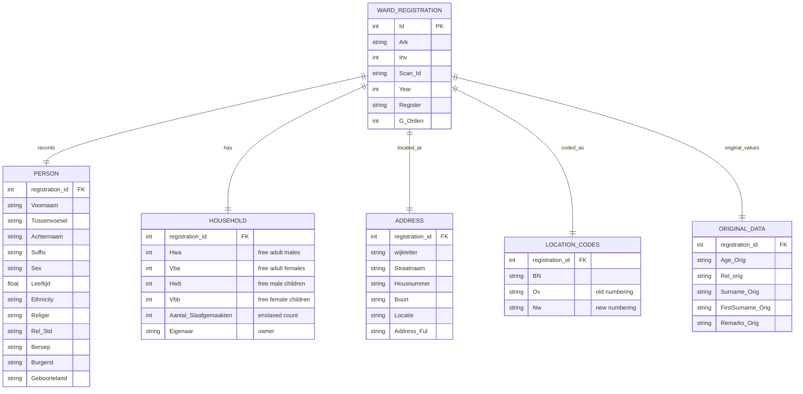

# Paramaribo Ward Registers 1828-1847

> **Version:** V1  
> **Citation:** [@KasteleijnvanOort2024-ward]  
> **License:** CC BY-NC-SA 4.0  
> **DOI:** [10.17026/SS/VAQF63](https://hdl.handle.net/10622/SS/VAQF63)

---

## Dataset Overview

| Property                | Value                              |
| ----------------------- | ---------------------------------- |
| **Primary Entity**      | Persons (census-like registration) |
| **Time Coverage**       | 1828–1847                          |
| **Data Rows**           | 102,260                            |
| **Data Columns**        | 40                                 |
| **File Format**         | CSV                                |
| **Geographic Coverage** | Paramaribo (city wards only)       |

### Purpose & Description

Since 1828, the colonial government of Suriname made an annual registration of the non-enslaved free inhabitants of the city. The registers have been partially preserved for 18 years. These "Ward Registers" are now available as a single CSV dataset. For more detailed information, consult the documentation.

The dataset includes:

- Person demographics (name, age, sex, ethnicity, religion)
- Household information (free persons count by type)
- Enslaved persons (count per household)
- Address information (detailed street-level)
- Location codes (using historical numbering systems)
- Administrative fields (register type, ward number)
- Original/raw data fields alongside standardized versions

---

## Field Definitions

Based on the source documentation screenshot:

### Archive Identification

| Field     | Type        | Description                       | Example |
| --------- | ----------- | --------------------------------- | ------- |
| `Id`      | integer     | Record identifier                 |         |
| `Ark`     | text/string | Archive code (e.g., `1.04.08.01`) |         |
| `Inv`     | integer     | Inventory number                  |         |
| `Scan_Id` | text/string | Scan(image) identifier            |         |
| `Scan`    | bool/string | URL to digitized original scan    |         |
| `Year`    | integer     | Level (year)                      |         |

### Person Information - Name

| Field           | Type        | Description                         |
| --------------- | ----------- | ----------------------------------- |
| `Voornaam`      | text/string | First name/given name(s)            |
| `Tussenvoesel`  | text/string | Name prefix(es) (e.g., `van`, `de`) |
| `Achternaam`    | text/string | Surname/family name                 |
| `Patroon`       | text/string | Patron name (e.g., `van 't`)        |
| `Naamtype`      | text/string | Unique name                         |
| `Geboorteland`  | text/string | Origin (place)                      |
| `Ov_Dec_Borrow` | text/string | First name of deceased spouse       |
| `Suffix`        | text/string | Suffix (e.g., `Jr`)                 |

### Person Information - Demographics

| Field       | Type        | Description                                                | Notes                       |
| ----------- | ----------- | ---------------------------------------------------------- | --------------------------- |
| `Religie`   | text/string | Religion - original                                        |                             |
| `Rel_Std`   | text/string | Religion - standardized level DAIS                         | Standardized classification |
| `Leeftijd`  | mixed/float | Age in years (can include fractions like `0.5` for months) |                             |
| `Ethnicity` | text/string | Ethnicity                                                  |                             |
| `Sex`       | text/string | Sex (`M` for male, `V` for female)                         |                             |
| `Beroep`    | text/string | Occupation/profession                                      |                             |
| `Burgerst`  | text/string | Civil/marital status                                       |                             |

### Household Composition - Free Persons

| Field | Type    | Description                                        |
| ----- | ------- | -------------------------------------------------- |
| `Hwa` | integer | Number of free adult males - cross-referenced      |
| `Vba` | integer | Number of free adult females - cross-referenced    |
| `Hwb` | integer | Number of free male children - uncrossreferenced   |
| `Vbb` | integer | Number of free female children - uncrossreferenced |
| `Hwc` | integer | Number of free adult males - heathen               |
| `Vbc` | integer | Number of free adult females - heathen             |
| `Hwi` | integer | Number of free male children - (heathen)           |
| `Vbi` | integer | Number of free female children - (heathen)         |
| `ink` | integer | Number of persons with unknown demographics        |

### Enslaved Persons

| Field                   | Type        | Description                 |
| ----------------------- | ----------- | --------------------------- |
| `Enslaved`              | text/string | Enslaved status indicator   |
| `Aantal_Slaafgemaakten` | integer     | Count of enslaved persons   |
| `Sloneman`              | text/string | Enslaved information detail |
| `Medel_Members`         | text/string | Family members              |
| `Response_Members`      | text/string | Additional members          |
| `Eigenaar`              | text/string | Owner's name                |

### Address Information

| Field                             | Type        | Description                                            | Notes |
| --------------------------------- | ----------- | ------------------------------------------------------ | ----- |
| `Annotaties`                      | text/string | Annotations/notes                                      |       |
| `Oiv`                             | text/string | District/ward                                          |       |
| `wijkletter`                      | text/string | Ward/district letter code                              |       |
| `Straatnaam`                      | text/string | Street name (old)                                      |       |
| `Housnummer`                      | text/string | House number (in `M+` entry)                           |       |
| `Adres_Huiding_anno`              | text/string | Address direction (suppression): e.g., `Prins`, `Oost` |       |
| `Adres_Lat_code_het_a_oost_zijde` | text/string | Location on street: `a=oost zijde, zo=z oost zijde`    |       |
| `Adres_Aanvulling`                | text/string | Address supplement                                     |       |
| `source`                          | text/string | Source description (e.g., `N house`, `N1 house`)       |       |
| `Buurt`                           | text/string | Neighborhood                                           |       |

### Location Codes

| Field                | Type        | Description                                           |
| -------------------- | ----------- | ----------------------------------------------------- |
| `BN`                 | text/string | Location code                                         |
| `Ov`                 | text/string | Old numbering system code                             |
| `Nw`                 | text/string | New numbering system code                             |
| `Locatie`            | text/string | Location description                                  |
| `Adres_Master`       | text/string | Standardized address                                  |
| `Generation_Maptype` | text/string | Generation/cross-reference to other numbering systems |
| `Address_Ful`        | text/string | Formatted full address                                |

### Administrative Fields

| Field       | Type        | Description                              |
| ----------- | ----------- | ---------------------------------------- |
| `G_Orden`   | integer     | Sort order                               |
| `Register`  | text/string | Register type (`W=Registers Paramaribo`) |
| `Onderdeel` | text/string | Living counts number                     |

### Original Data Fields

These preserve the original values before standardization:

| Field               | Type        | Description                                                          |
| ------------------- | ----------- | -------------------------------------------------------------------- |
| `Age_Orig`          | text/string | Original age notation (may include `m` for months, etc.)             |
| `Rel_orig`          | text/string | Original religion abbreviation                                       |
| `Slilr_Or`          | text/string | Original activity code (`B` = Blanke/white, `K` = kleurling/colored) |
| `Rleur/Colon_K`     | text/string | Color/colonial status                                                |
| `Surname_Orig`      | text/string | Surname as recorded                                                  |
| `FirstSurname_Orig` | text/string | Original first name as recorded                                      |
| `Remarks_Orig`      | text/string | Original remarks from source                                         |
| `Links_Orig`        | text/string | Cross-links original                                                 |
| `Kroniek_Remarks`   | text/string | Extra entry remarks                                                  |

---

## Standardization Tables

### Religion Standardisation

The dataset includes standardized religion codes:

| Field                | Description                                                                    |
| -------------------- | ------------------------------------------------------------------------------ |
| `id`                 | integer                                                                        |
| `Rel_org`            | text/string - Original religion as in rows as recorded in historical documents |
| `Standaardisering_1` | text/string                                                                    |
| `Standaardisering_2` | text/string                                                                    |

**Notes on this:**

- Mostly only original data are preserved as Excel
- Doesn't or marks (?, ???) indicates uncertainty or gaps
- Numerical/abbreviated religions included
- Can assign with no occupation (e.g., housewife/husband) rather than
- The cross-standardizations have different standardized names/groupings for analysis

### Street Standardisation

| Field                        | Description                                                            |
| ---------------------------- | ---------------------------------------------------------------------- |
| `id`                         | integer                                                                |
| `street_org`                 | text/string - Original street name as recorded in historical documents |
| `standaardiseerd_straatnaam` | text/string                                                            |

---

## Entity-Relationship Diagram

---

## Observations & Notes

### Key Characteristics

1. **Census-like data**: Annual registrations of free inhabitants, household composition.

2. **Rich address data**: Multiple address fields with old/new numbering systems.

3. **Original + Standardized**: Both raw original values and standardized versions preserved.

4. **Religion & Street standardization**: Separate lookup tables for normalizing historical variations.

5. **Enslaved counts per household**: Number of enslaved persons owned by each registered person.

### Unique Features

- **Leeftijd (age)**: Can be fractional (e.g., `0.5` for 6-month-old infant).
- **Multiple numbering systems**: `BN`, `Ov`, `Nw` codes for location cross-referencing.
- **Wijkletter**: Ward letter codes for Paramaribo neighborhoods.

### Implications for Database Design

1. **Person deduplication challenge**: Same person appears across multiple years (1828-1847).

2. **Address normalization needed**: Complex street standardization with multiple systems.

3. **Temporal person tracking**: Track same individual across registration years.

4. **Household vs Person**: Need to separate household-level (enslaved counts) from person-level data.

### Questions to Investigate

- [ ] How to track same person across years (name + age progression)?
- [ ] How do ward letters map to modern Paramaribo neighborhoods?
- [ ] What is the relationship between `Eigenaar` (owner) and person record?
- [ ] How does this overlap with Birth/Death certificate addresses?

---

## Related Datasets

| Dataset                                          | Relationship           | Potential Linking    |
| ------------------------------------------------ | ---------------------- | -------------------- |
| [Birth Certificates](03-birth-certificates.md)   | Address matching       | Street names, ward   |
| [Death Certificates](02-death-certificates.md)   | Person matching        | Name + age + address |
| [QGIS Maps](07-qgis-maps.md)                     | Geographic context     | Ward boundaries      |
| [Slave & Emancipation](05-slave-emancipation.md) | Enslaved person counts | Owner name matching  |

---

_Last updated: 2026-01-06_
