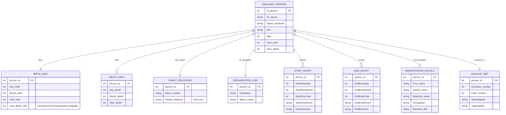
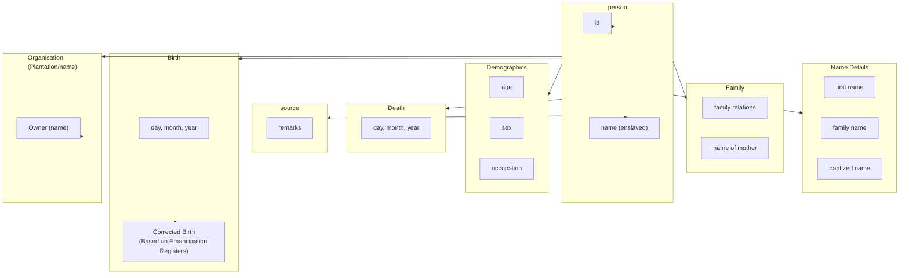

# Suriname Slave and Emancipation Registers Dataset

> **Version:** 1.1  
> **Citation:** [@RosenbaumFeldbrugge2023-emancipation]  
> **License:** CC BY-SA 4.0  
> **DOI:** [10.17026/SS/MSJBAN](https://hdl.handle.net/10622/MSJBAN)

---

## Dataset Overview

| Property                | Value                          |
| ----------------------- | ------------------------------ |
| **Primary Entity**      | Enslaved persons (individuals) |
| **Time Coverage**       | 1830–1863                      |
| **Data Rows**           | 95,388                         |
| **Data Columns**        | 38                             |
| **File Format**         | CSV                            |
| **Geographic Coverage** | Suriname (all plantations)     |

### Purpose

This dataset contains individual-level records of enslaved people in Suriname, tracking:

- Person identification (name, sex)
- Age and birth information
- Death information
- Family relationships (mother, family relations)
- Organization/plantation association
- Start and End entry information (temporal tracking)
- Personal details from Emancipation Register
- Archive information (inventory numbers, folio)

**Important:** Multiple entries per person based on the Start and End Entry information. A person may appear multiple times as their status/location changed.

---

## Field Definitions

Based on the source documentation screenshot:

### Person Identification

| Field           | Type        | Description                 | Example | Crucial for Linking | Primary Information |
| --------------- | ----------- | --------------------------- | ------- | ------------------- | ------------------- |
| `Id_person`     | integer     | Person identifier           |         |                     |                     |
| `Id_source`     | text/string | Source identifier           |         |                     |                     |
| `Name_enslaved` | text/string | Name of the enslaved person |         |                     |                     |
| `Sex`           | text/string | Sex of the person           |         |                     |                     |

### Age and Birth Information

| Field            | Type        | Description                                                 | Notes | Crucial for Linking | Primary Information |
| ---------------- | ----------- | ----------------------------------------------------------- | ----- | ------------------- | ------------------- |
| `Age`            | integer     | Age                                                         |       |                     |                     |
| `Age_Ruw`        | text/string | Raw/original age value                                      |       |                     |                     |
| `Day_birth`      | integer     | Day of birth                                                |       |                     |                     |
| `Month_birth`    | integer     | Month of birth                                              |       |                     |                     |
| `Year_birth`     | integer     | Year of birth                                               |       |                     |                     |
| `Year_Birth2_ER` | integer     | Alternative/corrected birth year from Emancipation Register |       |                     |                     |

### Death Information

| Field         | Type    | Description    | Crucial for Linking | Primary Information |
| ------------- | ------- | -------------- | ------------------- | ------------------- |
| `Day_death`   | integer | Day of death   |                     |                     |
| `Month_death` | integer | Month of death |                     |                     |
| `Year_death`  | integer | Year of death  |                     |                     |

### Family

| Field         | Type        | Description    | Crucial for Linking | Primary Information |
| ------------- | ----------- | -------------- | ------------------- | ------------------- |
| `Name_mother` | text/string | Name of mother |                     |                     |

### Organization

| Field        | Type        | Description     | Crucial for Linking | Primary Information |
| ------------ | ----------- | --------------- | ------------------- | ------------------- |
| `Plantation` | text/string | Plantation name |                     |                     |
| `Name_owner` | text/string | Owner's name    |                     |                     |

### Start Entry Information

Tracks when a person entered a particular status/location:

| Field                     | Type        | Description                      | Values                                                                              | Crucial for Linking | Primary Information |
| ------------------------- | ----------- | -------------------------------- | ----------------------------------------------------------------------------------- | ------------------- | ------------------- |
| `StartEntryDay`           | integer     | Day of start entry               |                                                                                     |                     |                     |
| `StartEntryMonth`         | integer     | Month of start entry             |                                                                                     |                     |                     |
| `StartEntryYear`          | integer     | Year of start entry              |                                                                                     |                     |                     |
| `StartEntryInfo`          | text/string | Additional start info            |                                                                                     |                     |                     |
| `StartEntryEventDetailed` | text/string | Detailed start event description |                                                                                     |                     |                     |
| `StartEntryEvent`         | text/string | Specific event types             | `Start Series`, `Birth`, `Transferred`, `Acquired/Transferred`, `Acquired (newlyb)` |                     |                     |

### End Entry Information

Tracks when a person left a particular status/location:

| Field                   | Type        | Description                    | Values                                                        | Crucial for Linking | Primary Information |
| ----------------------- | ----------- | ------------------------------ | ------------------------------------------------------------- | ------------------- | ------------------- |
| `EndEntryDay`           | integer     | Day of end entry               |                                                               |                     |                     |
| `EndEntryMonth`         | integer     | Month of end entry             |                                                               |                     |                     |
| `EndEntryYear`          | integer     | Year of end entry              |                                                               |                     |                     |
| `EndEntryInfo`          | text/string | Additional end info            |                                                               |                     |                     |
| `EndEntryEventDetailed` | text/string | Detailed end event description |                                                               |                     |                     |
| `EndEntryEvent`         | text/string | Specific event types           | `End Series/Freedom`, `Ended`, `Death`, `Transferred`, `Sold` |                     |                     |

### Personal Details (Primarily from Emancipation Register)

| Field              | Type        | Description                                           | Crucial for Linking | Primary Information |
| ------------------ | ----------- | ----------------------------------------------------- | ------------------- | ------------------- |
| `First_name`       | text/string | First name                                            |                     |                     |
| `Family_name`      | text/string | Family name                                           |                     |                     |
| `Baptized_name`    | text/string | Baptized name                                         |                     |                     |
| `Family_relations` | text/string | Family relationships (e.g., `Kind van...` = child of) |                     |                     |
| `Occupation`       | text/string | Occupation                                            |                     |                     |
| `Remarks_ER`       | text/string | Remarks from Emancipation Register                    |                     |                     |

### Archive Information

| Field              | Type        | Description                                                                                         | Crucial for Linking | Primary Information |
| ------------------ | ----------- | --------------------------------------------------------------------------------------------------- | ------------------- | ------------------- |
| `Inventory_number` | integer     | Archive inventory number                                                                            |                     |                     |
| `Folio_number`     | integer     | Folio number                                                                                        |                     |                     |
| `Slaveregister`    | text/string | Slave register reference                                                                            |                     |                     |
| `Typeregister`     | text/string | Register type: `Slave register plantation`, `Slave register private owner`, `Emancipation Register` |                     |                     |

---

## Entity-Relationship Diagram

---

## Data Interpretation Diagram

Based on the conceptual diagram from the source:

---

## Observations & Notes

### Key Characteristics

1. **Multiple entries per person**: The dataset has multiple rows per person based on Start/End Entry events. A person may be recorded multiple times as they were born, transferred, sold, or freed.

2. **Event-based tracking**: Uses Start Entry/End Entry pattern to track lifecycle events.

3. **Corrected birth years**: `Year_Birth2_ER` provides alternative birth year from Emancipation Register.

4. **Three register types**:

   - Slave register plantation
   - Slave register private owner
   - Emancipation Register

5. **Family relations encoded as text**: `Family_relations` contains strings like "Kind van..." (child of...).

### Start/End Entry Events

| Event Type             | Meaning                        |
| ---------------------- | ------------------------------ |
| `Start Series`         | Beginning of a data series     |
| `Birth`                | Person was born                |
| `Transferred`          | Person moved between locations |
| `Acquired/Transferred` | Person acquired by new owner   |
| `Acquired (newlyb)`    | Newly born and acquired        |
| `End Series/Freedom`   | End of slavery / Emancipation  |
| `Ended`                | End of record                  |
| `Death`                | Person died                    |
| `Sold`                 | Person was sold                |

### Implications for Database Design

1. **Person deduplication**: Need to track unique individuals across multiple rows (same `Id_person`).

2. **Event-sourced model**: Consider an event-based design to capture all status changes.

3. **Plantation linking**: `Plantation` field links to [Plantagen Dataset](01-plantagen-dataset.md) via PSUR ID matching.

4. **Family reconstruction**: `Name_mother` and `Family_relations` enable partial family tree building.

5. **Three-way reconciliation**: Birth year from original source vs Emancipation Register vs calculated from age.

### Questions to Investigate

- [ ] How many unique individuals vs total rows (95,388)?
- [ ] What is the distribution of event types (Start/End)?
- [ ] How to match `Plantation` to PSUR identifiers in Plantagen Dataset?
- [ ] How complete is the `Name_mother` field for family reconstruction?
- [ ] What is the overlap with Death Certificates post-1863?

---

## Related Datasets

| Dataset                                        | Relationship             | Potential Linking                |
| ---------------------------------------------- | ------------------------ | -------------------------------- |
| [Plantagen Dataset](01-plantagen-dataset.md)   | Plantation reference     | `Plantation` → `Name_plantation` |
| [Death Certificates](02-death-certificates.md) | Post-emancipation deaths | Person name + birth year         |
| [Birth Certificates](03-birth-certificates.md) | Post-emancipation births | Family name matching             |
| [Ward Registers](04-ward-registers.md)         | Free persons after 1863  | Person matching                  |
| [Almanakken](06-almanakken.md)                 | Owner names              | `Name_owner` matching            |

---

7 January 2026
