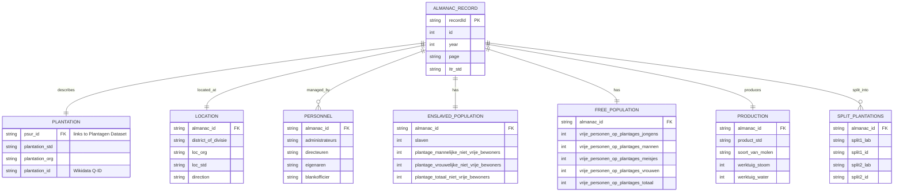

# Plantations Surinaamse Almanakken

> **Version:** V1  
> **Citation:** [@vanOort2023-almanakken]  
> **License:** CC BY-SA 4.0  
> **DOI:** [10.17026/SS/MVOJY5](https://hdl.handle.net/10622/SS/MVOJY5)

---

## Dataset Overview

| Property                | Value                                 |
| ----------------------- | ------------------------------------- |
| **Primary Entity**      | Plantation records (annual snapshots) |
| **Time Coverage**       | 1819–1935                             |
| **Data Rows**           | 22,000                                |
| **Data Columns**        | 60+                                   |
| **File Format**         | CSV                                   |
| **Geographic Coverage** | Suriname (all plantation districts)   |

### Purpose

This dataset contains digitized data from the **Surinaamse Almanakken** (Suriname Almanacs), which were annual publications listing plantations with detailed information about:

- Plantation identification and location
- Geographic/administrative information (districts)
- Enslaved population statistics (by gender, work status)
- Free persons on plantations
- Production information (products, machinery)
- Personnel (administrators, directors, owners)
- Temporal references to multiple data points per year

---

## Field Definitions

Based on the source documentation screenshot:

### Identification and Location Fields

| Field                 | Type        | Description                              | Example                                   |
| --------------------- | ----------- | ---------------------------------------- | ----------------------------------------- |
| `recordId`            | text/string | Record identifier                        |                                           |
| `id`                  | integer     | Integer ID                               |                                           |
| `year`                | integer     | Year of almanac entry                    | `1819`, `1827`, `1835`                    |
| `page`                | text/string | Page number or range                     | `e.g., '28', '176-177'`                   |
| `Itr_std`             | text/string | Letter-index                             | `e.g., 'D', 'D', 'E'`                     |
| `district_of_divisie` | text/string | Division name                            |                                           |
| `loc_org`             | text/string | Original location description (in Dutch) |                                           |
| `loc_std`             | text/string | Standardized location name               |                                           |
| `direction`           | text/string | Direction                                | `rechts`, `links`, `links afvarend`, etc. |

### Plantation Information

| Field            | Type        | Description                                                    | Notes                      |
| ---------------- | ----------- | -------------------------------------------------------------- | -------------------------- |
| `plantation_std` | text/string | Standardized plantation name                                   |                            |
| `plantation_org` | text/string | Original plantation name OR plantation name as organization??? |                            |
| `plantation_id`  | text/string | Wikidata Q-identifier                                          |                            |
| `psur_id`        | text/string | PSUR identifier (e.g., `PSUROOO1`)                             | Links to Plantagen Dataset |

### Split Plantations

For plantations split with Q-identifier — Wikidata:

| Field        | Type        | Description              |
| ------------ | ----------- | ------------------------ |
| `split1_lab` | text/string | Split plantation 1 label |
| `split1_id`  | text/string | Split plantation 1 ID    |
| `split2_lab` | text/string | Split plantation 2 label |
| `split2_id`  | text/string | Split plantation 2 ID    |
| `split3_lab` | text/string | Split plantation 3 label |
| `split3_id`  | text/string | Split plantation 3 ID    |
| `split4_lab` | text/string | Split plantation 4 label |
| `split4_id`  | text/string | Split plantation 4 ID    |
| `split5_lab` | text/string | Split plantation 5 label |
| `split5_id`  | text/string | Split plantation 5 ID    |

### References and Location Relationships

| Field               | Type        | Description              |
| ------------------- | ----------- | ------------------------ |
| `partof_lab`        | text/string | Part of (label)          |
| `part_of_id`        | text/string | Part of (ID)             |
| `reference_org`     | text/string | Reference organization   |
| `reference_std_lab` | text/string | Reference standard label |
| `reference_std_id`  | text/string | Reference standard ID    |

### Plantation Characteristics

| Field             | Type        | Description                     |
| ----------------- | ----------- | ------------------------------- |
| `size_std`        | integer     | Size (standardized)             |
| `product_std`     | text/string | Product type                    |
| `function`        | text/string | Function/purpose                |
| `additional_info` | text/string | Additional information          |
| `deserted`        | text/string | Whether plantation was deserted |
| `nummer`          | integer     | Number                          |

### Personnel

| Field                         | Type        | Description                |
| ----------------------------- | ----------- | -------------------------- |
| `administrateurs`             | text/string | Administrators' names      |
| `directeuren`                 | text/string | Directors' names           |
| `eigenaren`                   | text/string | Owners' names              |
| `administrateurs_in_Europa`   | text/string | Administrators in Europe   |
| `administrateurs_in_Suriname` | text/string | Administrators in Suriname |
| `blankofficier`               | text/string | Officer names              |

### Enslaved Population

| Field                                      | Type        | Description                           |
| ------------------------------------------ | ----------- | ------------------------------------- |
| `slaven`                                   | integer     | Number of enslaved people             |
| `namen_totaalafgemaakten`                  | text/string | Names of enslaved people (total list) |
| `plantage_mannelijke_niet_vrije_bewoners`  | integer     | Male unfree plantation residents      |
| `plantage_totaal_niet_vrije_bewoners`      | integer     | Total unfree plantation residents     |
| `plantage_vrouwelijke_niet_vrije_bewoners` | integer     | Female unfree plantation residents    |
| `priv_mannelijk_niet_vrije_bewoners`       | integer     | Male private unfree residents         |
| `priv_totaal_niet_vrije_bewoners`          | integer     | Total private unfree residents        |
| `priv_vrouwelijk_niet_vrije_bewoners`      | integer     | Female private unfree residents       |

### General Population Statistics

| Field                                                        | Type    | Description                           |
| ------------------------------------------------------------ | ------- | ------------------------------------- |
| `totaal_generaal_bewoners`                                   | integer | Total general population              |
| `vrije_bewoners`                                             | integer | Free residents                        |
| `generaal_totaal_slaven`                                     | integer | General total enslaved                |
| `generaal_aant_slaven_geschikt_tot_werken_plantages`         | integer | Enslaved fit for plantation work      |
| `generaal_aant_slaven_geschikt_tot_werken_priv`              | integer | Enslaved fit for private work         |
| `generaal_aant_slaven_ongeschikt_tot_werken_plantages`       | integer | Enslaved unfit for plantation work    |
| `generaal_aant_slaven_ongeschikt_tot_werken_priv`            | integer | Enslaved unfit for private work       |
| `totaal_slaven_op_de_plantages_aanwezig_geschikt_tot_werk`   | integer | Total enslaved present fit for work   |
| `totaal_slaven_op_de_plantages_aanwezig_ongeschikt_tot_werk` | integer | Total enslaved present unfit for work |

### Free Persons on Plantations

| Field                                 | Type    | Description                       |
| ------------------------------------- | ------- | --------------------------------- |
| `vrije_personen_op_plantages_jongens` | integer | Free boys on plantations          |
| `vrije_personen_op_plantages_mannen`  | integer | Free men on plantations           |
| `vrije_personen_op_plantages_meisjes` | integer | Free girls on plantations         |
| `vrije_personen_op_plantages_vrouwen` | integer | Free women on plantations         |
| `vrije_personen_op_plantages_totaal`  | integer | Total free persons on plantations |

### Machinery

| Field             | Type        | Description                    |
| ----------------- | ----------- | ------------------------------ |
| `soort_van_molen` | text/string | Type of mill (`Stoom` = steam) |
| `werktuig_stoom`  | integer     | Steam machinery count          |
| `werktuig_water`  | integer     | Water machinery count          |

---

## Entity-Relationship Diagram

---

## Observations & Notes

### Key Characteristics

1. **Annual snapshots**: Each row represents a plantation in a specific year, allowing temporal analysis.

2. **Detailed population breakdown**: Enslaved population by gender, work fitness, and location (plantation vs private).

3. **Personnel names**: Administrators, directors, owners tracked per year — enables tracking ownership changes.

4. **PSUR_ID linking**: Direct link to [Plantagen Dataset](01-plantagen-dataset.md) master list.

5. **Wikidata integration**: `plantation_id` contains Wikidata Q-identifiers for external linking.

6. **Split plantation tracking**: Up to 5 split plantation references for administrative changes.

### Column Count

With 60+ columns, this is the most detailed dataset, capturing:

- ~15 identification/location fields
- ~6 personnel fields
- ~15 enslaved population fields
- ~6 free population fields
- ~3 production/machinery fields
- ~10 split plantation fields
- ~5 reference/relationship fields

### Implications for Database Design

1. **Temporal dimension**: Key differentiator from Plantagen Dataset — same plantation across multiple years.

2. **Person extraction**: Personnel names (`administrateurs`, `directeuren`, `eigenaren`) need parsing and linking to `PEOPLE` table.

3. **Population aggregation**: Can aggregate to match Series 1-4 totals in Plantagen Dataset.

4. **Wikidata enrichment**: Use `plantation_id` to pull additional data from Wikidata.

### Questions to Investigate

- [ ] How many unique plantations vs total rows (22,000)?
- [ ] What years are covered (1819-1935 but which specific years)?
- [ ] How do personnel names relate to persons in other datasets?
- [ ] How to parse multiple names in single fields (comma-separated)?
- [ ] What is the format of `namen_totaalafgemaakten` (list of enslaved names)?

---

## Related Datasets

| Dataset                                          | Relationship                | Linking Field               |
| ------------------------------------------------ | --------------------------- | --------------------------- |
| [Plantagen Dataset](01-plantagen-dataset.md)     | Master plantation list      | `psur_id` → `ID_plantation` |
| [Slave & Emancipation](05-slave-emancipation.md) | Individual enslaved persons | Plantation name matching    |
| [QGIS Maps](07-qgis-maps.md)                     | Geographic locations        | Plantation name/location    |
| [Wikidata](08-wikidata.md)                       | External identifiers        | `plantation_id` (Q-ID)      |

---

_Last updated: 2026-01-06_
