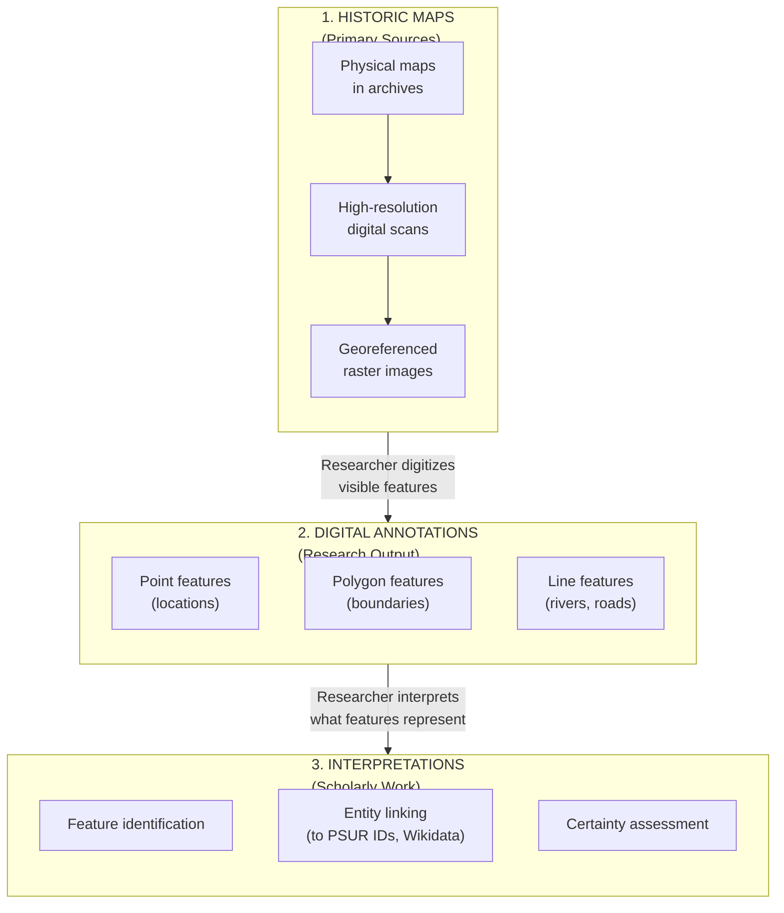
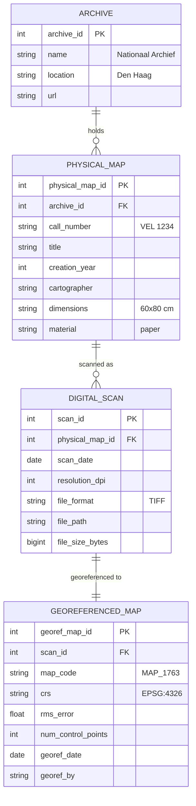
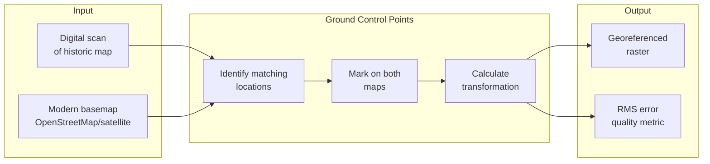
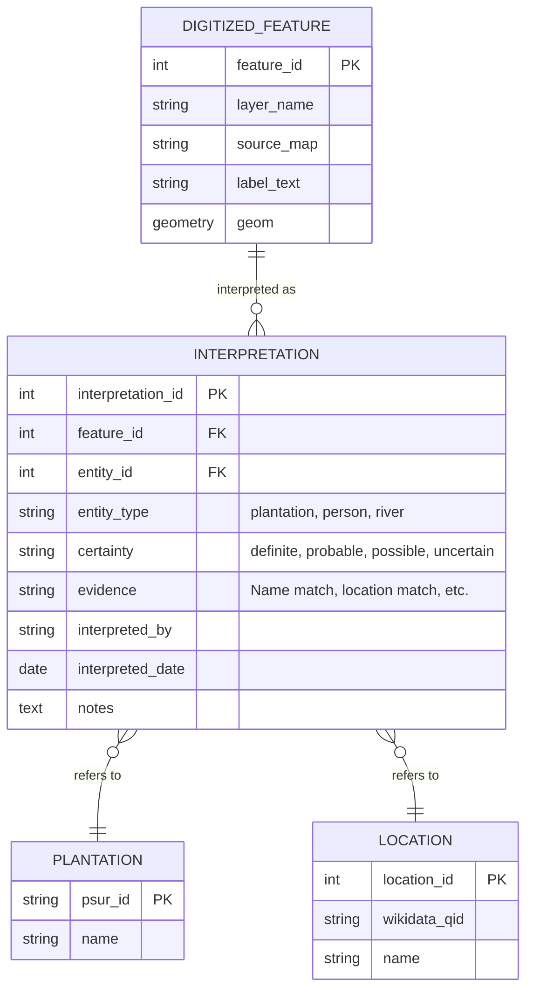
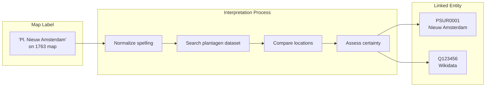
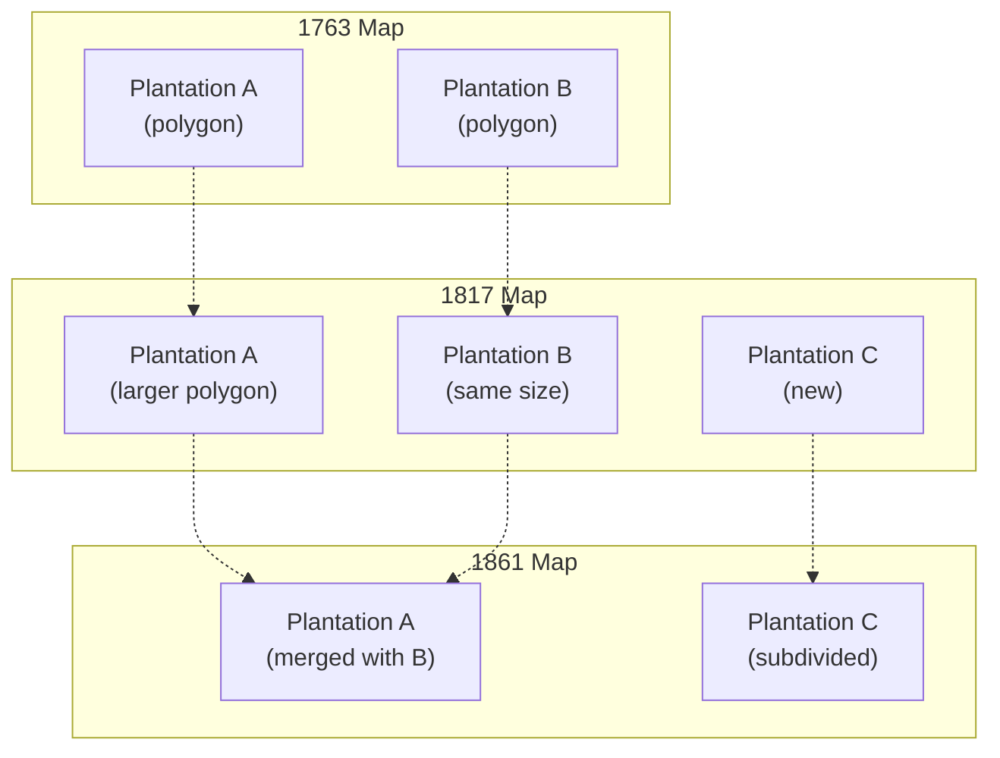
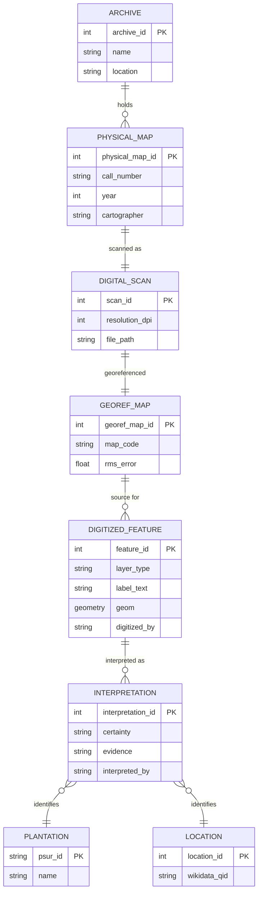

# QGIS Geographic Data & Historic Maps

> **Status:** Not yet published (own digitization work)  
> **Citation:** Own digitization work 2024  
> **License:** TBD

---

## Dataset Overview

| Property              | Value                                                                                     |
| --------------------- | ----------------------------------------------------------------------------------------- |
| **Primary Entity**    | Geographic features (plantations, rivers, settlements)                                    |
| **Time Coverage**     | 1763–1907 (historic maps)                                                                 |
| **Data Format**       | GeoTIFF (rasters) / GeoPackage (vectors)                                                  |
| **Coordinate System** | EPSG:4326 (WGS84)                                                                         |
| **Software**          | QGIS (current), potentially other onlineGIS tools in future like the NeRu re:Charted tool |

---

## What is a Historic Map? (My definition)

A historic map is not a photograph of the past — it is a **schematic representation** of how a mapmaker understood and chose to depict a place at a particular moment in time. It reflects:

- **Knowledge**: What the mapmaker knew (or thought they knew)
- **Purpose**: Why the map was made (navigation, administration, land claims)
- **Technology**: Available surveying and drawing techniques
- **Perspective**: Colonial viewpoints, ownership interests, aesthetic conventions

### The difference to a Historical Map

A **historic map** is a primary source created in the past. A **historical map** is a modern reconstruction of the past (e.g., a 2024 map of 1763 boundaries). In this project, we treat historic maps as sources and any new reconstructions as derived research outputs.

### The Chain of Representation

```mermaid
flowchart LR
    subgraph PAST["THE PAST"]
        REALITY["Physical reality<br/>(Suriname, 1763)"]
    end

    subgraph HISTORICAL["HISTORICAL ARTIFACT"]
        PERCEPTION["Mapmaker's<br/>perception"]
        DRAWING["Hand-drawn map<br/>(schematic representation)"]
    end

    subgraph MODERN["MODERN PROCESSING"]
        SCAN["Digital scan<br/>(pixel representation)"]
        GEOREF["Georeferenced image<br/>(aligned to coordinates)"]
        VECTOR["Digital annotations<br/>(vector geometries)"]
    end

    subgraph INTERPRETATION["SCHOLARLY WORK"]
        LINKING["Entity identification<br/>(what does this represent?)"]
    end

    REALITY --> |"observed by"| PERCEPTION
    PERCEPTION --> |"depicted as"| DRAWING
    DRAWING --> |"digitized as"| SCAN
    SCAN --> |"spatially aligned"| GEOREF
    GEOREF --> |"traced from"| VECTOR
    VECTOR --> |"interpreted as"| LINKING
```



### Each Step Introduces Transformation

| Step                      | What It Is                            | What It Adds                   | What May Be Lost               |
| ------------------------- | ------------------------------------- | ------------------------------ | ------------------------------ |
| **Physical reality**      | The actual landscape in the past      | -                              | -                              |
| **Mapmaker's perception** | Human observation and understanding   | Interpretation, selection      | Unseen or unvalued features    |
| **Hand-drawn map**        | Ink on paper, schematic symbols       | Visual conventions, aesthetics | Precision, scale accuracy      |
| **Digital scan**          | Pixel representation of the artifact  | Preservation, shareability     | Physical texture, some detail  |
| **Georeferenced image**   | Map aligned to modern coordinates     | Spatial comparability          | Perfect alignment (distortion) |
| **Digital annotations**   | Vector features traced by researchers | Queryable data, precision      | Context, uncertainty           |
| **Entity linking**        | Connection to database records        | Integration, analysis          | Alternative interpretations    |

### Epistemological Considerations

When working with this data, remember:

1. **Maps are arguments, not facts**: A colonial map showing plantation boundaries is a claim about ownership, not objective truth.

2. **Absence is not emptiness**: What a map does not show (Indigenous settlements, maroon communities) may be deliberate omission.

3. **Names carry power**: Plantation names on maps often reflect European naming, not how places were known by enslaved or Indigenous people.

4. **Precision is constructed**: A polygon we draw today appears precise, but the original boundary may have been vague, contested, or conceptual.

5. **Layers of interpretation**: Each step from reality to database adds human interpretation — this is unavoidable but should be documented.

---

## Conceptual Framework

This dataset consists of **three fundamentally different types of data** that must be clearly distinguished:



### Key Distinction

| Aspect           | Historic Maps (Rasters)    | Digital Annotations (Vectors) | Interpretations               |
| ---------------- | -------------------------- | ----------------------------- | ----------------------------- |
| **Nature**       | Primary historical source  | Modern research derivative    | Scholarly judgment            |
| **Content**      | What was drawn in the past | What researchers have traced  | What features mean            |
| **Authority**    | Original mapmaker          | Modern researcher             | Domain experts                |
| **Modification** | Should NOT be altered      | Can be corrected/updated      | Should be versioned           |
| **Completeness** | Shows full original map    | Selective digitization        | Depends on research           |
| **Example**      | "Scanned 1763 map image"   | "Polygon traced around area"  | "This polygon = Plantation X" |

---

## Part 1: Historic Maps (Raster Sources)

These are the **original historical documents** — scanned and georeferenced maps from the colonial period. They represent what mapmakers of that era recorded.

### Available Historic Maps

| Map Code | Year | Title / Description     | Archive Source       | Resolution | Georef. Accuracy |
| -------- | ---- | ----------------------- | -------------------- | ---------- | ---------------- |
| MAP_1763 | 1763 | Lavaux Map              | Nationaal Archief NL | High       | TBD              |
| MAP_1817 | 1817 | Post-British period map | TBD                  | High       | TBD              |
| MAP_1840 | 1840 | Mid-19th century        | TBD                  | High       | TBD              |
| MAP_1861 | 1861 | Late slavery period     | TBD                  | High       | TBD              |
| MAP_1907 | 1907 | Early 20th century      | TBD                  | High       | TBD              |

### What Historic Maps Show

Each historic map contains **visual information** that can be read but requires interpretation:

| Map Element          | What You See                 | Interpretation Challenge              |
| -------------------- | ---------------------------- | ------------------------------------- |
| **Text labels**      | "Plantation Nieuw Amsterdam" | Spelling variations, historical names |
| **Boundary lines**   | Drawn borders                | Uncertain if precise or approximate   |
| **Symbols**          | Building icons, tree symbols | Meaning varies by mapmaker            |
| **Colors**           | Colored regions              | Legend may be missing                 |
| **Rivers/waterways** | Blue lines/areas             | Course may have changed               |

### Map Provenance Model



### Georeferencing Process



**Georeferencing Challenges:**

- Historic maps may be distorted
- Some features no longer exist for reference
- Coastlines and rivers may have changed
- Different projection assumptions

---

## Part 2: Digital Annotations (Vector Layers)

These are **modern research outputs** — vector geometries created by researchers who traced features visible on the historic maps. They are interpretive work, not primary sources.

### Vector Layer Inventory

| Layer Name           | Geometry   | Feature Count | Source Map(s) | Description                   |
| -------------------- | ---------- | ------------- | ------------- | ----------------------------- |
| Plantages (points)   | Point      | TBD           | Multiple      | Plantation centroid locations |
| Plantages (polygons) | Polygon    | TBD           | Multiple      | Plantation boundary areas     |
| Rivers               | LineString | TBD           | Multiple      | River and creek courses       |
| Settlements          | Point      | TBD           | Multiple      | Towns, villages, forts        |
| Roads                | LineString | TBD           | Multiple      | Historic road network         |
| Districts            | Polygon    | TBD           | Multiple      | Administrative boundaries     |

### What Annotations Capture

| Source (What Map Shows) | Annotation (What We Digitize)  | Not Captured          |
| ----------------------- | ------------------------------ | --------------------- |
| Plantation name text    | Point at approximate center    | Exact text position   |
| Boundary drawing        | Polygon tracing the line       | Line thickness, style |
| River course            | LineString following blue area | Water body width      |
| Building symbol         | Point at symbol location       | Building footprint    |
| Colored region          | Polygon around colored area    | Color value           |

### Attribute Tables

#### Plantation Points Layer

| Attribute        | Type    | Description              | Example                   | Crucial for Linking | Primary Information |
| ---------------- | ------- | ------------------------ | ------------------------- | ------------------- | ------------------- |
| `fid`            | integer | Feature ID (auto)        | `1`                       |                     |                     |
| `source_map`     | text    | Which map digitized from | `MAP_1763`                |                     |                     |
| `label_text`     | text    | Text as written on map   | `Pl. Nieuw Amsterdam`     |                     |                     |
| `label_readable` | boolean | Is text clearly legible? | `true`                    |                     |                     |
| `geom`           | Point   | Location (WGS84)         | `POINT(-55.1 5.8)`        |                     |                     |
| `digitized_by`   | text    | Researcher name          | `JC`                      |                     |                     |
| `digitized_date` | date    | When digitized           | `2024-03-15`              |                     |                     |
| `notes`          | text    | Any observations         | `Name partially obscured` |                     |                     |

#### Plantation Polygons Layer

| Attribute        | Type    | Description                | Example                           | Crucial for Linking | Primary Information |
| ---------------- | ------- | -------------------------- | --------------------------------- | ------------------- | ------------------- |
| `fid`            | integer | Feature ID (auto)          | `1`                               |                     |                     |
| `source_map`     | text    | Which map digitized from   | `MAP_1840`                        |                     |                     |
| `label_text`     | text    | Text as written on map     | `Alkmaar`                         |                     |                     |
| `boundary_type`  | text    | How boundary was drawn     | `solid_line`, `dashed`, `implied` |                     |                     |
| `geom`           | Polygon | Boundary (WGS84)           | `POLYGON((...))`                  |                     |                     |
| `area_ha`        | float   | Calculated area (hectares) | `245.6`                           |                     |                     |
| `digitized_by`   | text    | Researcher name            | `JC`                              |                     |                     |
| `digitized_date` | date    | When digitized             | `2024-03-15`                      |                     |                     |
| `certainty`      | text    | Confidence in boundary     | `high`, `medium`, `low`           |                     |                     |

#### Rivers Layer

| Attribute    | Type       | Description              | Example                        | Crucial for Linking | Primary Information |
| ------------ | ---------- | ------------------------ | ------------------------------ | ------------------- | ------------------- |
| `fid`        | integer    | Feature ID (auto)        | `1`                            |                     |                     |
| `source_map` | text       | Which map digitized from | `MAP_1763`                     |                     |                     |
| `label_text` | text       | River name on map        | `Suriname Rivier`              |                     |                     |
| `river_type` | text       | Type classification      | `main_river`, `creek`, `canal` |                     |                     |
| `geom`       | LineString | Course (WGS84)           | `LINESTRING((...))`            |                     |                     |
| `length_km`  | float      | Calculated length        | `12.4`                         |                     |                     |

---

## Part 3: Interpretations (Entity Linking)

This is the **scholarly work** of connecting digitized features to real-world entities in other datasets. This requires domain expertise and should be tracked with confidence levels.

### Interpretation Model



### Certainty Levels

| Level         | Code        | Meaning                    | Example                            |
| ------------- | ----------- | -------------------------- | ---------------------------------- |
| **Definite**  | `definite`  | No reasonable doubt        | Unique name, exact location match  |
| **Probable**  | `probable`  | Most likely interpretation | Name matches, location plausible   |
| **Possible**  | `possible`  | One of several options     | Similar name, could be this entity |
| **Uncertain** | `uncertain` | Cannot determine           | Illegible text, no clear match     |

### Linking Map Labels to Database Entities



### Example Interpretations Table

| Feature ID | Map Label         | Interpreted As             | PSUR ID  | Certainty | Evidence                      |
| ---------- | ----------------- | -------------------------- | -------- | --------- | ----------------------------- |
| PT_001     | "Nieuw Amsterdam" | Nieuw Amsterdam plantation | PSUR0001 | definite  | Exact name, known location    |
| PT_002     | "N. Amst."        | Nieuw Amsterdam plantation | PSUR0001 | probable  | Abbreviation pattern          |
| PT_003     | "Pl. [illegible]" | Unknown                    | -        | uncertain | Text not readable             |
| PT_004     | "Alkmaar"         | Alkmaar plantation         | PSUR0045 | definite  | Unique name in district       |
| PT_005     | "Rust en Werk"    | Rust en Werk               | PSUR0089 | possible  | Common name, multiple matches |

---

## Part 4: Multi-Temporal Analysis

Since we have maps from different years, we can track how features changed over time.

### Temporal Feature Tracking



### Temporal Interpretation Table

| PSUR ID  | 1763 Feature | 1817 Feature | 1840 Feature    | 1861 Feature | Notes                 |
| -------- | ------------ | ------------ | --------------- | ------------ | --------------------- |
| PSUR0001 | PT_001       | PT_045       | PT_089          | PT_134       | Consistent appearance |
| PSUR0002 | -            | PT_046       | PT_090          | PT_135       | First appears 1817    |
| PSUR0003 | PT_002       | PT_047       | -               | -            | Disappears after 1817 |
| PSUR0004 | PT_003       | PT_048       | PT_091 (merged) | PT_091       | Merged with neighbor  |

---

## Data Quality Framework

### Quality Attributes for Each Layer Type

| Quality Dimension | Historic Maps               | Digital Annotations    | Interpretations             |
| ----------------- | --------------------------- | ---------------------- | --------------------------- |
| **Accuracy**      | RMS error of georeferencing | Digitizing precision   | Entity matching correctness |
| **Completeness**  | Full map captured           | % features digitized   | % features interpreted      |
| **Consistency**   | Scan quality                | Attribute completeness | Certainty level coverage    |
| **Provenance**    | Archive source              | Digitizer, date        | Interpreter, date, evidence |

### Quality Tracking Table

| Layer               | Total Features | High Certainty | Medium | Low | Uninterpreted |
| ------------------- | -------------- | -------------- | ------ | --- | ------------- |
| Plantation points   | TBD            | TBD            | TBD    | TBD | TBD           |
| Plantation polygons | TBD            | TBD            | TBD    | TBD | TBD           |
| Rivers              | TBD            | TBD            | TBD    | TBD | TBD           |
| Settlements         | TBD            | TBD            | TBD    | TBD | TBD           |

---

## Legacy Layer Documentation

The following tables document the current state of QGIS layers as they exist in the QGIS project:

> Note: These are the actual layer names and attributes from the current digitization work as far as I could see, but these are prone to changes soon once better cleaned.

### Current Raster Layers (Historic Maps)

| Map                | Year  | Description                | Status          |
| ------------------ | ----- | -------------------------- | --------------- |
| Map from 1763      | 1763  | Early colonial map         | Georeferenced   |
| Map from 1800-1850 | ~1840 | Mid-period map             | Georeferenced   |
| Map from 1817      | 1817  | Post-Napoleonic period     | Georeferenced   |
| Map from 1861      | 1861  | Late slavery period        | Georeferenced   |
| Map from 1907      | 1907  | Post-emancipation          | Georeferenced   |
| Wikidata           | -     | Wikidata locations overlay | Reference layer |

### Current Vector Layers

| Layer                       | Type    | Features | Description                      |
| --------------------------- | ------- | -------- | -------------------------------- |
| `places - point layer`      | Point   | ~50      | Settlement/place locations       |
| `plantages - point layer`   | Point   | ~145     | Plantation centroid locations    |
| `plantages - polygon layer` | Polygon | ~89      | Plantation boundary outlines     |
| `rivers - line layer`       | Line    | ~34      | River courses from historic maps |

### Current Attribute Schemas

#### `plantages - point layer`

| Field                                       | Type    | Description                 | Example       |
| ------------------------------------------- | ------- | --------------------------- | ------------- |
| `fid`                                       | integer | Feature ID (auto-generated) | `1`, `2`, `3` |
| `Name_var1-Het KH-Batisthof-DT_Straat-naam` | text    | Name variant 1              |               |
| `Name_var2`                                 | text    | Name variant 2              |               |
| `Br/Nu`                                     | text    | Reference number            |               |
| `straat`                                    | text    | Street/location name        |               |

#### `Koarten` (reference table)

| Field             | Type    | Description             | Example                       |
| ----------------- | ------- | ----------------------- | ----------------------------- |
| `Rij`             | integer | Row number              | `1`, `708`, `720`             |
| `ID`              | text    | Identifier              | `5_Pl_033`                    |
| `PLANTATION_NAME` | text    | Plantation name         | `Coed Graad`, `Plantage Kust` |
| `River body`      | text    | Associated river        | `Saramacca`, `Suriname`       |
| `Gemeency`        | text    | Community/region        | `Centrum`, `Caroentipo`       |
| `District`        | text    | District name           | `Sipaliwini`                  |
| `OpenStrMap`      | text    | OpenStreetMap reference |                               |

#### `plantages - polygon layer` (vzavlagen)

| Field              | Type | Description       |
| ------------------ | ---- | ----------------- |
| `PLANTATION_NAME`  | text | Plantation name   |
| `ALTERNATIVE_NAME` | text | Alternative names |
| `DISTRICT`         | text | District          |

#### `Z-ATLAS BVRH`

| Field           | Type    | Description           | Example             |
| --------------- | ------- | --------------------- | ------------------- |
| `Rij`           | integer | Row number            | `41`, `42`, `45`    |
| `nr`            | text    | Reference number      | `A`, `Bhw`, `T 487` |
| `Atlas`         | text    | Atlas code            | `N/A`               |
| `stroom1805`    | text    | Stream reference 1805 |                     |
| `zijdgebiD1855` | text    | Side reference 1855   |                     |
| `L1Broeks`      | text    | Brook reference       |                     |
| `L1Naam_h`      | text    | Name (historical)     |                     |
| `Comment`       | text    | Comments              |                     |
| `UTMgrids`      | text    | UTM grid reference    |                     |
| `L1Broekie`     | text    | Additional reference  |                     |

---

## Summary Entity-Relationship Diagram

This diagram shows the target structure integrating all three levels (historic maps, digitized features, and interpretations):



---

## Related Datasets

| Dataset                                      | Relationship                | Linking Strategy                        |
| -------------------------------------------- | --------------------------- | --------------------------------------- |
| [Plantagen Dataset](01-plantagen-dataset.md) | Plantation identification   | Map label -> PSUR ID via interpretation |
| [Almanakken](06-almanakken.md)               | Plantation details by year  | Name + year matching                    |
| [Wikidata](08-wikidata.md)                   | External coordinates        | Q-ID linking, coordinate comparison     |
| [Ward Registers](04-ward-registers.md)       | Paramaribo street locations | Street name matching                    |
| [Heritage Guide](09-heritage-guide-3d.md)    | Building locations          | Coordinate proximity                    |

---

## Technical Notes

### Coordinate Reference Systems

| CRS          | EPSG  | Use                            |
| ------------ | ----- | ------------------------------ |
| WGS 84       | 4326  | Storage and web display        |
| UTM Zone 21N | 32621 | Local measurements in Suriname |

### PostGIS Implementation Example

```sql
-- Creating tables for the three-level structure

-- Level 1: Historic Maps (Rasters)
CREATE TABLE historic_maps (
    georef_map_id SERIAL PRIMARY KEY,
    map_code VARCHAR(20) UNIQUE NOT NULL,
    title VARCHAR(255),
    year INTEGER,
    cartographer VARCHAR(255),
    archive_source VARCHAR(255),
    scan_file_path VARCHAR(500),
    rms_error FLOAT,
    georef_date DATE,
    georef_by VARCHAR(100)
);

-- Level 2: Digitized Features (Vectors)
CREATE TABLE digitized_features (
    feature_id SERIAL PRIMARY KEY,
    georef_map_id INTEGER REFERENCES historic_maps(georef_map_id),
    layer_type VARCHAR(50) NOT NULL, -- 'plantation_point', 'plantation_polygon', 'river', etc.
    label_text VARCHAR(255), -- Text as it appears on the map
    label_readable BOOLEAN DEFAULT true,
    geom GEOMETRY NOT NULL,
    digitized_by VARCHAR(100),
    digitized_date DATE,
    notes TEXT
);

-- Level 3: Interpretations (Linking)
CREATE TABLE feature_interpretations (
    interpretation_id SERIAL PRIMARY KEY,
    feature_id INTEGER REFERENCES digitized_features(feature_id),
    entity_type VARCHAR(50) NOT NULL, -- 'plantation', 'location', 'river'
    entity_id VARCHAR(50), -- PSUR ID, location_id, etc.
    wikidata_qid VARCHAR(20),
    certainty VARCHAR(20) NOT NULL CHECK (certainty IN ('definite', 'probable', 'possible', 'uncertain')),
    evidence TEXT,
    interpreted_by VARCHAR(100),
    interpreted_date DATE
);

-- Spatial indexes
CREATE INDEX idx_digitized_features_geom ON digitized_features USING GIST (geom);
```

---

## Key Observations

### Current State

1. **Multiple temporal layers**: Maps from 1763, 1817, 1840, 1861, and 1907 enable tracking changes over 150 years.

2. **Dual geometry capture**: Plantations recorded as both points (centroids) and polygons (boundaries).

3. **Work in progress**: Ongoing digitization effort, not yet published.

4. **Attribute inconsistency**: Layers have mixed Dutch/English field names, varying conventions.

### Database Design Implications

1. **Three-level model essential**: Must distinguish source maps, digitized features, and interpretations.

2. **Certainty tracking**: Not all map labels can be definitively linked to known entities.

3. **Multi-map features**: Same location may appear differently across map years.

4. **Provenance required**: Track who digitized/interpreted what and when.

---

## Questions

- what are the archive sources for each historic map?
- what is georeferencing accuracy (RMS error) for each?
- how do we track/map for different accuracies in the georeferencing process to therfore track the locational accuracy of places based on the map?
- how handle features appearing on multiple maps?
- how track changes when maps re-digitised or interpretations change?
