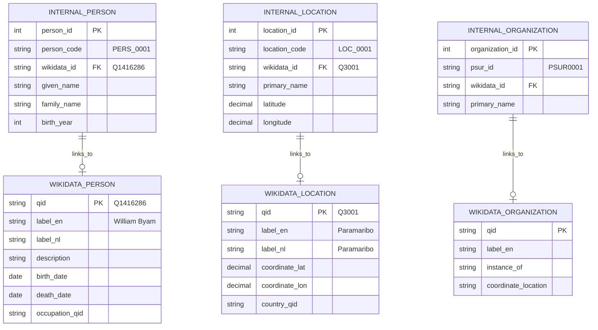
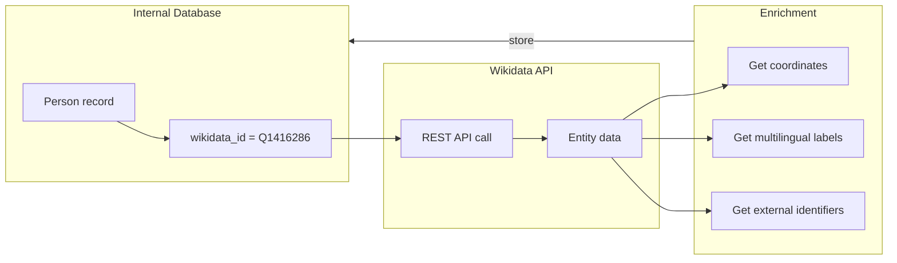

# Wikidata Integration

> **Source:** [Wikidata](https://www.wikidata.org/)  
> **Citation:** [@Wikidata2024]  
> **License:** CC0 (Public Domain)  
> **API:** [Wikidata REST API](https://www.wikidata.org/wiki/Wikidata:REST_API)

---

## Dataset Overview

| Property              | Value                                       |
| --------------------- | ------------------------------------------- |
| **Entity Type**       | External reference source                   |
| **Purpose**           | Unique identifiers, enrichment, LOD linking |
| **Access Method**     | REST API / SPARQL                           |
| **Identifier Format** | Q-IDs (e.g., `Q3001`, `Q416086`)            |

### Purpose

Wikidata serves as an **external reference source** for the Suriname Database, providing:

- **Persistent unique identifiers** (Q-IDs) for entities
- **Multilingual labels** (Dutch, English, German, etc.)
- **Biographical data** for historical persons
- **Geographic coordinates** for locations
- **Statements/properties** connecting to broader knowledge graphs
- **Linked Open Data** compatibility

---

## Wikidata Entity Types for Suriname

### Persons

Example: **William Byam** (Q1416286)

Based on the screenshot:

| Property            | Value                            |
| ------------------- | -------------------------------- |
| **Q-ID**            | Q1416286                         |
| **Label (English)** | William Byam                     |
| **Description**     | governor of Suriname (1623-1670) |
| **Also known as**   | Lieut.-Gen William Byam          |

**Statements:**
| Property | Value |
|----------|-------|
| `instance of` | human |
| `sex or gender` | male |
| `country of citizenship` | England |
| `given name` | William |

### Places / Locations

Example: **Paramaribo** (Q3001)

Based on the screenshot from Wikidata:

| Property            | Value                    |
| ------------------- | ------------------------ |
| **Q-ID**            | Q3001                    |
| **Label (English)** | Paramaribo               |
| **Label (Dutch)**   | Paramaribo               |
| **Label (German)**  | Paramaribo               |
| **Description**     | capital city of Suriname |
| **Also known as**   | Parbo                    |

**Statements:**
| Property | Value |
|----------|-------|
| `instance of` | city, big city, administrative territorial entity |
| `coordinate location` | 5°52′N, 55°10′W |

---

## Map Wikidata Coverage for Suriname

From the Wikishootme visualization in the screenshots:

```
Overview on the data based in Suriname from the Wikidata repository

The map shows Wikidata entities with coordinate locations in Suriname:
- Concentrated in coastal regions
- Higher density around Paramaribo
- Scattered points in interior (plantations, settlements)
```

### Tool Reference

**Wikishootme URL pattern:**

```
https://wikishootme.toolforge.org/#lat=5.697085388657068&lng=-56.24953324538664&zoom=10&layers=osm%2Cwikidata_low%2Cwikidata_no_image%2Cwikidata&sparql_filter=%3FP31%20wdt%3AP31%20wdt%3AP279*%20wd%3AQ7%20.%20%3FP31%20wdt%3AP625%3B%20wdt%3AP6305%3B%20.%20&location&worldwide=1
```

---

## Relevant Wikidata Properties

### For Persons

| Property               | ID   | Description    | Example            | Crucial for Linking | Primary Information |
| ---------------------- | ---- | -------------- | ------------------ | ------------------- | ------------------- |
| instance of            | P31  | Type of entity | Q5 (human)         |                     |                     |
| sex or gender          | P21  | Gender         | Q6581097 (male)    |                     |                     |
| date of birth          | P569 | Birth date     | 1623               |                     |                     |
| date of death          | P570 | Death date     | 1670               |                     |                     |
| place of birth         | P19  | Birth location |                    |                     |                     |
| place of death         | P20  | Death location |                    |                     |                     |
| occupation             | P106 | Job/role       | Q484876 (governor) |                     |                     |
| country of citizenship | P27  | Nationality    | Q145 (England)     |                     |                     |
| given name             | P735 | First name     |                    |                     |                     |
| family name            | P734 | Surname        |                    |                     |                     |

### For Places

| Property                | ID    | Description           | Example         | Crucial for Linking | Primary Information |
| ----------------------- | ----- | --------------------- | --------------- | ------------------- | ------------------- |
| instance of             | P31   | Type of entity        | Q515 (city)     |                     |                     |
| coordinate location     | P625  | Lat/Long              | 5°52′N, 55°10′W |                     |                     |
| country                 | P17   | Country               | Q730 (Suriname) |                     |                     |
| located in admin entity | P131  | Administrative parent |                 |                     |                     |
| population              | P1082 | Number of inhabitants |                 |                     |                     |

### For Organizations (Plantations)

| Property             | ID   | Description | Example    | Crucial for Linking | Primary Information |
| -------------------- | ---- | ----------- | ---------- | ------------------- | ------------------- |
| instance of          | P31  | Type        | plantation |                     |                     |
| coordinate location  | P625 | Location    |            |                     |                     |
| owned by             | P127 | Owner       |            |                     |                     |
| operator             | P137 | Who runs it |            |                     |                     |
| dissolved/demolished | P576 | End date    |            |                     |                     |

---

## Entity-Relationship with Internal Data



---

## Integration Strategy

### 1. Identifier Linking

Store Wikidata Q-IDs in internal tables:

```sql
-- Example: Person table with Wikidata link
CREATE TABLE people (
    person_id SERIAL PRIMARY KEY,
    person_code VARCHAR(20) UNIQUE,
    wikidata_id VARCHAR(20),  -- e.g., 'Q1416286'
    given_name VARCHAR(100),
    family_name VARCHAR(100),
    -- ... other fields
    CONSTRAINT fk_wikidata CHECK (wikidata_id ~ '^Q[0-9]+$')
);
```

### 2. Data Enrichment Workflow



### 3. SPARQL Queries for Batch Lookup

```sparql
# Find all Suriname plantations in Wikidata
SELECT ?plantation ?plantationLabel ?coord WHERE {
  ?plantation wdt:P31 wd:Q188913 .  # instance of plantation
  ?plantation wdt:P17 wd:Q730 .      # country = Suriname
  OPTIONAL { ?plantation wdt:P625 ?coord }
  SERVICE wikibase:label { bd:serviceParam wikibase:language "en,nl" }
}
```

---

## Related API Reference

### REST API (Recommended)

**Base URL:** `https://www.wikidata.org/wiki/Special:EntityData/`

**Get entity as JSON:**

```
GET https://www.wikidata.org/wiki/Special:EntityData/Q1416286.json
```

### SPARQL Endpoint

**URL:** `https://query.wikidata.org/sparql`

**Documentation:** https://www.wikidata.org/wiki/Wikidata:SPARQL_query_service

---

## Observations & Notes

### Benefits of Wikidata Integration

1. **Persistent identifiers**: Q-IDs don't change even if labels do
2. **Multilingual**: Labels in Dutch, English, and other languages
3. **Linked Open Data**: Connect to broader knowledge graph
4. **Free coordinates**: Get lat/long for places
5. **Community maintained**: Ongoing updates and corrections
6. **CC0 License**: No restrictions on reuse

### Challenges

1. **Coverage gaps**: Not all Suriname plantations have Wikidata entries
2. **Data quality**: Some entries may be incomplete or incorrect, so there is a need to verify the resources
3. **API rate limits**: Need to respect query limits
4. **Matching ambiguity**: Multiple entities with similar names

### Questions to Investigate

- [ ] How many Suriname plantations (and are they also differentiated as organisations or only locations), persons, locations currently have Wikidata entries?
- [ ] How to handle reconciliation when names don't match exactly?

---

## Related Resources

| Resource                  | URL                                                     | Description                   |
| ------------------------- | ------------------------------------------------------- | ----------------------------- |
| Wikidata REST API         | https://www.wikidata.org/wiki/Wikidata:REST_API         | API documentation             |
| SPARQL Tutorial           | https://www.wikidata.org/wiki/Wikidata:SPARQL_tutorial  | Query examples                |
| OpenRefine Reconciliation | https://www.wikidata.org/wiki/Wikidata:Tools/OpenRefine | Bulk matching tool            |
| WikiShootMe               | https://wikishootme.toolforge.org/                      | Map visualization of Wikidata |
