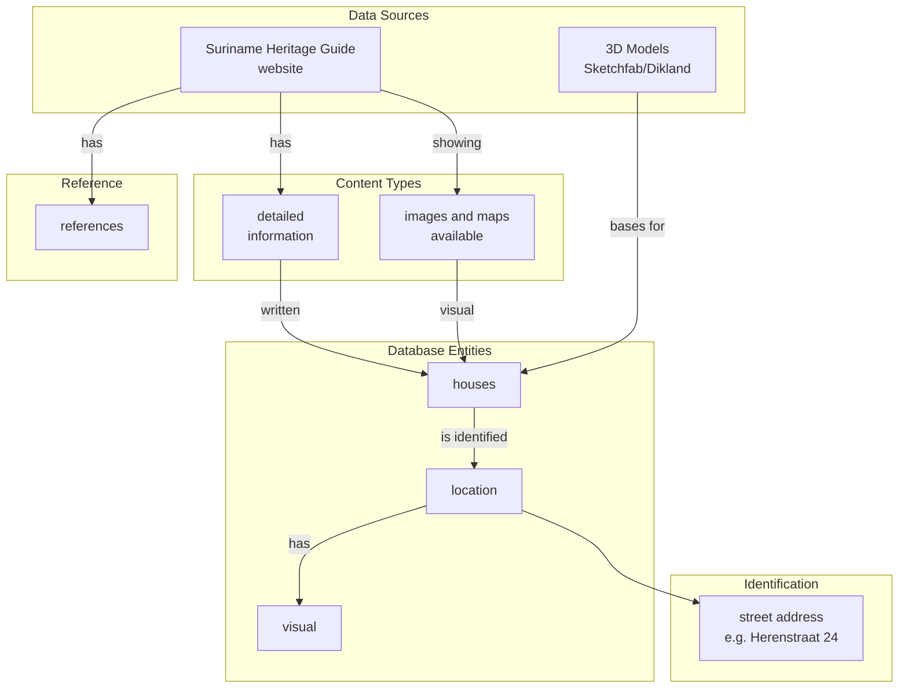

# Suriname Heritage Guide and 3D Models

> **Source:** [Suriname Heritage Guide](https://www.suriname-heritage-guide.com/)  
> **Status:** External reference / potential integration  
> **Related:** [Dikland 3D Models](https://sketchfab.com/)

---

## Dataset Overview

| Property                | Value                                      |
| ----------------------- | ------------------------------------------ |
| **Primary Entity**      | Historic buildings (panden)                |
| **Content Type**        | Text descriptions, images, maps, 3D models |
| **Geographic Coverage** | Paramaribo historic center                 |
| **Data Format**         | Website, Sketchfab 3D models               |

### Purpose

The Suriname Heritage Guide provides documentation of historic buildings in Suriname, including:

- Building descriptions and history
- Photographs and historical images
- Location information
- Links to 3D models on Sketchfab (Dikland project)
  - which will be changed as all this should be intregrated within the Suriname archive

---

## Data Sources

### Suriname Heritage Guide Website

**URL:** https://www.suriname-heritage-guide.com/

Content includes:

- Historic building information by street/area
- Architectural descriptions
- Historical context and occupancy
- Modern photographs

**Questions about this source:**

- What is the data format? (Structured or unstructured?)
- Is there an API or export capability?
- Data quantity: How many buildings documented?

### 3D Models - Dikland / Sketchfab

**Example URL:** https://sketchfab.com/... (3D modellen historische panden Suriname)

Example: Herenstraat 24 and 26

- 3D model with texture
- Model metadata (vertices, faces, materials)
- License information
- Download options

**Model Info (example):**
| Property | Value |
|----------|-------|
| Vertices | 7,874 |
| Faces | 6,737 |
| Materials | 1 |
| UV Mapping | 1-2 (0-2) |
| Download | Yes/No |

---

## Data Interpretation

---

## Potential Integration Points

### Link to Other Datasets

| Dataset                                | Relationship       | Linking Field               |
| -------------------------------------- | ------------------ | --------------------------- |
| [Ward Registers](04-ward-registers.md) | Street addresses   | `Straatnaam`, `Housnummer`  |
| [QGIS Maps](07-qgis-maps.md)           | Building locations | Coordinates                 |
| [Wikidata](08-wikidata.md)             | Building entities  | Q-IDs for notable buildings |

### Data Extraction Questions

- [ ] Can building data be structured into a database table?
- [ ] Are the 3D models geolocated (coordinates)?

---

## Example Data: Herenstraat 24

From the Excalidraw board screenshot:

**Herenstraat 6 t/m Keizerstraat Alleyway/driveway:**

- Contains building descriptions
- Historical information
- Photographs
- References to archival sources

---

## Technical Considerations

### 3D Model Integration

If incorporating 3D models:

- File formats: glTF, OBJ, FBX
- Coordinate system alignment with QGIS data
- Level of detail (LOD) for web display
- Texture/material storage
- Maybe using Cesium.js/Resium would be the way to go to create an hBIM/3D Paramaribo model?
- Maybe look into the IIIF 3D initiative

---

## Questions to Investigate

- [ ] What is the total number of buildings in the Heritage Guide?
- [ ] Is there an easier link between the 3D models and the PDFs?
- [ ] Can we extract data easier from the quite deep folder/pdf like organisation of the data?
- [ ] create a documentation/questionaire for the workflow/creation of the 3D models
- [ ] What story to tell within PURE3D?
