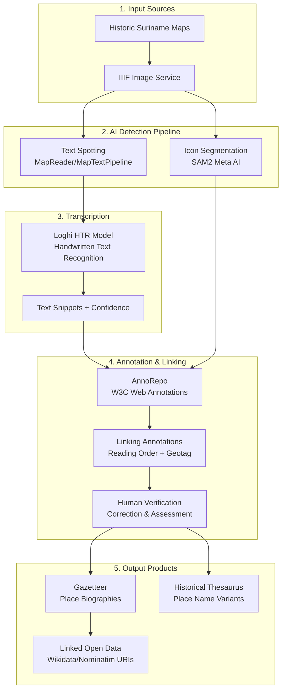
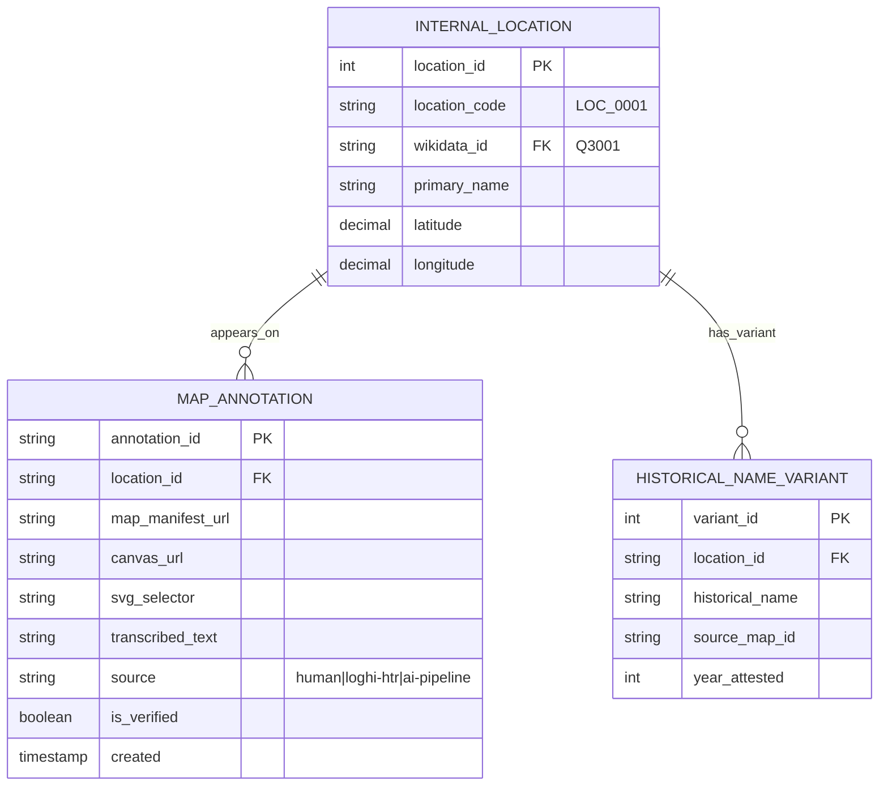

# Historic Map Annotations

> **Source:** Historic maps of Suriname from various archives  
> **Methodology:** [Necessary Reunions Project](https://necessaryreunions.org/)  
> **License:** Varies by source archive; see per-map metadata  
> **GitHub Reference:** https://github.com/globalise-huygens/necessary-reunions

---

## Dataset Overview

| Property          | Value                                                     |
| ----------------- | --------------------------------------------------------- |
| **Entity Type**   | Place annotations from historic maps                      |
| **Purpose**       | Extract place names, icons, and geographic data from maps |
| **Access Method** | IIIF Image Service + W3C Web Annotations                  |
| **Output Format** | Gazetteer entries, annotation pages, historical thesaurus |

### Purpose

Following the [Necessary Reunions project](https://necessaryreunions.org/) methodology, we process historic maps of Suriname to:

- **Extract handwritten place names** using HTR (Handwritten Text Recognition)
- **Detect map icons and symbols** (forts, plantations, settlements, churches)
- **Create geographic linkages** between historical cartographic representations and modern identifiers
- **Build a historical gazetteer** with place name variants across time
- **Georeference** historic maps to modern coordinate systems

---

## Project Reference

The Necessary Reunions project (NWO XS funded, Huygens Institute) provides a proven methodology for:

- **Remarrying maps to text**: Reuniting cartographic and textual sources separated by time
- **Georeferencing**: Aligning historical maps with modern coordinates
- **HTR-based text extraction**: Converting handwritten place names to machine-readable text
- **Iconography detection**: Identifying map symbols (forts, settlements, churches, etc.)

**Project Website:** https://necessaryreunions.org/  
**GitHub Repository:** https://github.com/globalise-huygens/necessary-reunions  
**Documentation:** https://necessaryreunions.org/documentation

---

## Workflow Overview



---

## Technology Stack

| Component              | Tool                                                  | Purpose                                              |
| ---------------------- | ----------------------------------------------------- | ---------------------------------------------------- |
| **Image Serving**      | IIIF (International Image Interoperability Framework) | Standardised high-resolution image delivery          |
| **Text Spotting**      | MapReader / MapTextPipeline                           | Detect text regions on maps                          |
| **Icon Detection**     | SAM2 (Meta AI Segment Anything)                       | Detect map symbols and icons                         |
| **HTR**                | Loghi HTR Model                                       | Transcribe handwritten text                          |
| **Annotation Storage** | AnnoRepo                                              | W3C Web Annotation repository                        |
| **Georeferencing**     | Allmaps                                               | Transform historical coordinates to modern positions |
| **Base Maps**          | Leaflet + OpenStreetMap                               | Modern reference layer                               |
| **Viewer/Editor**      | re:Charted (OpenSeadragon-based)                      | Browse maps and edit annotations                     |

---

## Annotation Types

Following the Necessary Reunions model, we create four types of annotations:

### 1. Text Spotting Annotations

Identify handwritten place names on maps with SVG polygon boundaries:

```json
{
  "@context": "http://www.w3.org/ns/anno.jsonld",
  "type": "Annotation",
  "motivation": "textspotting",
  "body": [
    {
      "type": "TextualBody",
      "value": "Paramaribo",
      "format": "text/plain",
      "purpose": "supplementing",
      "generator": {
        "id": "https://hdl.handle.net/10622/X2JZYY",
        "type": "Software",
        "label": "Loghi HTR Model"
      }
    }
  ],
  "target": {
    "source": "canvas:suriname-map-1667",
    "selector": {
      "type": "SvgSelector",
      "value": "<svg><polygon points=\"1234,567 1290,567 1290,590 1234,590\"/></svg>"
    }
  }
}
```

### 2. Iconography Annotations

Detect and classify map symbols (forts, plantations, settlements, churches):

```json
{
  "@context": "http://www.w3.org/ns/anno.jsonld",
  "type": "Annotation",
  "motivation": "iconography",
  "body": [
    {
      "purpose": "classifying",
      "source": {
        "id": "https://thesaurus.example.org/fort",
        "label": "Fort"
      }
    }
  ],
  "target": {
    "source": "canvas:suriname-map-1667",
    "selector": {
      "type": "SvgSelector",
      "value": "<svg><polygon points=\"...\"/></svg>"
    }
  }
}
```

### 3. Linking Annotations

Connect text and icon annotations to geographic locations:

```json
{
  "@context": "http://www.w3.org/ns/anno.jsonld",
  "type": "Annotation",
  "motivation": "linking",
  "body": [
    {
      "purpose": "geotagging",
      "source": {
        "preferredTerm": "Paramaribo",
        "uri": "https://www.wikidata.org/entity/Q3001",
        "geometry": {
          "type": "Point",
          "coordinates": [-55.1667, 5.8667]
        },
        "category": "settlement"
      }
    }
  ],
  "target": ["annotation:textspotting-001", "annotation:iconography-001"]
}
```

### 4. Georeferencing Annotations

Store control points aligning historical maps to modern coordinates (generated via Allmaps).

---

## Data Structure: Gazetteer Place

Each place extracted from maps follows this structure:

```typescript
interface GazetteerPlace {
  id: string; // Canonical place identifier
  name: string; // Standardised modern name
  category: string; // settlement, fort, plantation, river, etc.
  coordinates?: {
    x: number; // Longitude
    y: number; // Latitude
  };
  coordinateType: 'geographic' | 'pixel';
  alternativeNames?: string[]; // Historical spelling variants
  modernName?: string; // Current name if different

  // Map references
  manifestUrl?: string; // IIIF manifest
  canvasUrl?: string; // Specific map canvas
  mapReferences?: Array<{
    mapId: string;
    mapTitle: string;
    canvasId: string;
    linkingAnnotationId: string;
  }>;

  // Text recognition sources
  textRecognitionSources?: Array<{
    text: string;
    source: 'human' | 'ai-pipeline' | 'loghi-htr';
    motivation: 'textspotting' | 'iconography';
    confidence?: number;
    svgSelector?: string;
    canvasUrl?: string;
    isHumanVerified?: boolean;
  }>;

  // External links
  wikidataId?: string; // Q-ID for Wikidata linking
  nominatimId?: string; // OpenStreetMap reference
}
```

---

## Processing Pipeline Steps

| Step                      | Action                      | Tools                     | Output               |
| ------------------------- | --------------------------- | ------------------------- | -------------------- |
| **1. Ingest**             | Load historic map images    | IIIF, dezoomify-rs        | High-res tiles       |
| **2. Text Spotting**      | Detect text regions         | MapReader/MapTextPipeline | Bounding boxes       |
| **3. HTR**                | Transcribe handwritten text | Loghi HTR                 | Text + confidence    |
| **4. Icon Segmentation**  | Detect map symbols          | SAM2                      | SVG polygons         |
| **5. Initial Annotation** | Create W3C annotations      | AnnoRepo                  | Annotation pages     |
| **6. Human Review**       | Verify, correct, delete     | re:Charted viewer         | Assessed annotations |
| **7. Classification**     | Assign iconography types    | Thesaurus                 | Categorised icons    |
| **8. Linking**            | Connect to gazetteers       | Wikidata/Nominatim        | Geotagged places     |
| **9. Export**             | Build gazetteer             | API/JSON                  | Place biographies    |

---

## Integration with Suriname Database

The extracted place data integrates with our existing location model:



---

## Iconography Thesaurus Categories

Based on the Necessary Reunions taxonomy, adapted for Suriname maps:

| Category      | Dutch       | Description                       |
| ------------- | ----------- | --------------------------------- |
| Settlement    | Stad/Dorp   | Towns and villages                |
| Fort          | Fort        | Military fortifications           |
| Plantation    | Plantage    | Sugar, coffee, cotton plantations |
| Church        | Kerk        | Religious buildings               |
| River         | Rivier      | Waterways                         |
| Creek         | Kreek       | Smaller waterways                 |
| Island        | Eiland      | Islands                           |
| Mountain/Hill | Berg/Heuvel | Elevated terrain                  |
| Forest        | Bos         | Wooded areas                      |
| Boundary      | Grens       | Administrative boundaries         |

---

## Potential Map Sources

| Archive                       | Collection                | Notes                             |
| ----------------------------- | ------------------------- | --------------------------------- |
| Nationaal Archief (The Hague) | Leupe Collection          | VOC maps, including Suriname      |
| Stichting Surinaams Museum    | Historical map collection | Local archive                     |
| Koninklijke Bibliotheek       | Atlas collections         | Dutch cartographic heritage       |
| British Library               | Colonial maps             | Maps from British colonial period |

---

## Observations & Notes

### Benefits

1. **Reunites sources**: Maps and textual archives complement each other
2. **Extracts structured data**: Place names become searchable and linkable
3. **Tracks name evolution**: See how place names changed over centuries
4. **Modern coordinates**: Georeferencing enables spatial analysis
5. **Open standards**: IIIF + W3C Web Annotations ensure interoperability

### Challenges

1. **Map quality**: Faded or damaged maps affect HTR accuracy
2. **Historical handwriting**: Requires specialised HTR models
3. **Name ambiguity**: Same place may have many historical spellings
4. **Georeferencing accuracy**: Old maps may have significant distortions

### Questions to Investigate

- [ ] Which Suriname map collections are available in IIIF format?
- [ ] What is the coverage of existing georeferenced Suriname maps?
- [ ] How to adapt the Loghi HTR model for Suriname-specific handwriting?
- [ ] What iconography categories are specific to Suriname maps?

---

## Related Resources

| Resource                  | URL                                                     | Description                        |
| ------------------------- | ------------------------------------------------------- | ---------------------------------- |
| Necessary Reunions        | https://necessaryreunions.org/                          | Reference project methodology      |
| Necessary Reunions GitHub | https://github.com/globalise-huygens/necessary-reunions | Open source codebase               |
| re:Charted Viewer         | https://necessaryreunions.org/viewer                    | IIIF map viewer with annotations   |
| IIIF                      | https://iiif.io/                                        | Image interoperability framework   |
| Allmaps                   | https://allmaps.org/                                    | Georeferencing platform            |
| AnnoRepo                  | https://annorepo.globalise.huygens.knaw.nl/             | Web Annotation repository          |
| Loghi HTR                 | https://hdl.handle.net/10622/X2JZYY                     | Handwritten text recognition model |
| MapReader                 | https://github.com/maps-as-data/MapReader               | Text spotting pipeline             |
| SAM2                      | https://github.com/facebookresearch/sam2                | Meta AI Segment Anything           |
| Machines Reading Maps     | https://www.machines-reading-maps.ac.uk/                | Research project on map analysis   |
