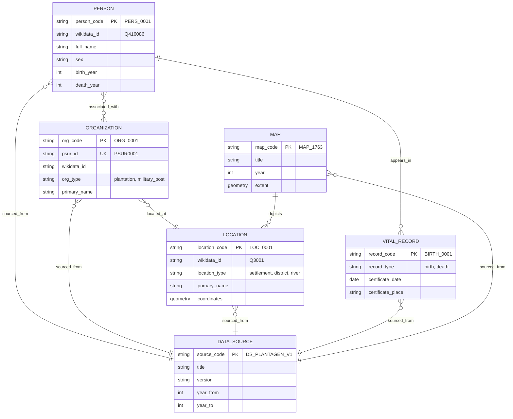
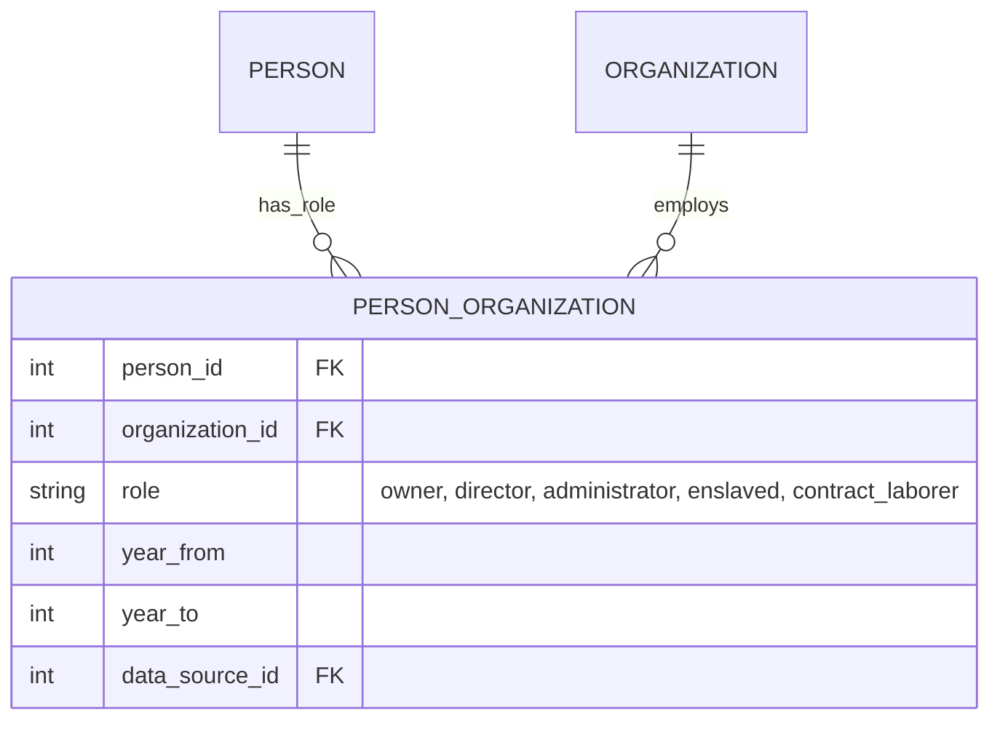
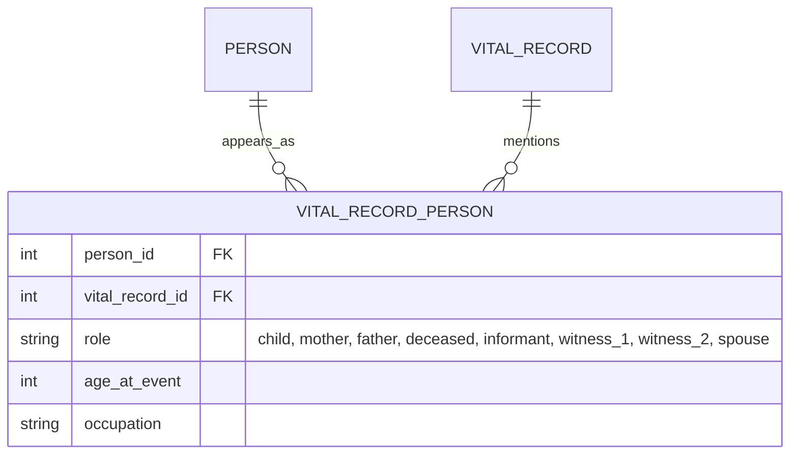
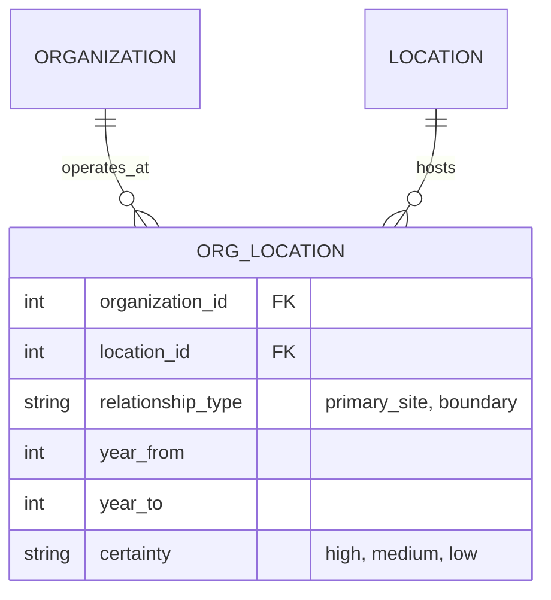
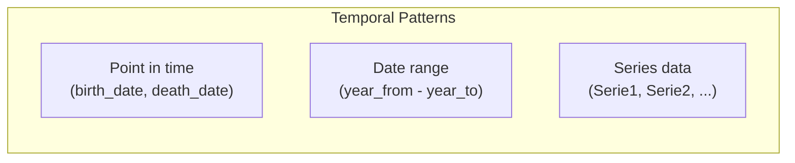
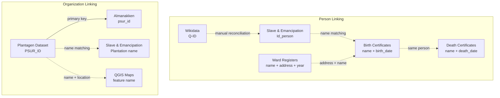

# Conceptual Model: Core Entities

> This document describes the high-level entities and relationships for the Suriname Time Machine database. It synthesizes concepts from all source datasets into a unified model.

---

## Core Entity Overview

Based on analysis of all 9 data sources, these are the primary entities:

---

## Entity Definitions

### PERSON

Individuals appearing in any dataset - enslaved persons, free persons, witnesses, officials, owners.

**Source datasets:**

- Slave & Emancipation Registers (enslaved individuals)
- Birth Certificates (children, parents, witnesses)
- Death Certificates (deceased, parents, spouses, witnesses)
- Ward Registers (free inhabitants)
- Almanakken (administrators, directors, owners)
- Wikidata (notable historical figures)

### ORGANIZATION

Collective entities - primarily plantations, but also military posts, businesses.

**Source datasets:**

- Plantagen Dataset (plantation master list)
- Almanakken (annual plantation records)
- Slave & Emancipation Registers (plantation references)
- Heritage Guide / 3D Models (buildings)

### LOCATION

Geographic places - settlements, districts, rivers, buildings, plantation sites.

**Source datasets:**

- QGIS Maps (digitized features)
- Ward Registers (streets, neighborhoods)
- Wikidata (coordinates, place hierarchy)
- Heritage Guide (building addresses)

### VITAL_RECORD

Birth and death certificates as documentary evidence.

**Source datasets:**

- Birth Certificates
- Death Certificates

### MAP

Georeferenced historic maps and their features.

**Source datasets:**

- QGIS Maps

### DATA_SOURCE

Metadata about each source dataset for provenance tracking.

**Implementation:** Already defined in data-sources documentation.

---

## Relationship Types

### Person-Organization Relationships

**Roles identified from sources:**
| Role | Source Dataset | Description |
|------|----------------|-------------|
| `owner` | Almanakken | Plantation owner (eigenaar) |
| `director` | Almanakken | Plantation director (directeur) |
| `administrator` | Almanakken | Administrator (administrateur) |
| `enslaved` | Slave & Emancipation | Enslaved person on plantation |
| `contract_laborer` | Post-1863 records | Contract worker |

### Person-Vital Record Relationships

**Roles on vital records:**
| Role | Birth Cert | Death Cert |
|------|-----------|------------|
| `child` | Yes | - |
| `mother` | Yes | - |
| `father` | Yes | - |
| `deceased` | - | Yes |
| `informant` | Yes | Yes |
| `witness_1` | Yes | Yes |
| `witness_2` | Yes | Yes |
| `spouse` | - | Yes (up to 4) |
| `parent_1` | - | Yes |
| `parent_2` | - | Yes |

### Organization-Location Relationships

### Temporal Aspects

Many relationships have temporal validity:

---

## Entity Count Estimates

| Entity       | Estimated Records  | Primary Source                             |
| ------------ | ------------------ | ------------------------------------------ |
| PERSON       | ~150,000 - 300,000 | All person datasets combined, deduplicated |
| ORGANIZATION | ~500 - 1,000       | Plantagen + Almanakken unique              |
| LOCATION     | ~1,000 - 5,000     | QGIS + Ward Register streets + Wikidata    |
| VITAL_RECORD | ~255,000           | Birth (63k) + Death (192k)                 |
| MAP          | ~10 - 20           | QGIS georeferenced maps                    |
| DATA_SOURCE  | 9                  | One per dataset                            |

---

## Cross-Dataset Linking Strategy

### How entities connect across sources:

---

## Open Questions

### Person Identity Resolution

- [ ] How to handle name variations (spelling, transliteration)?
- [ ] What confidence threshold for automated matching?
- [ ] How to represent uncertain identity links?

### Temporal Precision

- [ ] How to handle dates with only year known?
- [ ] How to represent "floruit" (active period) for persons?
- [ ] What granularity for Series 1-4 in Plantagen Dataset?

### Geographic Resolution

- [ ] How to link historic districts to modern boundaries?
- [ ] What coordinate accuracy is achievable from historic maps?
- [ ] How to handle location name changes over time?

---

## Next Steps

1. Create logical model with full attribute lists
2. Define junction tables for M:N relationships
3. Establish normalization level (target: 3NF with controlled denormalization)
4. Design provenance tracking columns

---

7 January 2026
