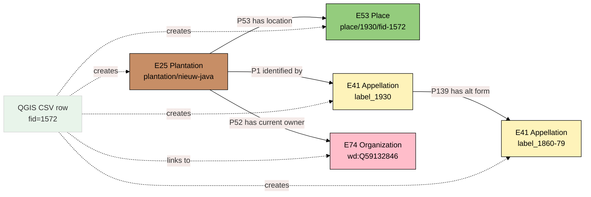
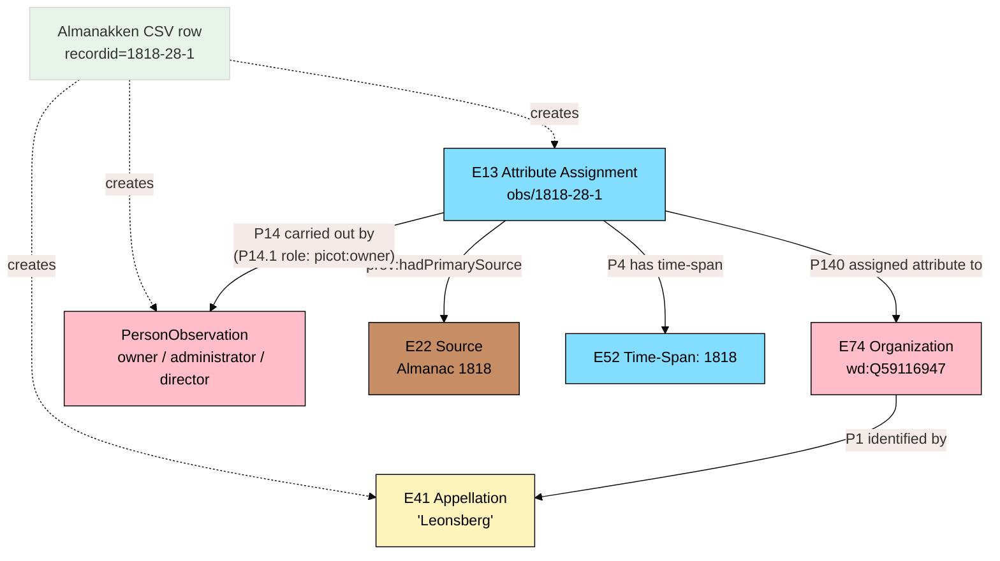
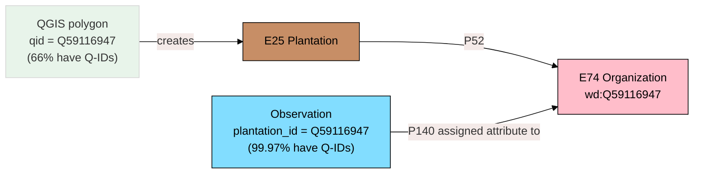

# CSV-to-Model Audit: Do the Mappings Actually Work?

This document takes every **essential column** from the QGIS and Almanakken CSVs --- the columns flagged as "Crucial for Linking" or "Primary Information" by domain expert TvO --- and holds each one against the data model defined in [SKILL.md](../../.github/skills/data-model/SKILL.md). For each column we show a real data sample, state what entity and property the model targets, report the actual coverage, and evaluate whether the mapping works, breaks, or needs adjustment.

Read this after [source-pattern-explained.mdx](source-pattern-explained.mdx) (Layers 1--7) and [observations-explained.mdx](observations-explained.mdx) (Layers 8--12).

---

## How to Read This Document

Each column gets a card structured like this:

> **Column** --- the CSV header as it appears in the file
> **Sample** --- one or two real values from the data
> **Model target** --- the entity, property, and URI pattern the model prescribes
> **Coverage** --- how many of the 1,597 (QGIS) or 23,003 (Almanakken) rows are non-empty
> **Verdict** --- does the mapping work, and if not, what needs to change

Verdicts use three labels:

- **Works** --- mapping is sound, implementation can proceed
- **Works with caveat** --- mapping is sound in principle but has a data-quality or scoping issue to watch
- **Needs adjustment** --- something in the model, the data, or both requires change before this column maps cleanly

---

# Part 1: QGIS Plantation Polygons (1930 Map)

**File:** `data/07-gis-plantation-map-1930/plantation_polygons_1930.csv`
**Rows:** 1,597 | **Columns:** 10 | **Delimiter:** semicolon

```
fid;psur_id;psur_id2;psur_id3;label_1930;label_1860-79;qid;qid_alt;plantation_label;coords
```

The QGIS CSV is the spatial backbone --- it supplies the polygon geometries that become E53 Place entities. Every row is one polygon traced from the 1930 plantation map.



---

### `fid` --- Feature ID

> **Sample:** `1572`, `2099`, `2600`
> **Model target:** `E53 Place` --- `P48 has preferred identifier` (E42 Identifier, QGIS fid); used in URI `place/1930/fid-{fid}`
> **Coverage:** 1,597 / 1,597 (100%)

**Verdict: Works.** Every polygon has an `fid` assigned by QGIS. The value is auto-generated and unique within the layer. It becomes both a property on the E53 Place and the slug in the URI. No issues.

---

### `coords` --- Polygon Geometry

> **Sample:** `Polygon ((630194.67... 647568.89..., ...))` (WKT in EPSG:32621 / UTM Zone 21N)
> **Model target:** `E53 Place` --- `geo:hasGeometry / geo:asWKT`
> **Coverage:** 1,597 / 1,597 (100%)

**Verdict: Works with caveat.** Every row has geometry. The mapping to GeoSPARQL is standard. The caveat: coordinates are in UTM Zone 21N (EPSG:32621), but the model and SKILL.md reference EPSG:4326 (WGS84) for storage. The transformation script must reproject before serializing. This is a processing step, not a model issue.

---

### `qid` --- Wikidata Q-Identifier

> **Sample:** `Q59132846` (Nieuw Java), `Q59115512` (Destombesburg), empty (534 rows)
> **Model target:** `E25 Plantation` --- `P52 has current owner` --> `wd:{Q-ID}` (E74 Organization)
> **Coverage:** 1,062 / 1,597 (66%)

**Verdict: Works with caveat.** The Q-ID is the key that links the QGIS polygon (via E25) to the Wikidata organization (E74). The mapping is the cornerstone of the entire linking strategy:

```
E25 plantation/{slug} --P52 has current owner--> E74 wd:{Q-ID}
```

The caveat is significant: **536 polygons (34%) have no Q-ID**. These are polygons traced from the 1930 map that have not yet been matched to a Wikidata entity. For these, we can still create:

- E53 Place (the polygon exists)
- E41 Appellation (if `label_1930` is present)

But we cannot create the P52 link to E74, and these polygons will not connect to any Almanakken data (which links via `plantation_id` Q-ID). This is a known data-completion gap, not a model flaw.

---

### `plantation_label` --- Display Label

> **Sample:** `Nieuw Java`, `Destombesburg`, `Aan De Vier Kinderen`
> **Model target:** `E25 Plantation` --- `rdfs:label` (display convenience)
> **Coverage:** 1,063 / 1,597 (67%)

**Verdict: Works.** This is the human-readable display label for the plantation. The model treats `rdfs:label` as a convenience alongside the formal E41 chain. Coverage is close to the Q-ID coverage (1,063 vs 1,062) --- almost exactly the rows that have been identified get a display label.

---

### `label_1930` --- Name on the 1930 Map

> **Sample:** `Nieuw Java`, `Destombesburg`, empty (565 rows)
> **Model target:** `E41 Appellation` --- `P190 has symbolic content` (text); `P1i identifies` E25; `P128i is carried by` E22 (1930 map source)
> **Coverage:** 1,032 / 1,597 (65%)

**Verdict: Works with caveat.** This is the name as it appears on the 1930 map --- the cartographic label. In CRM terms, the 1930 map (E22) _carries_ this appellation (E41), and the appellation _identifies_ the plantation (E25). The name provenance is clean:

```
E22 Map1930 --P128 carries--> E41 "Nieuw Java" --P1i identifies--> E25 Plantation
```

The caveat: 565 polygons (35%) have no label from the 1930 map. Some of these have labels from the 1860--79 map instead. Some have no label at all. For label-less polygons, the E41 instance is simply not created --- the E53 Place exists but the plantation has no name vouched by this source.

**Issue to flag:** The `label_1930` and `plantation_label` columns are very similar (1,032 vs 1,063 non-empty). Are they always identical when both are present? If `plantation_label` is always derived from `label_1930` (or vice versa), one of them is redundant. If they can differ --- for instance, `plantation_label` being a manually standardized version --- they represent _different_ E41 instances and P139 should link them. This needs clarification.

---

### `label_1860-79` --- Name on the 1860--79 Map

> **Sample:** `Nieuw Java`, `Destombesburg`, `Aan De Vier Kinderen`
> **Model target:** `E41 Appellation` --- `P190 has symbolic content`; `P1i identifies` E25; `P128i is carried by` E22 (1860--79 map source); linked to `label_1930` via `P139 has alternative form`
> **Coverage:** 1,040 / 1,597 (65%)

**Verdict: Works.** This is the name from an earlier map. The model handles this elegantly --- it is simply another E41 Appellation carried by a different E22 source:

```
E22 Map1860 --P128 carries--> E41 "Destombesburg" --P1i identifies--> E25 Plantation
E22 Map1930 --P128 carries--> E41 "Destombesburg" --P1i identifies--> E25 Plantation
E41(1860) --P139 has alternative form--> E41(1930)
```

When both labels exist and differ (spelling variation over 60+ years), P139 captures the relationship between name forms. When both labels are identical, P139 still holds --- it documents that the _same name_ was observed on two different sources, which is useful provenance.

---

### `qid_alt` --- Alternative Wikidata Q-ID

> **Sample:** `Q124832140` (on row for "Aan De Vier Kinderen"), mostly empty
> **Model target:** `E74 Organization` --- `P99i was dissolved by` (E68 Dissolution, merger network); and/or `P51 has former or current owner`
> **Coverage:** 230 / 1,597 (14%)

**Verdict: Works with caveat.** This column records a _second_ Q-ID for cases where the polygon represents a plantation that merged with or was absorbed by another. In the model, the primary `qid` is the "current" organization (P52), and `qid_alt` is either:

1. A former owner/operator (P51), or
2. An organization that was dissolved into the primary (`P99i was dissolved by` -> E68 Dissolution)

The SKILL.md mapping says: _"P51 former owner, P99i was dissolved by"_. This is slightly ambiguous --- should every `qid_alt` produce both a P51 triple and a dissolution event? Or is context needed to determine which?

**Recommendation:** Treat `qid_alt` as `P99i was dissolved by` by default (the alternative organization was dissolved into the primary). The P51 triple is then inferred: if an organization was dissolved, the plantation had a former owner. This avoids generating P51 triples without temporal qualification.

---

### `psur_id`, `psur_id2`, `psur_id3` --- Slave Register Identifiers

> **Sample:** `PSUR0093`, `PSUR0197`, mostly empty
> **Model target:** `E74 Organization` --- `skos:closeMatch psur:{ID}`
> **Coverage:** psur_id: 443 / 1,597 (28%) | psur_id2: 15 / 1,597 (1%) | psur_id3: 2 / 1,597 (0.1%)

**Verdict: Works with caveat.** The PSUR IDs connect to the slave register dataset, enabling cross-dataset linking. The model uses `skos:closeMatch` because the match is not exact --- the PSUR register's "plantation" may not be the same institutional scope as the QGIS polygon's plantation.

The coverage caveat: only 28% of polygons have even one PSUR ID. Multiple IDs (psur_id2, psur_id3) appear on 15 and 2 rows respectively --- these represent merged plantations where multiple former entities each had their own slave register entry.

As the SKILL.md notes: the PSUR link is _"flawed"_ because it conflates organizational and physical identity. The `skos:closeMatch` predicate is the right choice here --- it signals similarity without asserting identity.

---

## QGIS Summary Scorecard

| Column             | Target Entity                   | Coverage | Verdict                                     |
| ------------------ | ------------------------------- | -------- | ------------------------------------------- |
| `fid`              | E53 Place                       | 100%     | Works                                       |
| `coords`           | E53 Place (geo:asWKT)           | 100%     | Works (reproject to WGS84)                  |
| `qid`              | E74 via P52                     | 66%      | Works (34% unlinked)                        |
| `plantation_label` | E25 rdfs:label                  | 67%      | Works                                       |
| `label_1930`       | E41 Appellation                 | 65%      | Works (check overlap with plantation_label) |
| `label_1860-79`    | E41 Appellation                 | 65%      | Works                                       |
| `qid_alt`          | E74 P99i was dissolved by (E68) | 14%      | Works (clarify P51 vs dissolution)          |
| `psur_id`          | E74 skos:closeMatch             | 28%      | Works (flawed link, by design)              |
| `psur_id2`         | E74 skos:closeMatch             | 1%       | Works (merger cases only)                   |
| `psur_id3`         | E74 skos:closeMatch             | 0.1%     | Works (rare triple-merger)                  |

**Overall assessment:** The QGIS mapping is clean. The main concern is completeness (34% of polygons unlinked), not model structure. Every column has a well-defined target entity and property. The only question mark is the overlap between `label_1930` and `plantation_label`.

---

# Part 2: Almanakken (Plantations Surinaamse Almanakken)

**File:** `data/06-almanakken - Plantations Surinaamse Almanakken/Plantations Surinaamse Almanakken v1.0.csv`
**Rows:** 23,003 | **Columns:** 63 | **Delimiter:** comma

The Almanakken is the time-series backbone --- 23,000 annual snapshots of plantation organizations. Each row becomes an `E13 Attribute Assignment`. The columns below are those marked "Crucial for Linking" or "Primary Information: Yes" in the [data-sources documentation](../data-sources/06-almanakken.md).



---

## Group A: Identity and Linking

These columns establish _which_ plantation an observation refers to and how it connects to other datasets.

### `recordid` --- Record Identifier

> **Sample:** `1818-28-1`, `1829-56-300`, `1846-81-591`
> **Model target:** Observation URI --- `obs/{recordid}`
> **Coverage:** 23,003 / 23,003 (100%)

**Verdict: Works.** The record ID encodes `{year}-{page}-{sequence}` and is unique. It becomes the URI slug for the observation. This is the primary identifier for provenance --- when someone asks "where did this statement come from?", the answer traces to a specific page in a specific almanac edition.

---

### `year` --- Observation Year

> **Sample:** `1818`, `1829`, `1846`
> **Model target:** `E13 Attribute Assignment` --- `P4 has time-span` (E52 Time-Span)
> **Coverage:** 23,003 / 23,003 (100%)

**Verdict: Works.** Every row has a year. This is the temporal anchor of the observation pattern. It is what lets us say "in 1818, the owner was X" vs "in 1845, the owner was Y" without contradiction.

---

### `plantation_id` --- Wikidata Q-Identifier

> **Sample:** `Q59116947` (Leonsberg), `Q59115397` (Concordia), `Q124832564` (De Goede Vriend)
> **Model target:** `E13 Attribute Assignment` --- `P140 assigned attribute to` --> `wd:{Q-ID}` (E74 Organization)
> **Coverage:** 22,996 / 23,003 (99.97%)

**Verdict: Works.** This is the link from the observation to the organization. Nearly every row has a Q-ID --- only 7 rows lack one. This is the column that, when matched against the QGIS `qid` column, connects the almanac time series to the map polygon:

```
Almanakken: obs/1818-28-1 --P140 assigned attribute to--> wd:Q59116947
QGIS:      plantation/leonsberg --P52 has current owner--> wd:Q59116947
```

The 99.97% coverage means the Almanakken side of the linkage is essentially complete. The bottleneck is on the QGIS side (66% have Q-IDs).

---

### `plantation_std` --- Standardized Plantation Name

> **Sample:** `Leonsberg`, `Concordia`, `Vuide Bouteille`
> **Model target:** `E41 Appellation` --- `P190 has symbolic content` (standardized form); `P1i identifies` E74 Organization
> **Coverage:** 22,970 / 23,003 (99.9%)

**Verdict: Works.** This is the standardized (modern-spelling) form of the plantation name. In the model, it creates an E41 Appellation instance identifying the E74 organization. Since this is a _standardized_ name, it is also used as the `rdfs:label` on E74.

---

### `plantation_org` --- Original Plantation Name

> **Sample:** `Leonsberg`, `Concordia`, `en Vuide Bouteille`
> **Model target:** `E41 Appellation` --- `P190 has symbolic content` (original form); `P139 has alternative form` links to `plantation_std` E41
> **Coverage:** 22,970 / 23,003 (99.9%)

**Verdict: Works.** This is the name as the clerk wrote it in the almanac. Often identical to `plantation_std`, but sometimes differs in spelling or includes connective text ("en Vuide Bouteille" vs "Vuide Bouteille"). When different, it creates a second E41 instance linked via P139 to the standardized form. The almanac source (E22) carries _this_ E41 specifically:

```
E22 Almanac1846 --P128 carries--> E41 "en Vuide Bouteille" --P1i identifies--> E74
E41 "en Vuide Bouteille" --P139 has alt form--> E41 "Vuide Bouteille"
```

---

### `psur_id` --- Slave Register Identifier

> **Sample:** `PSUR0197`, `PSUR0061`, empty
> **Model target:** `E74 Organization` --- `skos:closeMatch psur:{ID}`
> **Coverage:** 21,898 / 23,003 (95%)

**Verdict: Works with caveat.** High coverage (95%), but the SKILL.md and domain expert both flag this as complex. The PSUR ID may link to a specific plantation in the slave register that was later split or merged. When `split1_id` or `partof_id` is also present, the "real" PSUR link might be to one of the component plantations, not the merged entity.

As TvO notes: _"when linking with PSUR it is best to also include [split/partof references]!"_ The model handles this via `skos:closeMatch` (not `owl:sameAs`), which correctly signals approximate equivalence. But transformation scripts should emit warnings when a row has both `psur_id` and `split1_id` with a conflicting Q-ID.

---

### `page` --- Almanac Page

> **Sample:** `28`, `56`, `81`
> **Model target:** `E13 Attribute Assignment` --- `P3 has note` (page reference)
> **Coverage:** 22,999 / 23,003 (100%)

**Verdict: Works.** Page reference for provenance. Currently a convenience string. As TvO notes, DBNL does not yet provide IIIF, but if it does in the future, this could become a IIIF canvas URI. The model's `P3 has note` is intentionally untyped to accommodate both.

---

## Group B: Observation Properties (Time-Varying Data)

These columns are the values that change year to year --- the reason we need the observation pattern in the first place.

### `eigenaren` --- Owners

> **Sample:** `Abraham de Leon`, `Isaak Monsanto.`, empty (many rows)
> **Model target:** `E13 Attribute Assignment` --- `P14 carried out by` --> `PersonObservation` (P14.1 role: picot:owner)
> **Coverage:** 13,049 / 23,003 (57%)

**Verdict: Works with caveat.** The owner field contains one or more person names in a single string, sometimes comma-separated, sometimes with punctuation quirks (note the period after "Monsanto."). Each name becomes a `PersonObservation` with `pico:hasRole picot:owner`, linked to the `E13 Attribute Assignment` for that year via `P14 carried out by`.

The caveats:

1. **Name parsing** --- multi-name fields need splitting. TvO confirms this has already been done in a separate normalization effort (name info split into separate fields in v2.0).
2. **Natural persons vs legal entities** --- TvO notes owners can be "organisations, banks, legal representatives, heirs." The `PersonObservation` frame may not fit legal entities well. Consider: should "De Erven Van X" (heirs of X) be modeled as a person observation or an E74 subgroup?
3. **57% coverage** --- not every row lists an owner. This is expected: some editions did not record owners, or the field was simply left blank.

---

### `administrateurs` --- Administrators

> **Sample:** `Abraham de Leon`, multi-name strings
> **Model target:** `E13 Attribute Assignment` --- `P14 carried out by` --> `PersonObservation` (P14.1 role: picot:administrator)
> **Coverage:** 2,071 / 23,003 (9%)

**Verdict: Works with caveat.** Same parsing challenge as `eigenaren`. The low coverage (9%) is because earlier almanac editions used a different structure --- the `administrateurs_in_Europa` and `administrateurs_in_Suriname` columns were used in later editions instead.

**Issue to flag:** The 9% coverage for `administrateurs` combined with 71% for `admin_europa` (16,452 rows) and 26% for `admin_suriname` (5,943 rows) suggests the data is split across three columns by era. The model (SKILL.md) only maps `administrateurs` to `P14 carried out by` with role qualifier. The Europa/Suriname variants are not in the mapping table.

**Recommendation:** Add `administrateurs_in_Europa` and `administrateurs_in_Suriname` as additional sources for the `P14 carried out by` --> `PersonObservation` mapping. Tag the PersonObservation with a location qualifier (Europe vs Suriname) to preserve the distinction.

---

### `directeuren` --- Directors

> **Sample:** person name strings
> **Model target:** `E13 Attribute Assignment` --- `P14 carried out by` --> `PersonObservation` (P14.1 role: picot:director)
> **Coverage:** 11,993 / 23,003 (52%)

**Verdict: Works.** Reasonable coverage for the on-site plantation manager. Same name-parsing considerations as above, but this is a single-column mapping with no era-split ambiguity.

---

### `slaven` --- Number of Enslaved People

> **Sample:** integer values, many empty
> **Model target:** `E13 Attribute Assignment` --- `P141 assigned` (E54 Dimension: enslaved count)
> **Coverage:** 1,535 / 23,003 (7%)

**Verdict: Works with caveat.** The mapping is straightforward --- one integer property on the observation. But the 7% coverage is startlingly low. This is because enslaved population counts only appear in 1834+ editions of the almanac.

TvO notes that v2.0 adds a `slaves_norm` column (normalized integer) and a `slaves_shared_with` column (Q-ID of plantation sharing the workforce). The `slaves_shared_with` column introduces a new structural relationship that the current model does not account for.

**Recommendation for v2.0:** Add a property linking to a second E74, to model the shared-enslaved-population relationship. This is semantically different from dissolution (`P99i was dissolved by`) --- it describes an operational arrangement, not an identity change.

---

### `namen_totslaafgemaakten` --- Sranantongo Plantation Name

> **Sample:** Sranantongo name strings (only in last 3 almanac years)
> **Model target:** `E41 Appellation` --- `P190 has symbolic content`; `P72 has language` --> Sranantongo; `P1i identifies` E25 Plantation
> **Coverage:** 3,277 / 23,003 (14%)

**Verdict: Works with caveat --- and this column deserves special attention.**

The column name is misleading (and is being corrected to `sranantongo_naam` in v2.0). These are NOT names of enslaved people. They are the names by which enslaved people _called the plantation_ --- in Sranantongo, the creole language of Suriname. This is one of the few places in the entire dataset where the perspective of the enslaved community is preserved.

In CRM terms, this is another E41 Appellation instance, but with a crucial difference: `P72 has language` points to Sranantongo (ISO 639-3: `srn`), not Dutch. It identifies the E25 Plantation (the physical place), not the E74 Organization (the colonial legal entity):

```
E22 Almanac --P128 carries--> E41 "..." (srn) --P1i identifies--> E25 Plantation
```

TvO recommends this be placed _"somewhere prominent."_ The model supports this --- E41 entities can carry language tags, and the provenance chain documents which source recorded it. But the transformation script should ensure these E41 instances are tagged with `@srn` and visually prioritized in any display layer.

This is a case where the colonial administrative source accidentally preserved counter-colonial knowledge. The model should not bury it.

---

### `product_std` --- Product Type

> **Sample:** `koffie`, `suiker`, `katoen`
> **Model target:** `E13 Attribute Assignment` --- `P141 assigned` (E55 Type: product)
> **Coverage:** 15,800 / 23,003 (69%)

**Verdict: Works.** Standardized product names with good coverage. Currently modeled as a string property. Could be upgraded to link to a SKOS vocabulary of colonial plantation products (coffee, sugar, cotton, cacao, etc.) for richer querying. This is a nice-to-have, not a blocker.

---

### `loc_std` --- Standardized Location

> **Sample:** `Suriname`, `Boven-Commewijne`, `Orelana Kreek`
> **Model target:** `E13 Attribute Assignment` --- `P7 took place at` (E53 Place, string)
> **Coverage:** 23,001 / 23,003 (100%)

**Verdict: Works with caveat.** Near-perfect coverage. The model treats this as a string on the observation --- not as an E53 Place. This is intentional: the almanac location description is a _river/district name_, not a geometry. The actual geometry comes from the QGIS polygon.

The caveat: these location strings could eventually link to a topology of Surinamese rivers and districts (if such a dataset is created). For now, string-as-property is the right call --- it avoids creating spurious E53 entities for unresolved place names.

---

### `deserted` --- Plantation Deserted Status

> **Sample:** `verlaten`, `vervallen`, various Dutch terms
> **Model target:** `E13 Attribute Assignment` --- `P141 assigned` (E55 Type: deserted status)
> **Coverage:** 2,294 / 23,003 (10%)

**Verdict: Works with caveat.** The model maps this to a status type, but the actual CSV values are Dutch text strings (`verlaten`, `vervallen`), not true/false. Two options:

1. **Boolean coercion:** Treat any non-empty value as `true`, empty as `false` (or unknown).
2. **E55 Type mapping:** Map the Dutch terms to `type/plantation-status/abandoned` vocabulary terms, preserving the distinction between `verlaten` (abandoned) and `vervallen` (dilapidated).

**Recommendation:** Option 2. The E55 PlantationStatus vocabulary already exists in the model, and the distinction between "abandoned" and "dilapidated" may be historically significant.

---

### `size_std` --- Size in Akkers

> **Sample:** integer values (akkers/acres)
> **Model target:** `E13 Attribute Assignment` --- `P43 has dimension` (E54 Dimension: akkers)
> **Coverage:** 4,264 / 23,003 (19%)

**Verdict: Works.** Straightforward numeric property. TvO notes it can change over time (plantations grew or shrank), which is exactly why it belongs on the observation rather than on the E25 or E74 directly. The 19% coverage reflects that size information was not consistently recorded across all edition years.

---

## Group C: Structural Relationships

These columns encode mergers, splits, part-of relationships, and cross-references between plantations. They are the most complex mapping challenge.

### `split1_lab` through `split5_lab` --- Merged Plantation Labels

> **Sample:** `Porto Bello`, `Claverblad`, `Nieuw-Rust`
> **Model target:** Labels for merged/component plantations (display)
> **Coverage:** split1_lab: 7,764 / 23,003 (34%)

### `split1_id` through `split5_id` --- Merged Plantation Q-IDs

> **Sample:** Q-IDs of component plantations
> **Model target:** `E74 Organization` --- `P99i was dissolved by` (E68 Dissolution) targeting the primary `plantation_id`
> **Coverage:** split1_id: 729 / 23,003 (3%)

**Verdict: Needs adjustment.** This is the most structurally complex column group, and the mismatch between label coverage (34%) and ID coverage (3%) is the critical issue.

7,764 rows (34%) have a `split1_lab` (the _name_ of a merged component), but only 729 (3%) have a `split1_id` (the _Q-ID_ of that component). That means for 7,035 rows, we know that a plantation was merged with another but cannot identify the component by Q-ID --- we only have a name string.

The model maps `split_id` values to dissolution events:

```
wd:Q-split1 --P99i was dissolved by--> E68 Dissolution --P14 carried out by--> wd:Q-primary
```

This works when the Q-ID is present. When only the label is available, we have an unresolved reference. The current model has no way to represent "this organization probably absorbed a plantation called 'Porto Bello' but we don't know its Q-ID."

**Naming note:** TvO confirms these columns are being renamed to `has_parts1_label`, `has_parts1_id`, etc. in v2.0. The "split" terminology is misleading --- these are not plantations that _split off_ from the current one, but plantations that were _absorbed into_ it. The v2.0 naming ("has parts") is clearer.

**Recommendation:**

1. When `split_id` is present: emit `P99i was dissolved by` -> E68 Dissolution triple as designed.
2. When only `split_lab` is present: create an E41 Appellation with the label, attached to the observation, flagged for resolution.

---

### `partof_lab` / `part_of_id` --- Part-Of Relationship

> **Sample (label):** text (rare)
> **Model target:** `E74 Organization` --- `P107i is member of` --> parent Q-ID
> **Coverage:** partof_lab: 82 / 23,003 (0.4%)

**Verdict: Works.** The inverse of the split columns --- this plantation is a component of a larger merged entity. The model maps `part_of_id` to `P107i is member of`:

```
wd:Q-this --P107i is member of--> wd:Q-parent
```

With only 82 rows, this is rare but important for structural completeness. P107i is standard CRM for group membership. No issues.

---

### `reference_std_id` / `reference_std_lab` --- Reference Plantation

> **Sample:** Q-IDs and labels of plantations that "own" or are otherwise linked to this one
> **Model target:** `E13 Attribute Assignment` --- `crm:P67_refers_to` --> `wd:{Q-ID}`
> **Coverage:** reference_std_id: 3,205 / 23,003 (14%)

**Verdict: Works with caveat.** TvO explains this is _"a plantation that owns the plantation mentioned in this record"_ --- a form of inter-plantation ownership. The model uses `crm:P67_refers_to` which is admittedly generic.

**Recommendation:** Consider a more specific subproperty to distinguish this from generic references. The relationship is directional and ownership-based, which `P67 refers to` does not fully capture.

---

## Group D: Contextual Information

Columns marked "Primary Information" but not "Crucial for Linking."

### `function` --- Plantation Function/Purpose

> **Sample:** `kerkplaats`, `militaire post`, Dutch text
> **Model target:** `E13 Attribute Assignment` --- `P3 has note` (free text, deferred priority)
> **Coverage:** 13,258 / 23,003 (58%)

**Verdict: Works.** Modeled as free text on the observation. High coverage suggests this is actually quite information-rich. Could be upgraded to an E55 Type vocabulary in the future ("military post", "church plantation", etc.), but free text is the right first step.

---

### `additional_info` --- Additional Information

> **Sample:** Dutch text about workforce or plantation use
> **Model target:** `E13 Attribute Assignment` --- `P3 has note` (free text, deferred priority)
> **Coverage:** 1,776 / 23,003 (8%)

**Verdict: Works.** Free text annotation. Low coverage, but the content may be historically rich. No model issues.

---

## Group E: Unmapped Columns Worth Noting

These columns are NOT flagged as essential in the data-sources documentation but deserve discussion because the model either ignores them or the coverage suggests they matter.

### `administrateurs_in_Europa` / `administrateurs_in_Suriname`

> **Coverage:** 16,452 (71%) / 5,943 (26%)
> **Current model status:** Not in SKILL.md mapping table

These have _higher_ coverage than `administrateurs` (9%). The later almanac editions split the administrator role by location. Ignoring them loses 71% of all administrator data.

**Must add to model.** Map both to `P14 carried out by` PersonObservation (P14.1 role: picot:administrator), with an additional qualifier for geographic scope (Europe/Suriname).

### `blank-officier` --- Overseer

> **Coverage:** very sparse (1835 edition only)
> **Current model status:** Not in SKILL.md mapping table

A fourth plantation role (overseers, second to the director). Only recorded in one edition, so extremely sparse. Could be modeled as a fourth PICO role (`picot:overseer`?) if considered worth the effort.

### `litt_std` --- Letter Index

> **Coverage:** 18,632 / 23,003 (81%)
> **Current model status:** Not mapped (described as "district letter abbreviation")

High coverage, but TvO says _"No, needs to be further normalised."_ Skip for now; flag for future district-linking work.

---

## Almanakken Summary Scorecard

| Column                    | Target Entity                 | Coverage | Verdict                                           |
| ------------------------- | ----------------------------- | -------- | ------------------------------------------------- |
| `recordid`                | Observation URI               | 100%     | Works                                             |
| `year`                    | P4 has time-span (E52)        | 100%     | Works                                             |
| `plantation_id`           | E74 via P140 assigned attr.   | 99.97%   | Works                                             |
| `plantation_std`          | E41 Appellation               | 99.9%    | Works                                             |
| `plantation_org`          | E41 Appellation (P139)        | 99.9%    | Works                                             |
| `psur_id`                 | E74 skos:closeMatch           | 95%      | Works (caveat: merger complexity)                 |
| `page`                    | P3 has note                   | 100%     | Works                                             |
| `eigenaren`               | PersonObservation (owner)     | 57%      | Works (caveat: name parsing, legal entities)      |
| `administrateurs`         | PersonObservation (admin)     | 9%       | Works (but see Europa/Suriname split)             |
| `directeuren`             | PersonObservation (director)  | 52%      | Works                                             |
| `slaven`                  | P141 assigned (E54 Dimension) | 7%       | Works (v2.0 adds slaves_norm)                     |
| `namen_totslaafgemaakten` | E41 Appellation (srn)         | 14%      | Works (PROMINENT placement)                       |
| `product_std`             | P141 assigned (E55 Type)      | 69%      | Works                                             |
| `loc_std`                 | P7 took place at (E53)        | 100%     | Works                                             |
| `deserted`                | P141 assigned / E55 Type      | 10%      | Needs adjustment (text, not boolean)              |
| `size_std`                | P43 has dimension (E54)       | 19%      | Works                                             |
| `split1_id`               | P99i was dissolved by (E68)   | 3%       | Needs adjustment (label coverage 34%, ID only 3%) |
| `partof_lab/id`           | P107i is member of            | 0.4%     | Works                                             |
| `reference_std_id`        | crm:P67_refers_to             | 14%      | Works (consider more specific subproperty)        |
| `function`                | P3 has note                   | 58%      | Works                                             |
| `additional_info`         | P3 has note                   | 8%       | Works                                             |
| `admin_europa`            | NOT MAPPED                    | 71%      | Must add                                          |
| `admin_suriname`          | NOT MAPPED                    | 26%      | Must add                                          |

---

# Cross-Dataset Linking: Does It Work?

The entire model hinges on one question: can the QGIS polygon reach the Almanakken observation? The link goes through Wikidata Q-IDs:



**The bottleneck is the QGIS side.** The Almanakken has Q-IDs on 99.97% of rows. The QGIS has Q-IDs on 66% of polygons. That means:

- **~1,062 polygons** can link to Almanakken time series (rich, multi-year records)
- **~536 polygons** are spatial-only (geometry exists, no temporal history via Almanakken)

This is not a model problem --- it is a data-completion problem. The model will work perfectly once the QGIS Q-ID coverage improves. In the meantime, the 1,062 linked polygons still give us a substantial dataset.

---

# Action Items

Based on this audit, the following adjustments are recommended:

1. **Add `administrateurs_in_Europa` and `administrateurs_in_Suriname`** to the SKILL.md mapping table, mapping both to `P14 carried out by` PersonObservation (P14.1 role: picot:administrator) with a geographic qualifier.

2. **Resolve `deserted` column type** --- map Dutch text values to E55 PlantationStatus vocabulary terms instead of coercing to boolean.

3. **Handle unresolved `split_lab` references** --- create a fallback pattern for the 7,035 rows where a merged-component name exists but no Q-ID. Consider an interim `rdfs:label` on the E68 Dissolution event.

4. **Clarify `label_1930` vs `plantation_label`** overlap in the QGIS CSV --- determine whether these are always identical or can diverge.

5. **Consider refining `crm:P67_refers_to`** to a more specific subproperty to capture the directional ownership relationship between plantations.

6. **Plan for v2.0 columns** --- `slaves_norm`, `slaves_shared_with`, `sranantongo_naam`. The `slaves_shared_with` column introduces a new structural relationship not yet in the model.

7. **Coordinate reprojection** --- ensure QGIS coordinates are reprojected from UTM 21N to WGS84 before RDF serialization.

8. **Sranantongo names** --- ensure transformation scripts tag `namen_totslaafgemaakten` values with `@srn` language tag and surface them prominently.
