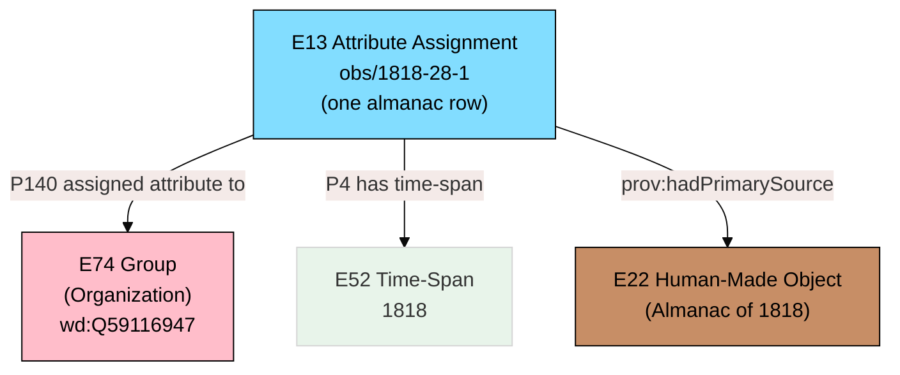
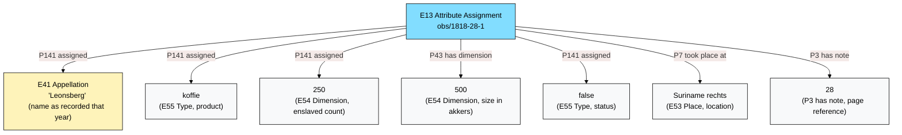
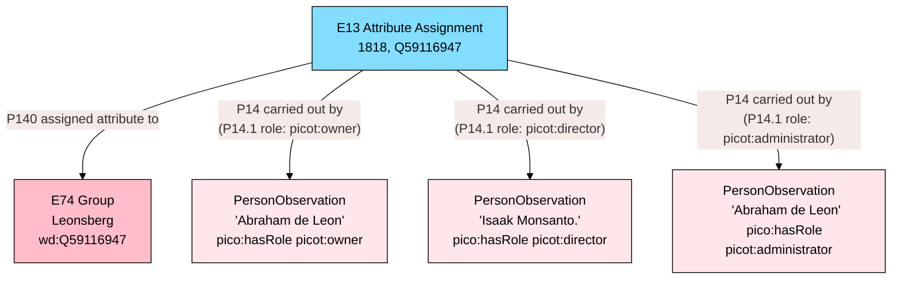
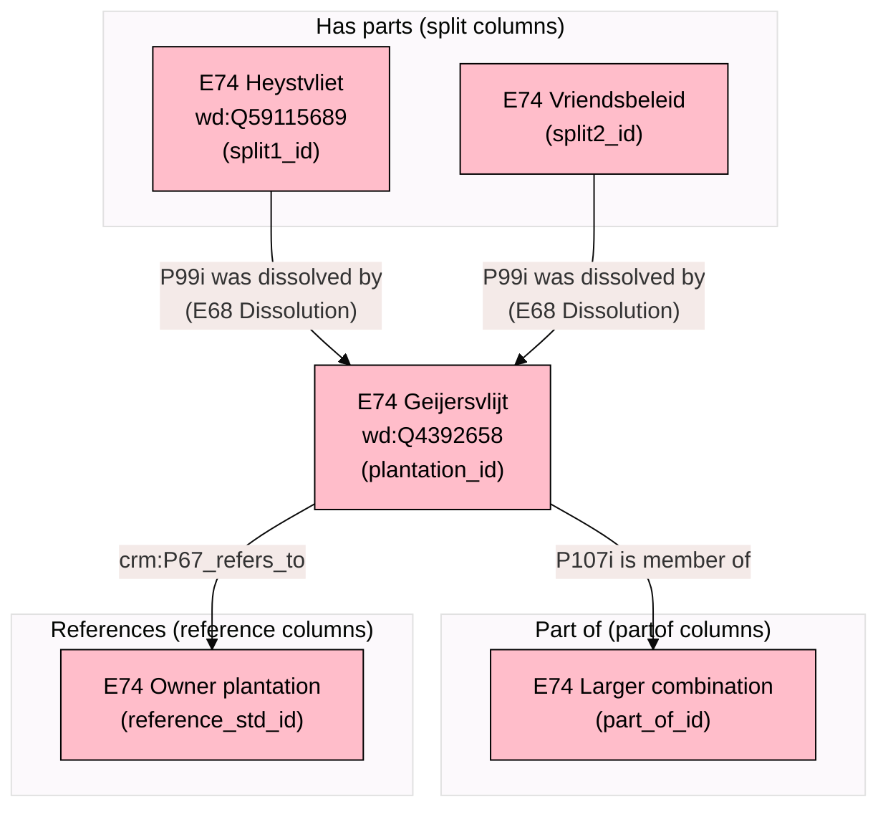
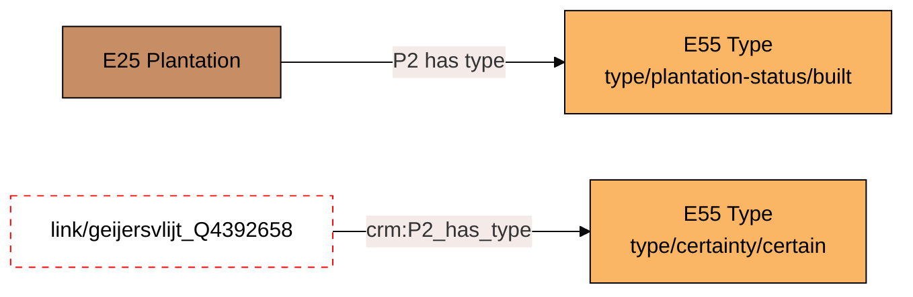
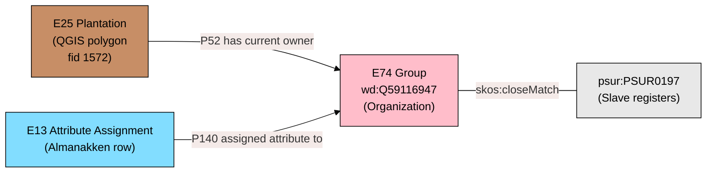
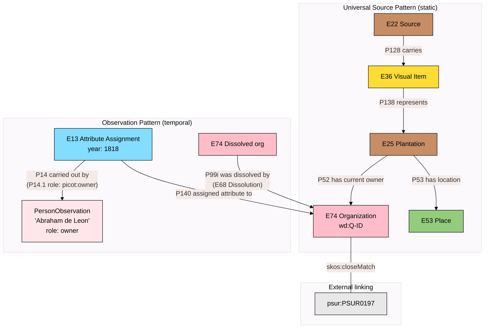

# Observations, People, and Temporal Change, Explained

The [universal source pattern](source-pattern-explained.mdx) describes how sources connect to real-world things. But everything in that pattern is _static_ --- it tells us what a map depicts, not how the plantation changed over 120 years of almanac records. This document explains the patterns that handle _time-varying data_: observations, people, mergers, and the structural relationships between plantations.

---

## The Problem: 23,000 Rows of Change

The Almanakken CSV contains 23,003 rows. Each row is an annual snapshot of a plantation organization: who owned it, who managed it, how many enslaved people were recorded, what it produced, whether it was deserted. The same organization (`wd:Q4392658`, Geijersvlijt) appears in row after row, year after year, with different values.

If we modeled each fact as a permanent property of the E74 organization, we would have contradictions. Geijersvlijt had 250 enslaved people in 1818 and 0 in 1920. It produced coffee in 1818 and nothing in 1920. These are not errors --- they are observations at different points in time.

CIDOC-CRM solves this with _events_. But the Almanakken are not describing events (nobody is recording "the moment ownership transferred"). They are annual _observations_ --- a clerk looked at a plantation and wrote down what they saw that year.

---

## Layer 8 --- The Observation Pattern

**Entities:** E13 Attribute Assignment
**Relationships:**

- `E13 --P140 assigned attribute to--> E74 Group`
- `E13 --P4 has time-span--> E52 Time-Span (year)`



### Why E13 Attribute Assignment?

Each almanac row is an act of recording attributes of a plantation organization at a specific point in time. CIDOC-CRM models this precisely as E13 Attribute Assignment --- an activity of making assertions about properties of an entity.

E13 connects to the entity being described via `P140 assigned attribute to`, and the values being recorded via `P141 assigned`. The year of observation is modeled through `P4 has time-span` pointing to an E52 Time-Span. The almanac source itself is linked via `prov:hadPrimarySource`.

Using E13 keeps the model purely within CIDOC-CRM. While E13 can support full provenance (who made the assertion, with what authority), for the bulk almanac data we use it in a lightweight manner --- the 23,000 rows all follow the same pattern (a clerk copied numbers from a ledger into a book), so the E22 source reference via `prov:hadPrimarySource` provides sufficient provenance. If we later need detailed provenance for specific observations (e.g., a disputed ownership claim), the E13 structure already supports it without migration.

### What the observation carries

Each observation holds the properties that change year by year:



The name recorded in the observation (`P141 assigned`) is itself an E41 Appellation --- a name as it appeared in that specific year's almanac. This preserves spelling variations across years.

---

## Layer 9 --- People: The PICO Pattern

**Entities:** PersonObservation (PICO model)
**Relationships:**

- `E13 --P14 carried out by--> PersonObservation` (with P14.1 role)
- `PersonObservation --pico:hasRole--> Role`



### Why PICO?

The PICO (Person In Context Ontology) model separates the _observation_ of a person from the _reconstruction_ of their identity. This matters enormously for historical data:

- The 1818 almanac says the owner of Leonsberg is "Abraham de Leon."
- The 1820 almanac says the owner of Leonsberg is "Abr. de Leon."
- The 1825 almanac says the owner of Leonsberg is "A. de Leon."

Are these the same person? Almost certainly. But the almanac clerks did not use persistent identifiers. They wrote down names with varying abbreviations and spellings.

PICO handles this in two layers:

1. **PersonObservation** --- the raw data. "Abraham de Leon" as owner of Leonsberg in 1818. This is a fact about the source, not a claim about identity.

2. **PersonReconstruction** --- the scholarly conclusion. "These three observations all refer to the historical person Abraham de Leon (born ~1770, died ~1830)." This is an interpretation that can be revised.

We currently create only PersonObservations. PersonReconstructions are future work that requires name normalization (already underway according to domain expert notes).

### The three roles

The Almanakken distinguish three types of personnel:

| Almanac Column    | Role                | CRM Relationship         | Meaning                                                                                      |
| ----------------- | ------------------- | ------------------------ | -------------------------------------------------------------------------------------------- |
| `eigenaren`       | picot:owner         | P52i is current owner of | Legal owner of the plantation. Could be a person or an institution (bank, estate).           |
| `administrateurs` | picot:administrator | P107 member of E74       | Managed the plantation from a distance (Paramaribo or Europe). Business/financial oversight. |
| `directeuren`     | picot:director      | P107 member of E74       | On-site plantation manager. Physically present. Day-to-day operations.                       |

Later almanac editions (post-1835) additionally distinguish:

- `administrateurs_in_Europa` --- administrators based in the Netherlands
- `administrateurs_in_Suriname` --- administrators based in Paramaribo
- `blankofficier` --- overseers, ranked below the director (only 1835 edition)

These additional columns create more specific PersonObservations with the same pattern, just with more granular roles.

### Multiple names in one field

A single `eigenaren` field may contain: `"J.H. Franke, E.G. Veldwijk en de Curators deze Kolonie."` --- that is three owners in one cell. The transformation scripts need to parse these into separate PersonObservation instances. This parsing is an interpretation step and should be documented.

---

## Layer 10 --- Mergers, Splits, and Structural Relationships

**Relationships:**

- `E74 --P99i was dissolved by--> E68 Dissolution` (organization dissolved by successor)
- `E25 --P124i was transformed by--> E81 Transformation` (physical plantation merged)
- `E74 --P107i is member of--> E74` (part-of relationship)
- `E74 --crm:P67_refers_to--> E74` (inter-plantation reference)



### Mergers: P99i was dissolved by (E68 Dissolution)

Surinamese plantation history is full of mergers. Small coffee plantations were absorbed by larger sugar plantations as the coffee economy declined. The Almanakken track this through the `split` columns:

- `split1_lab` / `split1_id` through `split5_lab` / `split5_id` --- these are plantations that have been **merged into** the current plantation. The naming is confusing (they are called "split" in the CSV but represent the opposite: components that were _absorbed_).

When `split1_id = Q59115689` on the row for `plantation_id = Q4392658`, it means:

```
E74 Q59115689 (Heystvliet) --P99i was dissolved by--> E68 Dissolution
E68 Dissolution --P14 carried out by--> E74 Q4392658 (Geijersvlijt, successor)
```

The dissolved organization's Q-ID still exists in Wikidata but is marked as having been dissolved. This matters for PSUR linking --- a PSUR ID might reference the dissolved plantation, not the surviving one. Without tracking the dissolution, that link would break.

On the QGIS side, the `qid_alt` column captures the same phenomenon: a polygon has a primary Q-ID (`qid`) and an alternative Q-ID (`qid_alt`) for the dissolved entity:

```
E25 polygon --P52 has current owner--> E74 (qid, surviving org)
E25 polygon --P51 has former or current owner--> E74 (qid_alt, dissolved org)
E74 (qid_alt) --P99i was dissolved by--> E68 Dissolution --P14 carried out by--> E74 (qid)
```

### Part-of: P107i is member of

Some plantations are part of larger merged combinations. The `partof_lab` / `part_of_id` columns record this:

```
E74 (plantation_id) --P107i is member of--> E74 (part_of_id)
```

We use CIDOC-CRM's standard `P107 has current or former member` (inverse: `P107i is current or former member of`) because this is organizational membership --- one E74 group belongs to a larger E74 group around. This is standard CRM for nested organizations.

### References: crm:P67_refers_to

Some almanac entries say "see Plantation X" or indicate that plantation A is owned by or related to plantation B. The `reference_std_id` / `reference_std_lab` columns capture this:

```
E74 (plantation_id) --crm:P67_refers_to--> E74 (reference_std_id)
```

This is a weaker link than absorption or membership --- it indicates a reference relationship that may be ownership, administrative connection, or simply that the almanac clerk pointed researchers to another entry for more information. The reference network is valuable for linking when direct PSUR matches fail: if plantation A references plantation B, and B has a PSUR ID, we may be able to trace A through B.

---

## Layer 11 --- Types and Certainty

**Entities:** E55 Type
**Relationships:**

- `E25 --P2 has type--> E55 PlantationStatus`
- `E13 Attribute Assignment --crm:P2_has_type--> E55 Certainty`



### PlantationStatus

Not every polygon on the 1930 map was an active plantation. Some were planned but never built. Some were abandoned ruins. E55 Type gives us a controlled vocabulary:

| Status                             | Meaning                             | How determined                                                 |
| ---------------------------------- | ----------------------------------- | -------------------------------------------------------------- |
| `type/plantation-status/built`     | Physically constructed and operated | Has almanac records, appears on maps with structures           |
| `type/plantation-status/planned`   | Plan only, never built              | Appears on maps but no almanac records, no operational data    |
| `type/plantation-status/abandoned` | Ceased operations                   | Almanac says "verlaten" (deserted), or no entries after a date |
| `type/plantation-status/unknown`   | Cannot determine                    | Insufficient evidence                                          |

The `deserted` column in the Almanakken (2,294 rows with values) provides direct evidence for abandonment. But a plantation can be abandoned and then reactivated --- so the status is also time-dependent and ideally lives on the observation, not just on E25.

### Link Certainty

When connecting an E25 Plantation (from QGIS) to an E74 Organization (via Q-ID), the match may be uncertain. Qualified links capture this:

```
link/geijersvlijt_Q4392658
    crm:P140_assigned_attribute_to  plantation/geijersvlijt
    crm:P141_assigned  wd:Q4392658
    crm:P2_has_type  type/certainty/certain
    crm:P3_has_note  "Exact name match on 1930 map and Wikidata label"
```

Three levels:

- **Certain** --- exact name match, confirmed by multiple sources
- **Probable** --- strong name similarity, plausible location
- **Uncertain** --- tentative, needs verification

This is particularly important for the 536 QGIS polygons that have no Q-ID. Future linking work will need to assess and record certainty for each match.

---

## Layer 12 --- Cross-Dataset Linking via PSUR

**Relationship:** `E74 --skos:closeMatch--> psur:{ID}`



### Why skos:closeMatch and not owl:sameAs?

PSUR IDs were created by modern researchers to link the slave registers to plantations. They are not historical identifiers. The matching has known flaws:

- Some PSUR IDs are incorrectly assigned
- Some plantations lack IDs entirely
- Mergers/splits create ambiguity about which component plantation a PSUR ID refers to
- A PSUR ID might link to a component plantation that was later absorbed into a larger one

`skos:closeMatch` says: "these two concepts are sufficiently similar that they can be used interchangeably in _some_ information retrieval applications." That is exactly the right claim. `owl:sameAs` would say they are identical --- which they are not. `skos:exactMatch` would be too strong given the known errors.

### The PSUR complexity with mergers

Consider this scenario:

- PSUR0118 was assigned to the plantation "Geijersvlijt" in the slave registers
- But by 1930, Geijersvlijt had absorbed "Kl. Suzanna'sdal" (Q131349015)
- The QGIS polygon for Geijersvlijt also carries `psur_id2` for the absorbed plantation

Without the merger network (Layer 10), you cannot know that PSUR0118 connects through a dissolution chain. The `skos:closeMatch` on E74, combined with `P99i was dissolved by`, gives us the full picture:

```
E74 Q4392658 (Geijersvlijt) --skos:closeMatch--> psur:PSUR0118
E74 Q131349015 (Kl. Suzanna'sdal) --P99i was dissolved by--> E68 Dissolution --P14 carried out by--> E74 Q4392658
E74 Q131349015 --skos:closeMatch--> psur:PSUR02xx (if assigned)
```

---

## How It All Connects

The observation pattern sits _on top of_ the universal source pattern. The source pattern gives us the static structure (sources, things, names, locations). The observation pattern gives us the temporal dimension (annual snapshots, changing properties, people, mergers).



The E74 Organization is the meeting point. Everything connects through it:

- The plantation (E25) is owned by it (P52)
- The observations describe it (P140 assigned attribute to)
- The people relate to it (via P14 carried out by, with role qualifiers)
- The PSUR links identify it (skos:closeMatch)
- Dissolved organizations connect to it (P99i was dissolved by -> E68 Dissolution)
- The Q-ID is its permanent identifier, shared across datasets
