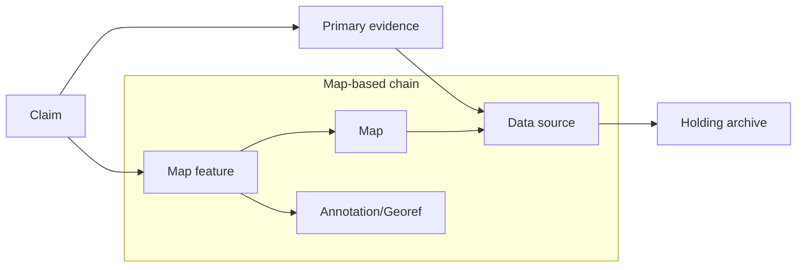
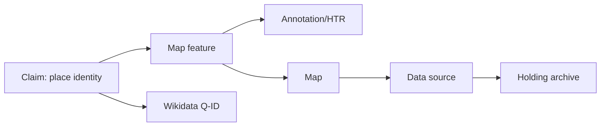

# Provenance Chain Examples (Draft)

Purpose: log 2–3 example claims per dataset using the checklist fields. These are **illustrative** and do not assert definitive links.

Legend for provenance depth: see [docs/models/provenance-chain-checklist.md](docs/models/provenance-chain-checklist.md).



```mermaid
flowchart TB
	PERSON[Person] --> VR[Vital record]
	VR --> DS[Data source]
	PERSON --> ORG[Organization (plantation)]
	ORG --> LOC[Location]
	LOC --> MAP[Map]
	MAP --> DS
	DS --> ARCH[Holding archive]
```



---

## 01 — Plantagen dataset (v1.0)

**Example A**

- Claim text: Plantation “A la Bonheur” existed in 1830–1862.
- Claim type: organization
- Primary evidence: Plantagen dataset row `ID_plantation=PSUR0001`
- Supporting evidence: none
- Provenance depth: D2
- Linking assumptions: none
- Uncertainty notes: years reflect register series coverage, not necessarily exact founding/closure.
- Source link(s): [data/01-plantages-dataset - Suriname Plantation Dataset Version 1.0/Suriname Plantation Dataset Version 1.0.csv](data/01-plantages-dataset%20-%20Suriname%20Plantation%20Dataset%20Version%201.0/Suriname%20Plantation%20Dataset%20Version%201.0.csv)
- Flow: claim → record (PSUR0001) → dataset (Plantagen v1.0)

**Example B**

- Claim text: Plantation “A la Bonheur” listed in divisie beneden Commewijne.
- Claim type: location
- Primary evidence: Plantagen dataset row `ID_plantation=PSUR0001`
- Supporting evidence: none
- Provenance depth: D2
- Linking assumptions: district labels are consistent across datasets.
- Uncertainty notes: district boundaries may change over time.
- Source link(s): [data/01-plantages-dataset - Suriname Plantation Dataset Version 1.0/Suriname Plantation Dataset Version 1.0.csv](data/01-plantages-dataset%20-%20Suriname%20Plantation%20Dataset%20Version%201.0/Suriname%20Plantation%20Dataset%20Version%201.0.csv)
- Flow: claim → record (PSUR0001) → dataset (Plantagen v1.0)

---

## 02 — Doodakten Suriname

**Example A**

- Claim text: A death certificate exists for `id=SR-NA_2.10.61_1000_0001-r`.
- Claim type: event
- Primary evidence: death certificate record `id=SR-NA_2.10.61_1000_0001-r`
- Supporting evidence: none
- Provenance depth: D2
- Linking assumptions: record ID is stable for citation.
- Uncertainty notes: transcript accuracy depends on source scan quality.
- Source link(s): [data/02-death-certificates - Suriname Death Certificates 1845-1915 Version 1.0/Suriname_death_certificates_1845_1915.csv](data/02-death-certificates%20-%20Suriname%20Death%20Certificates%201845-1915%20Version%201.0/Suriname_death_certificates_1845_1915.csv)
- Flow: claim → record (SR-NA_2.10.61_1000_0001-r) → dataset (death certificates)

**Example B**

- Claim text: The certificate states a death in Paramaribo on 02-01-1858.
- Claim type: place/event
- Primary evidence: death certificate record `id=SR-NA_2.10.61_1000_0001-r`
- Supporting evidence: none
- Provenance depth: D2
- Linking assumptions: `cert_place` represents location of record/event.
- Uncertainty notes: exact interpretation of place field may vary by registrar.
- Source link(s): [data/02-death-certificates - Suriname Death Certificates 1845-1915 Version 1.0/Suriname_death_certificates_1845_1915.csv](data/02-death-certificates%20-%20Suriname%20Death%20Certificates%201845-1915%20Version%201.0/Suriname_death_certificates_1845_1915.csv)
- Flow: claim → record (SR-NA_2.10.61_1000_0001-r) → dataset (death certificates)

---

## 03 — Geboorteakten Paramaribo

**Example A**

- Claim text: A birth certificate exists for `id=SR-NA_2.10.61_1_0008-r`.
- Claim type: event
- Primary evidence: birth certificate record `id=SR-NA_2.10.61_1_0008-r`
- Supporting evidence: none
- Provenance depth: D2
- Linking assumptions: record ID is stable for citation.
- Uncertainty notes: transcript accuracy depends on source scan quality.
- Source link(s): [data/03-birth-certificates - Paramaribo Birth Certificates 1828-1921 Version 1.0/Paramaribo_birth_certificates_V1.0.csv](data/03-birth-certificates%20-%20Paramaribo%20Birth%20Certificates%201828-1921%20Version%201.0/Paramaribo_birth_certificates_V1.0.csv)
- Flow: claim → record (SR-NA_2.10.61_1_0008-r) → dataset (birth certificates)

**Example B**

- Claim text: The certificate records a birth on 06-07-1828 in Paramaribo.
- Claim type: place/event
- Primary evidence: birth certificate record `id=SR-NA_2.10.61_1_0008-r`
- Supporting evidence: none
- Provenance depth: D2
- Linking assumptions: `birth_place` corresponds to place of birth.
- Uncertainty notes: spelling variants may exist in original text.
- Source link(s): [data/03-birth-certificates - Paramaribo Birth Certificates 1828-1921 Version 1.0/Paramaribo_birth_certificates_V1.0.csv](data/03-birth-certificates%20-%20Paramaribo%20Birth%20Certificates%201828-1921%20Version%201.0/Paramaribo_birth_certificates_V1.0.csv)
- Flow: claim → record (SR-NA_2.10.61_1_0008-r) → dataset (birth certificates)

---

## 04 — Wijkregisters Paramaribo

**Example A**

- Claim text: Address “Heiligenweg 1” is listed as onbebouwd in 1833.
- Claim type: place
- Primary evidence: ward register record `Id=15601`
- Supporting evidence: none
- Provenance depth: D2
- Linking assumptions: `Jaar` field represents register year.
- Uncertainty notes: “onbebouwd” is a classification, not a physical inspection.
- Source link(s): [data/04-ward-registers - Paramaribo Ward Registers 1828-1847/WR28-47.csv](data/04-ward-registers%20-%20Paramaribo%20Ward%20Registers%201828-1847/WR28-47.csv)
- Flow: claim → record (Id=15601) → dataset (ward registers)

**Example B**

- Claim text: The address is in Wijk C.
- Claim type: place
- Primary evidence: ward register record `Id=15601`
- Supporting evidence: none
- Provenance depth: D2
- Linking assumptions: ward labeling is consistent with contemporary administrative practice.
- Uncertainty notes: ward boundaries may shift between years.
- Source link(s): [data/04-ward-registers - Paramaribo Ward Registers 1828-1847/WR28-47.csv](data/04-ward-registers%20-%20Paramaribo%20Ward%20Registers%201828-1847/WR28-47.csv)
- Flow: claim → record (Id=15601) → dataset (ward registers)

---

## 05 — Slaven- en Emancipatieregisters (v1.1)

**Example A**

- Claim text: Person “Betje” appears in the registers with `Id_person=1`.
- Claim type: person
- Primary evidence: slave/emancipation record `Id_person=1`
- Supporting evidence: none
- Provenance depth: D2
- Linking assumptions: `Id_person` is stable within the dataset.
- Uncertainty notes: “Betje” may be a single-name reference; disambiguation likely needed.
- Source link(s): [data/05-slave-emancipation - Suriname Slave and Emancipation Registers Dataset Version 1.1/Dataset Suriname Slave and Emancipation Registers Version 1.1.csv](data/05-slave-emancipation%20-%20Suriname%20Slave%20and%20Emancipation%20Registers%20Dataset%20Version%201.1/Dataset%20Suriname%20Slave%20and%20Emancipation%20Registers%20Version%201.1.csv)
- Flow: claim → record (Id_person=1) → dataset (slave/emancipation registers)

**Example B**

- Claim text: The record for `Id_person=1` has `StartEntryEvent=Start Series` and `EndEntryEvent=Ended`.
- Claim type: event
- Primary evidence: same record `Id_person=1`
- Supporting evidence: none
- Provenance depth: D2
- Linking assumptions: `StartEntryEvent` and `EndEntryEvent` reflect register lifecycle events.
- Uncertainty notes: event meaning depends on register conventions.
- Source link(s): [data/05-slave-emancipation - Suriname Slave and Emancipation Registers Dataset Version 1.1/Dataset Suriname Slave and Emancipation Registers Version 1.1.csv](data/05-slave-emancipation%20-%20Suriname%20Slave%20and%20Emancipation%20Registers%20Dataset%20Version%201.1/Dataset%20Suriname%20Slave%20and%20Emancipation%20Registers%20Version%201.1.csv)
- Flow: claim → record (Id_person=1) → dataset (slave/emancipation registers)

---

## 06 — Surinaamse Almanakken (Plantages)

**Example A**

- Claim text: Plantation Leonsberg is listed in 1818 with product “koffie”.
- Claim type: organization
- Primary evidence: almanakken record `recordid=1818-28-1`
- Supporting evidence: none
- Provenance depth: D2
- Linking assumptions: `plantation_std` represents standardized name.
- Uncertainty notes: product may be partial/seasonal.
- Source link(s): [data/06-almanakken - Plantations Surinaamse Almanakken/Plantations Surinaamse Almanakken v1.0.csv](data/06-almanakken%20-%20Plantations%20Surinaamse%20Almanakken/Plantations%20Surinaamse%20Almanakken%20v1.0.csv)
- Flow: claim → record (recordid=1818-28-1) → dataset (almanakken)

**Example B**

- Claim text: Leonsberg is linked to `psur_id=PSUR0197`.
- Claim type: organization
- Primary evidence: almanakken record `recordid=1818-28-1`
- Supporting evidence: none
- Provenance depth: D2
- Linking assumptions: PSUR identifiers align with Plantagen dataset.
- Uncertainty notes: linkage may require manual verification.
- Source link(s): [data/06-almanakken - Plantations Surinaamse Almanakken/Plantations Surinaamse Almanakken v1.0.csv](data/06-almanakken%20-%20Plantations%20Surinaamse%20Almanakken/Plantations%20Surinaamse%20Almanakken%20v1.0.csv)
- Flow: claim → record (recordid=1818-28-1) → dataset (almanakken)

---

## 07 — QGIS Maps

**Example A**

- Claim text: A georeferenced raster exists for the 1763 Lavaux map.
- Claim type: place
- Primary evidence: map metadata entry `ID=2` (1763 Lavaux map)
- Supporting evidence: IIIF manifest + IIIF info URL
- Provenance depth: D3
- Linking assumptions: raster corresponds to the historic map scan.
- Uncertainty notes: georeferencing accuracy depends on control points.
- Source link(s): [data/10-historic-maps-metadata.tsv](data/10-historic-maps-metadata.tsv)
- External link(s): https://www.nationaalarchief.nl/onderzoeken/archief/4.HEK/invnr/MC749/file/NL-HaNA_4.HEK_MC749
- Flow: claim → map metadata (ID=2) → holding archive (Nationaal Archief)

**Example B**

- Claim text: The Lavaux map has a IIIF manifest that can be used for georeferencing workflows.
- Claim type: source
- Primary evidence: map metadata entry `ID=2`
- Supporting evidence: IIIF manifest URL
- Provenance depth: D3
- Linking assumptions: IIIF manifest is authoritative for the scan.
- Uncertainty notes: IIIF manifest metadata may not include georeferencing details.
- Source link(s): [data/10-historic-maps-metadata.tsv](data/10-historic-maps-metadata.tsv)
- External link(s): https://service.archief.nl/iip/a9/99/ff/49/28/d5/4a/2f/85/e0/b9/0f/c9/85/d1/d8/8198ed36-ae50-4b4f-b086-ace8dd1c5c28.jp2/info.json
- Flow: claim → map metadata (ID=2) → IIIF manifest/info → dataset (historic maps metadata)

---

## 08 — Wikidata

**Example A**

- Claim text: Paramaribo has Wikidata ID `Q3001`.
- Claim type: place
- Primary evidence: Wikidata item `Q3001`
- Supporting evidence: none
- Provenance depth: D2
- Linking assumptions: Wikidata item represents the intended place.
- Uncertainty notes: Wikidata statements may vary in reliability.
- External link(s): https://www.wikidata.org/entity/Q3001
- Flow: claim → Wikidata item (Q3001)

**Example B**

- Claim text: Paramaribo has coordinates used for modern reference.
- Claim type: place
- Primary evidence: Wikidata item `Q3001`
- Supporting evidence: none
- Provenance depth: D2
- Linking assumptions: coordinates are current and precise.
- Uncertainty notes: coordinates may not represent historical extent.
- External link(s): https://www.wikidata.org/entity/Q3001
- Flow: claim → Wikidata item (Q3001)

---

## 09 — Historic Map Annotations

**Example A**

- Claim text: A historic map has a IIIF manifest enabling annotation workflows.
- Claim type: source
- Primary evidence: historic maps metadata entry `ID=73`
- Supporting evidence: IIIF manifest
- Provenance depth: D3
- Linking assumptions: manifest is the basis for downstream annotations.
- Uncertainty notes: annotation quality depends on HTR and manual validation.
- Source link(s): [data/10-historic-maps-metadata.tsv](data/10-historic-maps-metadata.tsv)
- External link(s): https://digitalcollections.universiteitleiden.nl/iiif_manifest/item%3A814811/manifest
- Flow: claim → map metadata (ID=73) → IIIF manifest → annotation pipeline

**Example B**

- Claim text: The same map has an Allmaps georeferencing output that can support spatial linking.
- Claim type: source
- Primary evidence: historic maps metadata entry `ID=73`
- Supporting evidence: Allmaps geo output
- Provenance depth: D3
- Linking assumptions: Allmaps output is derived from the same map.
- Uncertainty notes: georeferencing error propagates into spatial links.
- Source link(s): [data/10-historic-maps-metadata.tsv](data/10-historic-maps-metadata.tsv)
- External link(s): https://annotations.allmaps.org/maps/5f85ef4e29065511
- Flow: claim → map metadata (ID=73) → Allmaps geo → spatial linking
