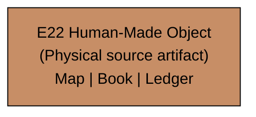
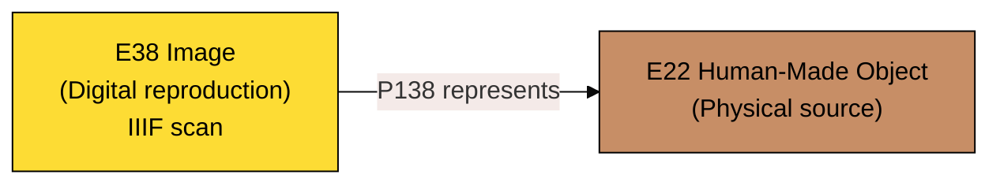
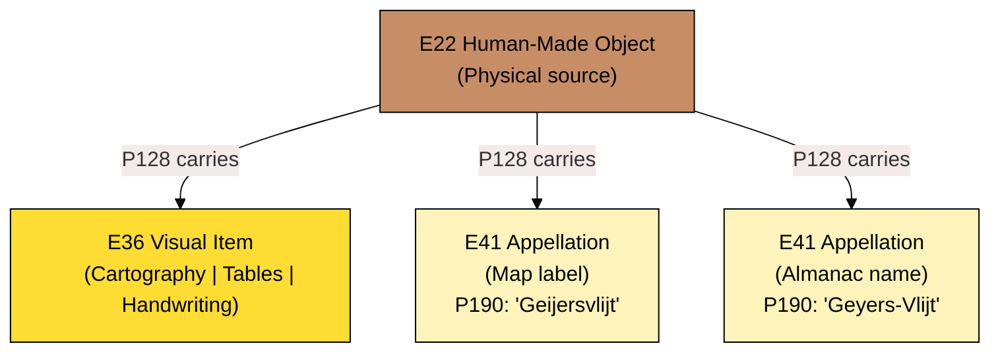
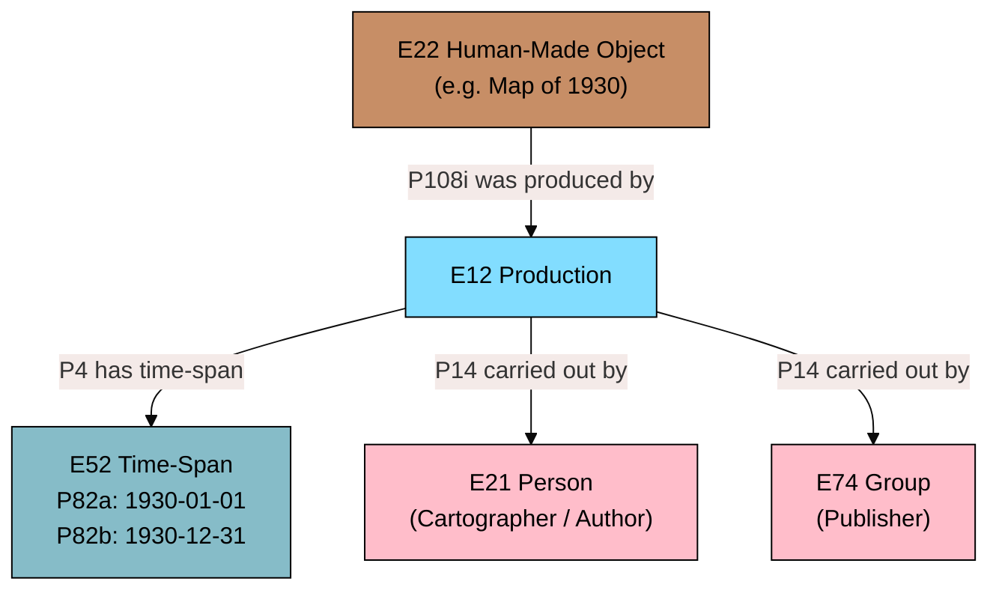
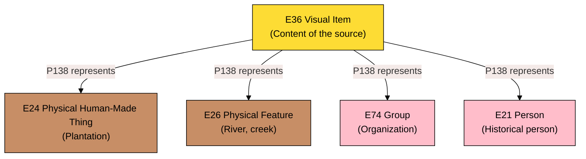
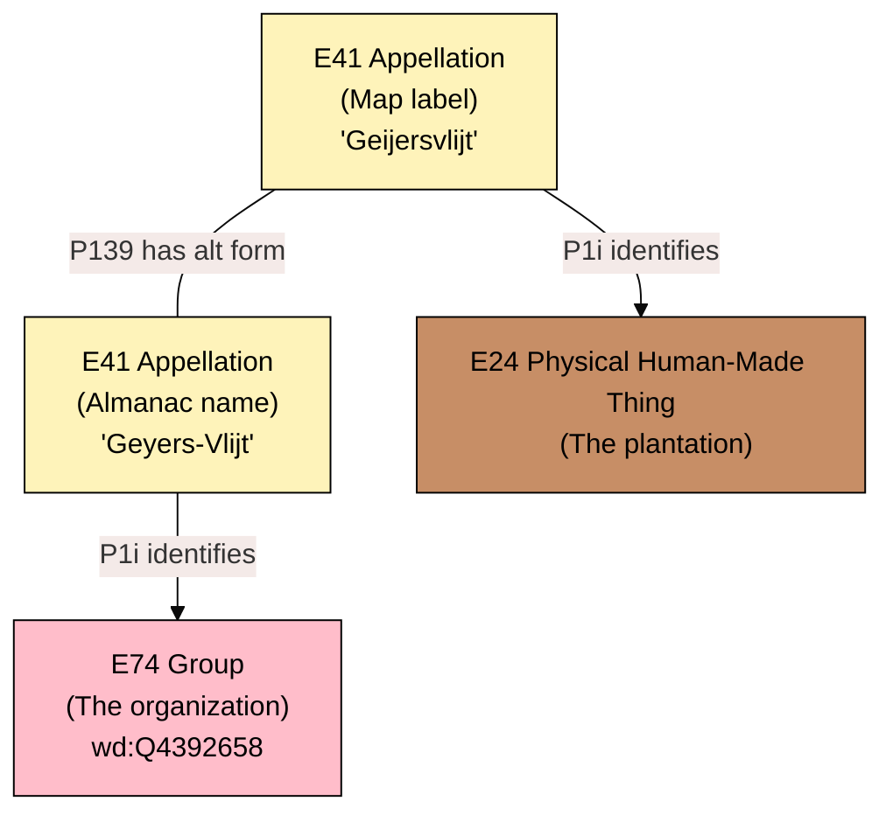
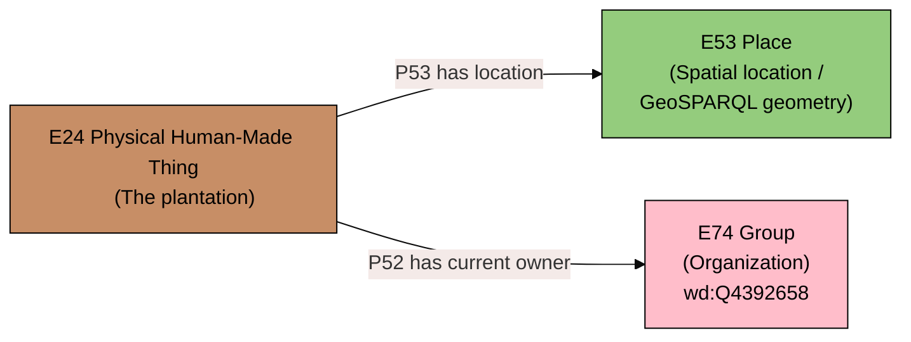
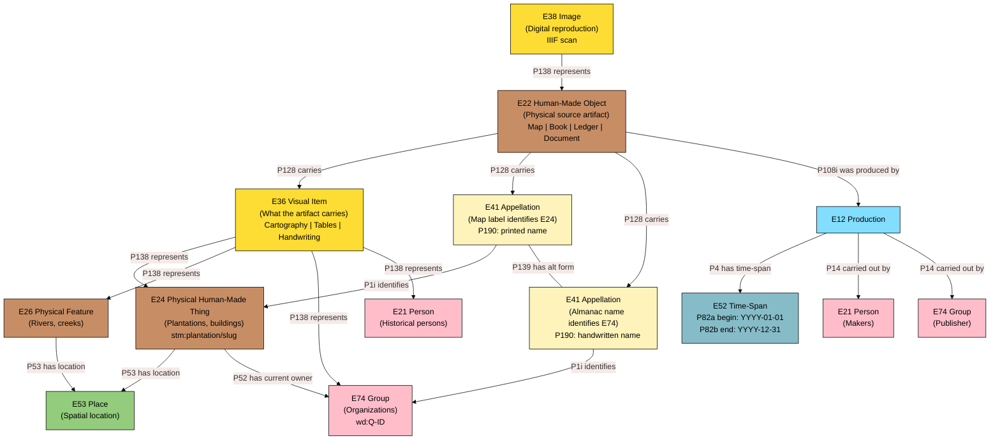

# The Universal Source Pattern, Explained

A relationship-by-relationship guide to the CIDOC-CRM model behind the Suriname Time Machine. Each section isolates one layer of the [universal source pattern](universal-source-pattern.mmd), explains the entities and properties involved, and reasons through _why_ this particular connection makes sense --- both in formal CRM terms and for the practical reality of Suriname's colonial archives.

Read this alongside the full diagram in [universal-source-pattern.mmd](universal-source-pattern.mmd). We will rebuild it from the ground up, one link at a time.

---

## Layer 1 --- The Physical Source

**Entities:** E22 Human-Made Object
**In our project:** A 1930 plantation map. An 1818 almanac. A slave register ledger.

Before anything else: the source is a _thing_. Not an idea, not a dataset, not a scan --- a physical object with ink, paper, folds, wormholes, and water damage. It sat in an archive. Someone touched it.

CIDOC-CRM gives us two candidates for this. E73 Information Object would treat the source as pure information --- the text, the data, the intellectual content. E22 Human-Made Object treats it as a physical artifact created by humans.

We chose E22, and there is a reason.

> **CRM Scope Note (E22 Human-Made Object):**
> _"This class comprises all persistent physical objects of any size that are purposely created by human activity and have physical boundaries that separate them completely in an objective way from other objects."_

A plantation map from 1930 is not just the cartographic information it contains. It is _that specific sheet of paper_, printed in _that specific print run_, with _those specific annotations_ that someone added by hand in the margin. It has a physical history --- it was stored, moved, perhaps damaged, eventually digitized. This physical history is part of provenance. If we reduced the source to its information content (E73), we would lose the ability to say _which copy_ we are looking at, or to record that the scan in our IIIF server was made from _this particular sheet_ that lives in the Nationaal Archief.

The distinction between vessel and content is fundamental to what comes next.

---

## Layer 2 --- The Digital Reproduction

**Relationship:** `E38 Image --P138 represents--> E22 Human-Made Object`

The IIIF scan that appears on your screen is not the map. It _represents_ the map.

E38 Image is a subclass of E36 Visual Item, which itself is a subclass of E73 Information Object --- it lives in the conceptual realm. The scan is a pattern of pixels that was mechanically derived from the physical artifact by a scanner or camera, but it is an entirely different kind of entity.

P138 _represents_ is the CRM property that bridges these worlds.

> **CRM Scope Note (P138 represents):**
> _"This property establishes the relationship between an instance of E36 Visual Item and the instance of E1 CRM Entity that it visually represents."_
>
> _"This property is also used for the relationship between an original and a digitisation of the original by the use of techniques such as digital photography, flatbed or infrared scanning. Digitisation is here seen as a process with a mechanical, causal component rendering the spatial distribution of structural and optical properties of the original."_

The word _represents_ is deliberately weaker than "is identical to." Every digitization involves choices: resolution, color calibration, cropping, lighting angle. Two different scans of the same map will produce two different E38 instances, both representing the same E22. This asymmetry matters for scholarly work --- when a researcher zooms into a scan and reads a faded plantation name, they need to know that what they see already passed through a layer of mechanical interpretation.

The arrow points from E38 to E22, not the other way around. The map does not "have" a scan; the scan "represents" the map. This preserves the primacy of the physical source.

---

## Layer 3 --- What the Source Carries

**Relationships:**

- `E22 --P128 carries--> E36 Visual Item`
- `E22 --P128 carries--> E41 Appellation (map label)`
- `E22 --P128 carries--> E41 Appellation (almanac name)`

This is where vessel and content separate. The physical source (E22) _carries_ things --- not in a metaphorical sense, but in the specific CRM sense of P128.

> **CRM Scope Note (P128 carries):**
> _"This property identifies an instance of E90 Symbolic Object carried by an instance of E18 Physical Thing. Since an instance of E90 Symbolic Object is defined as an immaterial idealization over potentially multiple carriers, any individual realization on a particular physical carrier may be defective, due to deterioration or shortcomings in the process of creating the realization compared to the intended ideal."_

Think of the map as a vessel. What does it carry? Three kinds of things, all at once:

1. **E36 Visual Item** --- the cartographic image itself, the visual pattern of lines, colors, and shapes that constitutes the map's visual content. E36 is "the intellectual or conceptual aspects of recognisable marks, images and other visual works." It is independent of any one physical carrier --- the same visual item could theoretically appear on multiple printed copies of the same map.

2. **E41 Appellation (map label)** --- a name printed on the map, like "Geijersvlijt," identifying a plantation. This is not just a string of characters; it is a _name entity_ with its own identity, its own provenance (it came from _this_ source), and its own referent (it identifies _this_ plantation).

3. **E41 Appellation (almanac name)** --- a name written in a tabular almanac entry, like "Geyers-Vlijt," identifying an organization. Different source, different spelling, different entity type identified.

### Why E41 Appellation instead of just `rdfs:label`?

This is one of the crucial modeling decisions. A simple `rdfs:label` would give us a string attached to a thing. But colonial-era Surinamese plantation names are not simple:

- The same plantation appears under different spellings in different sources ("Geijersvlijt" on the 1930 map, "Geyers-Vlijt" in the 1818 almanac).
- A name may have been printed incorrectly, or transcribed by a clerk who misheard it.
- We need to know _where_ a name came from --- which source first recorded it --- to evaluate its reliability.

> **CRM Scope Note (E41 Appellation):**
> _"Instances of E41 Appellation do not identify things by their meaning, even if they happen to have one, but instead by convention, tradition, or agreement. Instances of E41 Appellation are cultural constructs; as such, they have a context, a history, and a use in time and space by some group of users."_

That phrase --- "a context, a history, and a use in time and space by some group of users" --- is exactly why we promote names to first-class entities. A plantation name is a cultural construct that was used by a specific community (Dutch colonial administrators) at a specific time (the year the almanac was published) in a specific place (Suriname). By making each name instance an E41 carried by its source via P128, we preserve this entire provenance chain.

The property P190 _has symbolic content_ gives us the actual string value ("Geijersvlijt"), so we do not lose the plain text --- we simply nest it inside a richer structure.

---

## Layer 4 --- Production: Who Made It, and When

**Relationships:**

- `E22 --P108i was produced by--> E12 Production`
- `E12 --P4 has time-span--> E52 Time-Span`
- `E12 --P14 carried out by--> E21 Person`
- `E12 --P14 carried out by--> E74 Group (Publisher)`

CIDOC-CRM is _event-centric_. The map did not simply appear in the world --- it was _produced_. By treating production as an event (E12), we gain the ability to say when, by whom, and under what circumstances the source came into existence.

> **CRM Scope Note (E12 Production):**
> _"This class comprises activities that are designed to, and succeed in, creating one or more new items. It specializes the notion of modification into production."_

### Why model production as a separate event?

It would be simpler to slap a `dcterms:date` on the E22 and move on. But the event-centric approach unlocks something important: **the production event indirectly dates the names the source carries.**

If a map was produced in 1930, then the names printed on it (the E41 Appellations it P128 carries) were current _as of 1930_. We do not need a separate E15 Identifier Assignment event to date each name --- the temporal scope is inherited from the production of the carrier. The Production event is the single temporal anchor for everything the source contains.

> **CRM Scope Note (P4 has time-span):**
> _"This property associates an instance of E2 Temporal Entity with the instance of E52 Time-Span during which it was on-going. The associated instance of E52 Time-Span is understood as the real time-span during which the phenomena making up the temporal entity instance were active."_

P14 _carried out by_ attributes agency. The cartographer who drew the map, the publishing house that printed it --- both participated in the production event.

> **CRM Scope Note (P14 carried out by):**
> _"This property describes the active participation of an instance of E39 Actor in an instance of E7 Activity. It implies causal or legal responsibility."_

That word "responsibility" is significant. When a cartographer labels a plantation on a map, they are taking responsibility for that identification. When we later link that label to a specific E24 Plantation entity, the production event tells us _who made that claim_ and _when_.

---

## Layer 5 --- What Sources Depict: From Document to Reality

**Relationships:**

- `E36 Visual Item --P138 represents--> E24 Physical Human-Made Thing (Plantation)`
- `E36 Visual Item --P138 represents--> E26 Physical Feature (River)`
- `E36 Visual Item --P138 represents--> E74 Group (Organization)`
- `E36 Visual Item --P138 represents--> E21 Person`

This is the bridge from document to reality. The visual content of a source _represents_ real-world things.

We already met P138 in Layer 2, where a scan represents a map. Here, the same property operates at a higher level: the _content_ of the map (E36 Visual Item) represents real-world entities --- plantations, rivers, people, organizations. The map's cartography is a visual representation of the physical plantation. The almanac's tabular data is a visual representation of the organization that operates it.

### The key insight: "Maps depict things; things have locations"

It would be tempting to draw a line from E36 directly to E53 Place --- after all, a map literally shows a geographic area. But this would be a category error.

The map's visual content (E36) represents the _plantation_ (E24). The plantation, being a physical thing in the real world, _has a location_ (E53). The map does not depict the location; it depicts the thing that is at the location. This is a subtle but crucial distinction:

- If E36 linked directly to E53, we would be saying "the map shows a piece of empty land."
- By routing through E24, we say "the map shows a plantation, and that plantation is located somewhere."

This correctly models the chain of inference: we look at the map, see a depiction of a plantation, and from the plantation's identity we can determine where it was located. The location is not something we read off the map directly --- it is a property of the real-world thing the map depicts.

### Why E24 for plantations?

> **CRM Scope Note (E24 Physical Human-Made Thing):**
> _"This class comprises all persistent physical items of any size that are purposely created by human activity. This class comprises, besides others, Human-Made objects, such as a sword, and Human-Made features, such as rock art."_

A plantation is a physical transformation of the landscape --- forests cleared, fields laid out, buildings constructed, canals dug. It is not just a concept or a legal designation; it is a persistent physical thing that was created by human activity and that you could walk through, touch, and photograph. E24 captures this physical reality.

> **CRM Scope Note (E26 Physical Feature):**
> _Rivers and creeks are natural features of the landscape that plantations sit alongside. E26 Physical Feature covers items that are "physically attached in an integral way to particular physical objects" --- in our case, the land itself._

---

## Layer 6 --- Names Identify Things

**Relationships:**

- `E41 Appellation (map label) --P1i identifies--> E24 Physical Human-Made Thing`
- `E41 Appellation (almanac name) --P1i identifies--> E74 Group (Organization)`
- `E41 (map label) --P139 has alternative form--> E41 (almanac name)`

Now names connect to the things they identify. This is where the model makes its most important philosophical distinction: **a map label and an almanac name refer to different kinds of entities**.

A printed label on a 1930 plantation map ("Geijersvlijt") identifies the _physical plantation_ --- the land, the buildings, the canals. The cartographer saw this physical thing (or a record of it) and labeled it on the map.

A handwritten entry in an 1818 almanac ("Geyers-Vlijt") identifies the _organization_ that operated the plantation at that time --- the legal entity with owners, administrators, and enslaved workers. The almanac clerk was recording administrative information about the operating organization, not describing the physical landscape.

These are _different E41 instances_ in our model, each carried by a different source (via P128 from Layer 3), each identifying a different entity type (via P1i).

> **CRM Scope Note (P1 is identified by):**
> _"This property describes the naming or identification of any real-world item by a name or any other identifier. [...] The property does not reveal anything about when, where and by whom this identifier was used."_

The CRM deliberately makes P1 neutral about provenance --- it just says "this name identifies this thing." The provenance (who used this name, when, and in what context) is captured elsewhere: in the P128 link from E22 to E41, and in the E12 Production event that dates the source.

### P139 has alternative form: bridging name variants

> **CRM Scope Note (P139 has alternative form):**
> _"This property associates an instance of E41 Appellation with another instance of E41 Appellation that constitutes a derivative or variant of the former and that may also be used for identifying items identified by the former, in suitable contexts, independent from the particular item to be identified."_

P139 links "Geijersvlijt" (map label) to "Geyers-Vlijt" (almanac name) as alternative forms of each other. This does _not_ mean E24 and E74 are the same entity. It means: these two names, despite their different spellings and different referent types, ultimately trace back to the same real-world referent complex. The plantation (E24) and the organization (E74) are connected through ownership (P52, in the next layer), and their names are connected through P139.

This is the mechanism that makes cross-source reconciliation possible without conflating things that are ontologically distinct.

---

## Layer 7 --- Space and Ownership

**Relationships:**

- `E24 Physical Human-Made Thing --P53 has former or current location--> E53 Place`
- `E24 Physical Human-Made Thing --P52 has current owner--> E74 Group`

The final layer grounds the model in space and in social relations.

### P53: The plantation has a location

> **CRM Scope Note (P53 has former or current location):**
> _"This property identifies an instance of E53 Place as the former or current location of an instance of E18 Physical Thing. In the case of immobile objects, the Place would normally correspond to the Place of creation."_

Plantations are, by nature, immobile. They were carved out of specific pieces of Surinamese land, and that land does not move. P53 connects the plantation (E24) to its location (E53), where E53 holds the actual geometry (a GeoSPARQL polygon derived from the 1930 QGIS map data).

> **CRM Scope Note (E53 Place):**
> _"This class comprises extents in the natural space we live in, in particular on the surface of the Earth, in the pure sense of physics: independent from temporal phenomena and matter."_

E53 is purely spatial --- it is a piece of the Earth's surface, nothing more. It does not care who owned the land above it, or what was built on it, or what happened there. That information lives on E24 and E74. The separation is clean: **E53 = where**, **E24 = what**, **E74 = who**.

This is why the model routes location through E24 rather than attaching it to E36 or E22 directly. The map (E22) depicts the plantation (E24), and the plantation occupies a location (E53). Remove the map from the picture, and the plantation is still there, still occupying that same piece of land. Location is a property of the real-world thing, not of the document that depicted it.

### P52: The plantation has an owner

> **CRM Scope Note (P52 has current owner):**
> _"This property identifies the instance of E21 Person or E74 Group that was the owner of an instance of E18 Physical Thing at the time of validity of the record or database containing the statement that uses this property."_
>
> _"This property is a shortcut for the more detailed path from E18 Physical Thing through P24i changed ownership through, E8 Acquisition, P22 transferred title to, to E39 Actor, if and only if this acquisition event is the most recent."_

P52 connects the physical plantation to the organization that owns or operates it. This is the relationship that makes E24 and E74 separate entities rather than one dual-typed entity (a key modeling decision, number 2 in our decisions list).

Why separate them? Because they change independently:

- A plantation can change owners. The land, the buildings, the canals --- the E24 --- remain the same. But the E74 connected through P52 changes.
- An organization can absorb another organization (`stm:absorbedInto`). The E74 entities merge, but the E24 might keep its physical boundaries.
- A plantation can be abandoned. The E24 still exists (you can still see its remains), but no E74 currently operates it.

The Q-ID (Wikidata identifier) lives on the E74, serving as the linking key between our different data sources --- the same `wd:Q4392658` appears in both the QGIS CSV and the Almanakken dataset, connecting them through the organization they both describe.

---

## Reading the Complete Pattern

Here is the full picture, all seven layers assembled. Every arrow is a relationship we have now justified:

Read the pattern as a sentence:

> A **physical source** (E22), **produced** (E12) at a **time** (E52) by **someone** (E21/E74), **carries** (P128) **visual content** (E36) and **names** (E41). The content **represents** (P138) real-world **things** (E24, E26, E74, E21). The names **identify** (P1i) those things. And those things **have locations** (P53 to E53) and **owners** (P52 to E74). A **digital scan** (E38) **represents** (P138) the physical source, giving us access to everything it carries.

Every link exists for a reason. Every separation between entities preserves a distinction that matters for the historical record of Suriname.

---

## Quick Reference: Properties Used

| Property                           | Domain              | Range                         | Why we use it                                    |
| ---------------------------------- | ------------------- | ----------------------------- | ------------------------------------------------ |
| P128 carries                       | E18 Physical Thing  | E90 Symbolic Object           | Source carries content and names                 |
| P138 represents                    | E36 Visual Item     | E1 CRM Entity                 | Content depicts real things; scan depicts source |
| P108 has produced                  | E12 Production      | E24 Physical Human-Made Thing | Source was made by someone at some time          |
| P4 has time-span                   | E2 Temporal Entity  | E52 Time-Span                 | Dates the production (and indirectly the names)  |
| P14 carried out by                 | E7 Activity         | E39 Actor                     | Who made the source                              |
| P1 is identified by                | E1 CRM Entity       | E41 Appellation               | A name identifies a thing                        |
| P139 has alternative form          | E41 Appellation     | E41 Appellation               | Links variant name spellings across sources      |
| P190 has symbolic content          | E90 Symbolic Object | E62 String                    | The actual text of a name                        |
| P53 has former or current location | E18 Physical Thing  | E53 Place                     | Where the plantation is                          |
| P52 has current owner              | E18 Physical Thing  | E39 Actor                     | Who owns the plantation                          |

---

## Color Key (CRITERIA Scheme)

The diagrams use the [CRITERIA](https://github.com/chin-rcip/CRITERIA) color scheme by George Bruseker for CIDOC-CRM visualization:

| Color                  | CRM Superclass        | Examples in our model                   |
| ---------------------- | --------------------- | --------------------------------------- |
| Brown (#c78e66)        | E18 Physical Thing    | E22 Source, E24 Plantation, E26 Feature |
| Yellow (#fddc34)       | E28 Conceptual Object | E36 Visual Item, E38 Image              |
| Light yellow (#fef3ba) | E41 Appellation       | Map labels, almanac names               |
| Green (#94cc7d)        | E53 Place             | Spatial locations                       |
| Pink (#ffbdca)         | E39 Actor             | Persons, organizations, publishers      |
| Light blue (#82ddff)   | E2 Temporal Entity    | E12 Production                          |
| Teal (#86bcc8)         | E52 Time-Span         | Date ranges                             |
